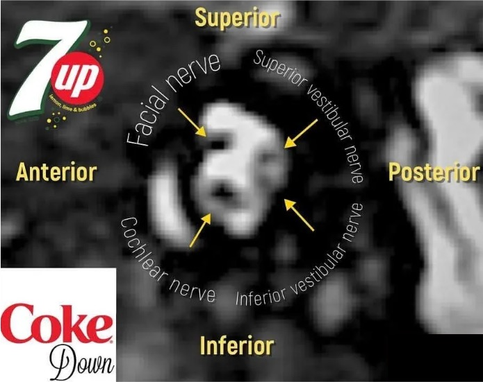

# Modèles de comptes rendus

=== "méta"
    ```
    Séquences axiale diffusion, axiale T1 écho de spin, 3D FLAIR, 3D SWAN.
    Après injection de gadolinium, séquence 3D T1 écho de spin FS.
    ```
    ```
    Structures de la ligne médiane en place.
    Intégrité des espaces liquidiens intra et péri-cérébraux.
    Absence de prise de contraste suspecte de lésion secondaire.
    Pas de lésion ischémique ou hémorragique récente.
    Pas de microsaignement chronique ni de stigmate hémorragique.
    Leucopathie périventriculaire vraisemblablment vasculaire, classée Fazekas
    Trophicité cortico-sous-corticale en rapport avec l'âge.
    Pas d'anomalie de morphologie ou de signal en fosse postérieure.
    Pas de lésion de remplacement médullaire de la boîte crânienne.
    ```
=== "céphalées"
    ```
    Séquences sagittale T1 EG, axiale diffusion, 3D FLAIR, SWI, TOF, et coronale T2.
    ```
    ```
    Structures de la ligne médiane en place.
    Intégrité des espaces liquidiens intra et péri-cérébraux.
    Pas de lésion ischémique ou hémorragique récente ni séquellaire.
    Pas d'anomalie de signal des sinus veineux péri-encéphaliques.
    Pas de signe d'hypertension ou d'hypotension intracrânienne.
    Absence d'anomalie de signal de la substance blanche.
    Respect de la trophicité cortico-sous-corticale.
    Pas d'anomalie de morphologie ou de signal en fosse postérieure.
    Absence de comblement sinusien.
    ```
=== "médullaire"
    ```
    Séquences sagittales T2 STIR, et T1 sans puis après injection de gadolinium. 
    ```
    ```
    Projection du cône terminale en regard de .
    Respect des espaces liquidiens périmédullaires.
    Cordon médullaire de trophicité normale, sans anomalie de signal.
    Pas d'anomalie inflammatoire somato-discale.
    Respect de la hauteur des corps vertébraux.
    Pas de lésion de remplacement médullaire suspecte.
    Pas de prise de contraste pathologique du cordon médullaire, du cône terminal, des racines de la queue de cheval, ou du cul-de-sac dural.
    ```
=== "vertiges"
    ```
    Séquences axiales diffusion et FLAIR à l'étage encéphalique.
    Séquences centrées sur les conduits auditifs internes 3D T2 HR, axiales T1 SE sans puis après injection de gadolinium, et 3D T1 EG FS.
    ```
    ```
    Etage supra-tentoriel :
    Structures de la ligne médiane en place.
    Intégrité des espaces liquidiens intra et péri-cérébraux.
    Pas de lésion ischémique ou hémorragique récente.
    Trophicité cortico-sous-corticale en rapport avec l'âge.

    Fosse postérieure :
    Tronc cérébral, vermis et hémisphères cérébelleux sans anomalie.
    Respect des nerfs vestibulo-cochléaires, sans rehaussement pathologique.
    Signal des liquides labyrinthiques d'aspect normal, sans rehaussement pathologique.
    ```
    <figure markdown="span">
        {width="400"}
    </figure>
=== "hydrops"
    ```
    Séquences axiales diffusion et FLAIR à l'étage encéphalique.
    Séquences centrées sur les conduits auditifs internes 3D T2 HR et 3D FLAIR 4 heures après injection de gadolinium.
    ```
    ```
    Etage supra-tentoriel :
    Structures de la ligne médiane en place.
    Intégrité des espaces liquidiens intra et péri-cérébraux.
    Pas de lésion ischémique ou hémorragique récente.
    Trophicité cortico-sous-corticale en rapport avec l'âge.

    Fosse postérieure :
    Tronc cérébral, vermis et hémisphères cérébelleux sans anomalie.
    Pas de syndrome de masse des nerfs vestibulo-cochléaires.
    Pas d'anomalie de signal des liquides labyrinthiques.
    Pas de dilatation des utricules, saccules et canaux endolymphatiques.
    ```
    <figure markdown="span">
        [thèse de Victor Chaton](https://pepite-depot.univ-lille.fr/LIBRE/Th_Medecine/2021/2021LILUM114.pdf){:target="_blank"}
    </figure>