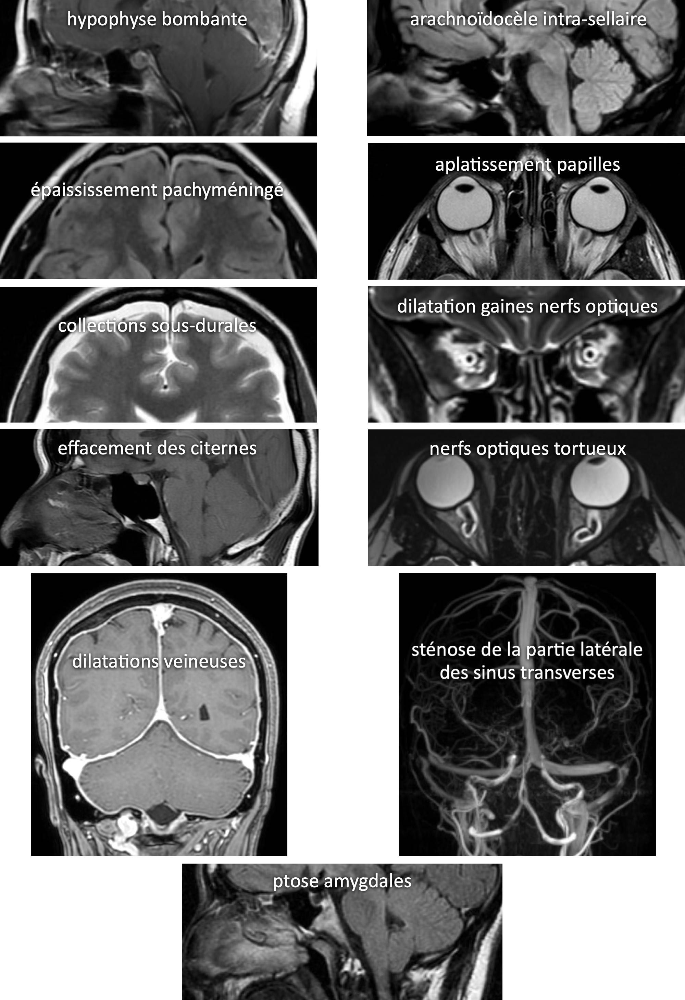

# Hypo et hypertension intracrânienne

|  [hTIC](https://radiopaedia.org/articles/spontaneous-intracranial-hypotension-2){:target="_blank"} |  [HTIC](https://radiopaedia.org/articles/idiopathic-intracranial-hypertension-1){:target="_blank"} |
| :----------: | :-------: | 
| céphalées orthostatiques | céphalées matinales, tb visuels, diplopie VI | 
| post-PL ou F35 idiopathique  | F35 obèse | 

<figure markdown="span">
    {width="650"}  
    20% de [sténose d'un sinus transverse](https://radiopaedia.org/articles/transverse-sinus-stenosis){:target="_blank"} en population générale
</figure>