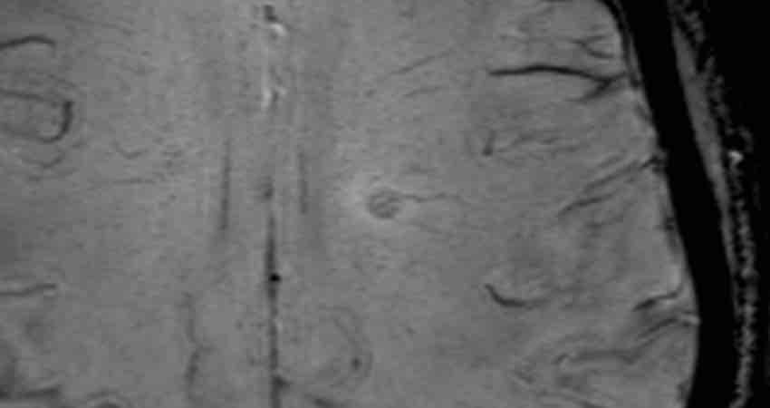
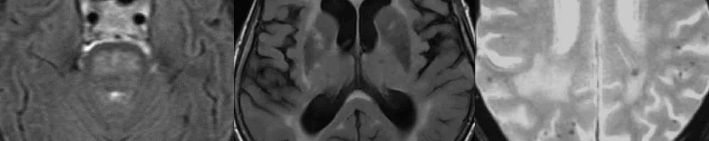
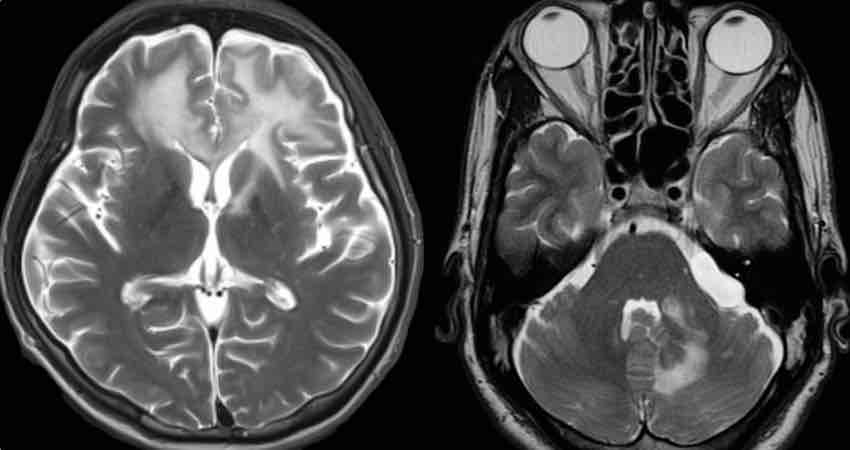

# [Sclérose en plaques](https://radiopaedia.org/articles/multiple-sclerosis){:target="_blank"}

```
Séquences axiale diffusion, 3D FLAIR, 3D T1 EG et SWI.
Après injection de gadolinium séquence 3D T1 SE.
```
```
Pas de lésion ischémique ou hémorragique récente ou séquellaire.
Pas de prise de contraste pathologique parenchymateuse ou méningée.

Hypersignaux FLAIR du parenchyme cérébral :
- de la substance blanche périventriculaire : non
- de la substance blanche juxta-corticale : non
- de la substance blanche infratentorielle : non
- de la jonctions cervicomédullaire : non
- des nerfs optiques : non

Restriction de la diffusion des hypersignaux FLAIR : non
Prise de contraste des hypersignaux FLAIR : non
Atrophie parenchymateuse : non
Atrophie callosale : non
```

!!! tip "Critères de [McDonald 2024](https://radiopaedia.org/articles/mcdonald-diagnostic-criteria-for-multiple-sclerosis-4){:target="_blank"}"
    - dissémination **spatiale** si ≥ 2 parmi 
        - péri-ventriculaire (collée et ⊥)
        - juxta-corticale ou corticale
        - sous-tentorielle (périphérie du pont ++)
        - médullaire (< 2 corps vertébraux et < hémi-moelle)
        - [névrite optique](https://radiopaedia.org/articles/optic-neuritis){:target="_blank"} (PDC intraorbitaire unilatérale et courte)
    - dissémination **temporelle** 
        - lésions gado + et - (PDC pdt M1), ou nouvelle lésion
        - bandes oligoclonales ou chaines légères libres kappa à la PL

!!! tip "Signe de la [veine centrale](https://radiopaedia.org/articles/central-vein-sign-1){:target="_blank"} en SWI"
    <figure markdown="span">
        doit être visible dans 2 plans + uniquement pour les lésions < 3 mm
        {width="300"}
        [anneau paramagnétique](https://radiopaedia.org/articles/paramagnetic-rim-lesions){:target="_blank"}
    </figure>

!!! warning "drapeaux rouges"
    <figure markdown="span">
        atteinte centro-pontique, noyaux gris centraux, microsaignements
        {width="600"}
    </figure>

!!! danger "[LEMP](https://radiopaedia.org/articles/progressive-multifocal-leukoencephalopathy){:target="_blank"} si > M18 **natalizumab** = IRM/M3 si JC+"
    <figure markdown="span">
        atteinte SB sous-corticale, bilatérale et symétrique, sans effet de masse  
        + SB cérébelleuse épargnant les noyaux dentelés ([shrimp sign](https://radiopaedia.org/articles/shrimp-sign-progressive-multifocal-leukoencephalopathy){:target="_blank"})
        {width="350"}
    </figure>