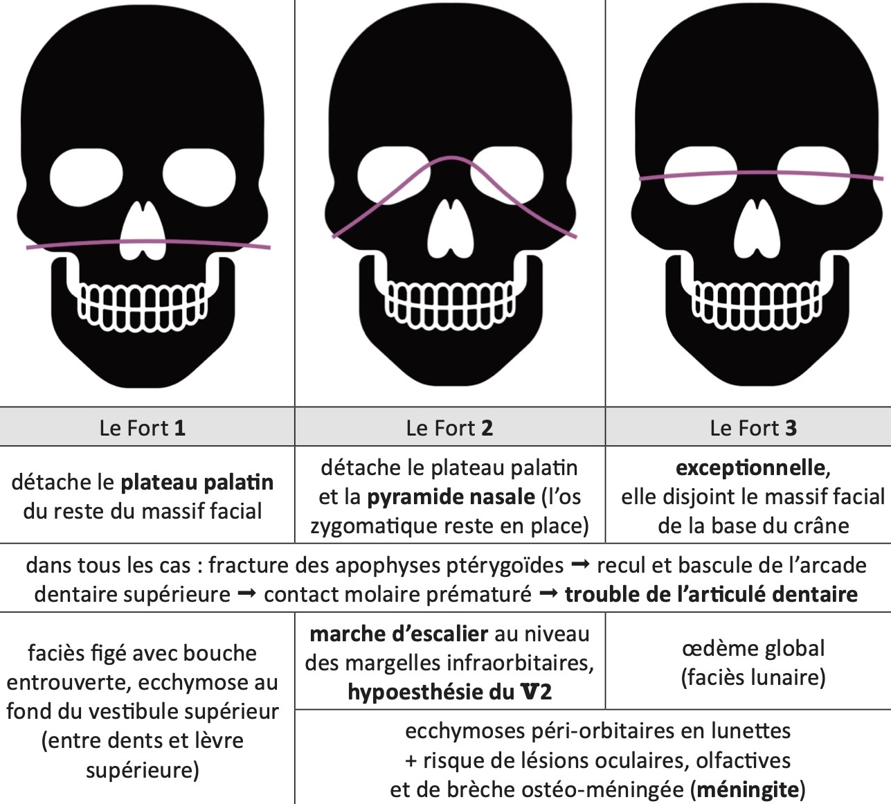
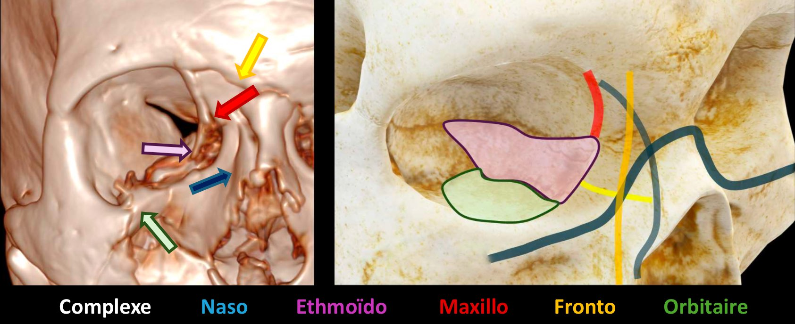
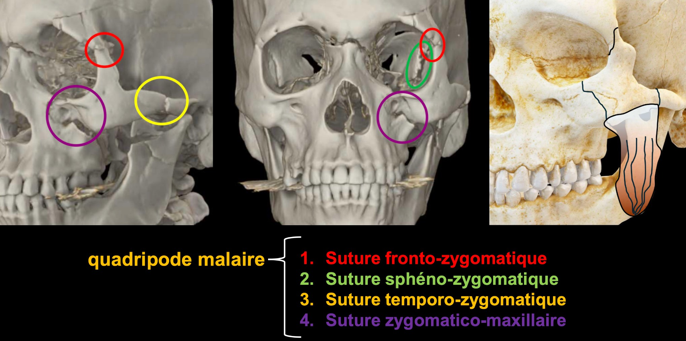
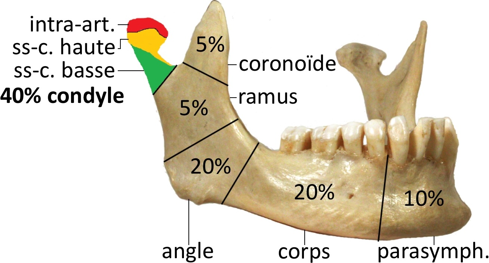
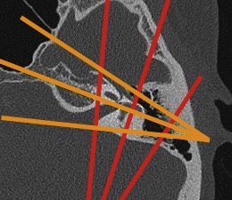

# [Traumatismes cranio-faciaux](https://onclepaul.fr/wp-content/uploads/2011/07/Trauma-cranio-enc%C3%A9phalique-2018.pdf){:target="_blank"}

```
Structures médianes en place.
Pas de lésion hémorragique intra ou péri-cérébrale récente.
Elargissement passif des espaces liquidiens intra et péri-cérébraux.
Bonne aération des sinus de la face et des cellules mastoïdiennes.
Pas de lésion osseuse post-traumatique.
```

<figure markdown="span">
    </br>
    {width="680"}
    --------------- **ssi # apophyse ptérygoïde** ---------------  
    Le Fort 2 et 3 /!\ brèche ostéo-méningée et fistule carotido-caverneuse  
    </br>
    {width="700"}
    fracture frontale associée ++, /!\ nerf alvéolaire inférieur (V2)   
    </br>
    {width="800"}
    muscle masséter => déplacement ++  
    </br>
    {width="800"}
    bifocale dans 30% des cas, /!\ nerf alvéolaire inférieur (V3)  
    </br>
    {width="300"}
</figure>

| <div style="color:orange;"> 80% longitudinale </div> | <div style="color:red;"> 20% transversale </div>   |
| :----------: | :-------: |
| hémotympan, luxation uncudo-malléaire, PFP | cophose, vertiges, PFP |
| extralabyrinthique ++ ± # tegmen | /!\ translabyrinthique ++ |

<figure markdown="span">
    [Trauma **dent**aire](https://www.maxilloclic.com/traumatisme-sur-dent-definitive){:target="_blank"}  
    </br>
    [C'est quoi ce truc dans l'**œil**](https://onclepaul.fr/wp-content/uploads/2011/07/C_est-quoi-ce-truc-dans-l_oeil-JFR-2018.pdf){:target="_blank"}  
    </br>
    [Lésions de la **voute** crânienne](https://www.ajronline.org/doi/10.2214/AJR.14.13415){:target="_blank"} ([médiathèque SFR](https://lamediatheque.radiologie.fr/mediatheque/media.aspx?mediaId=11915&channel=3277){:target="_blank"})
</figure>

!!! tip "DD HFLAIR sous-arachnoïdien"
    - artefacts (entrée de coupe / métal / maquillage)
    - sang frais
    - méningite infectieuse / carcinomateuse
    - hyperoxygénation (FiO2 = 100%)
    - injection récente de gadolinium