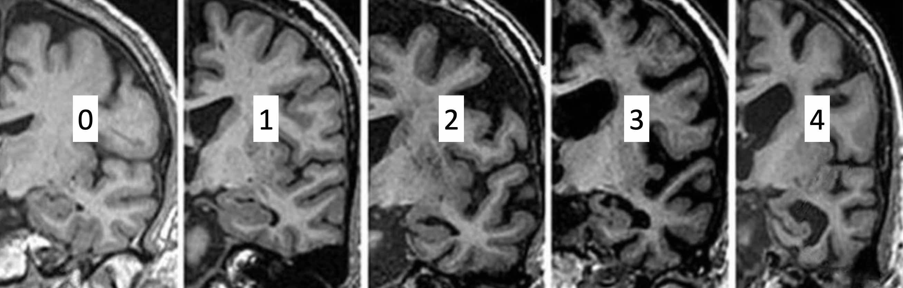
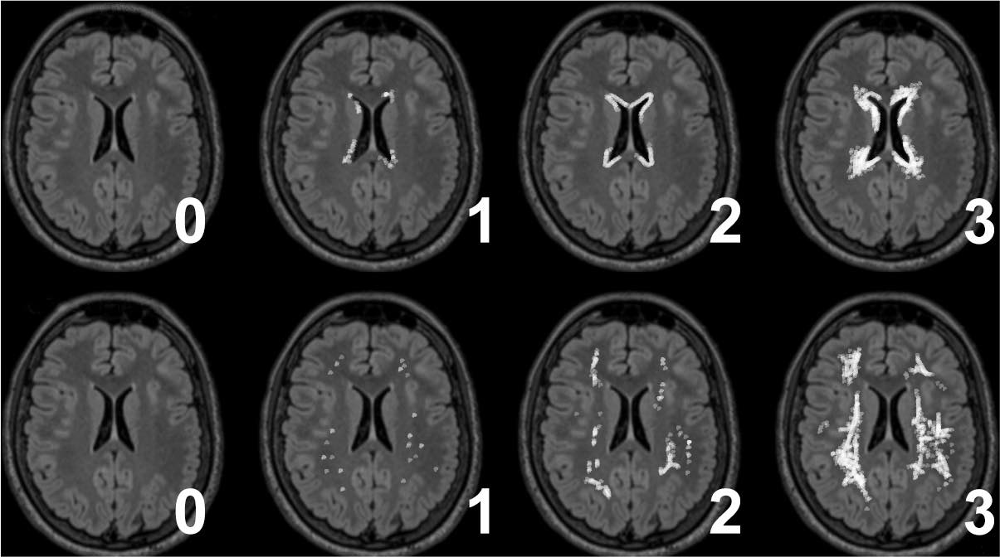
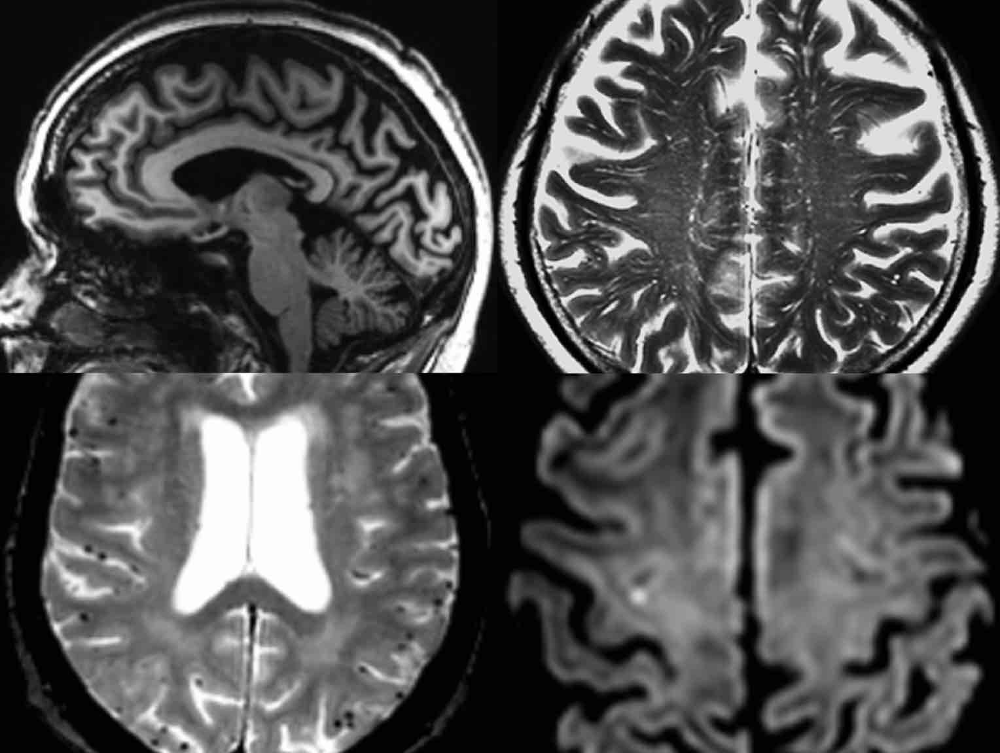
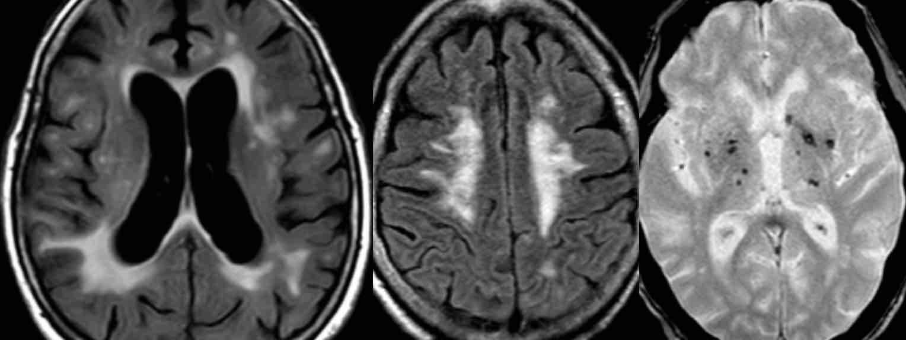
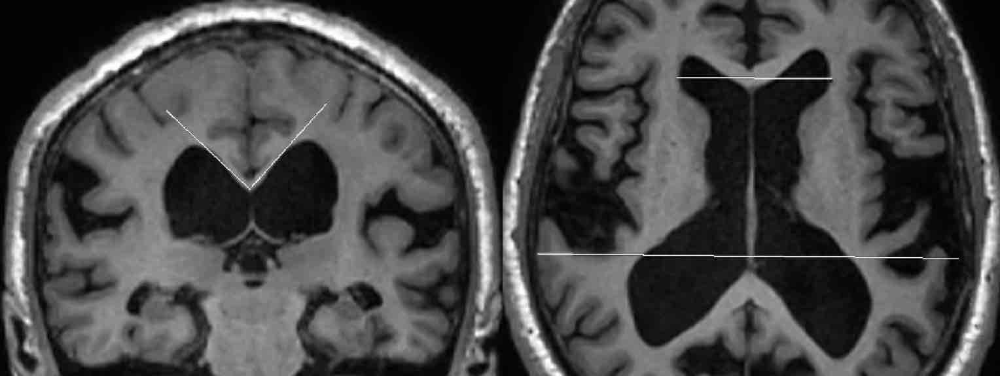
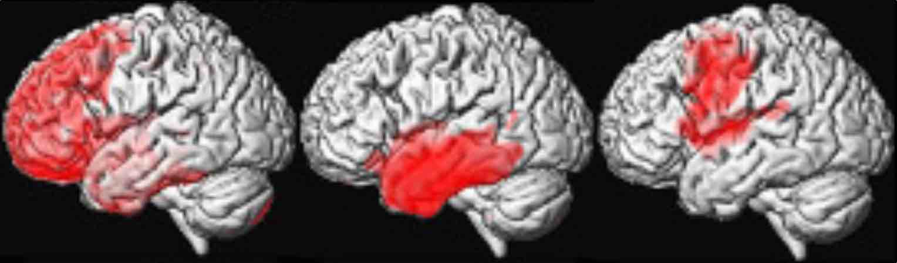

# [Troubles neuro-cognitifs sévères](https://radiopaedia.org/articles/dementia){:target="_blank"}

<figure markdown="span">
    [{width="600"}](https://radiopaedia.org/articles/medial-temporal-lobe-atrophy-score){:target="_blank"}
</figure>

|  [Scheltens](https://www.imaios.com/fr/e-cases/imaios/classifications/atrophie-hippocampique-scheltens){:target="_blank"} | 1 | 2 | 3 | 4 |
| :----------: | :-------: | :----------: | :-------: | :-------: |
| `fissure choroïdienne` | ↗ | ↗↗ | ↗↗↗ | ↗↗↗ |
| `corne temporale` | N | ↗↗ | ↗↗↗ | ↗↗↗ |
| `hauteur hippocampe` | N | ↘ | ↘↘ | ↘↘↘ |

<figure markdown="span">
    [{width="600"}](https://radiopaedia.org/articles/fazekas-scale-for-white-matter-lesions){:target="_blank"}
</figure>

```
Séquences axiales diffusion, FLAIR, T2* et 3D T1 EG.

Pas de lésion ischémique ou hémorragique récente ni de collection péricérébrale.
Pas de microsaignement chronique, de cavernome ni de stigmate hémorragique.
Pas de séquelle ischémique visualisée aux étage supra et infratentoriel.
Pas de syndrome de masse intracrânien.

Atrophie cortico-sous-corticale diffuse, sans atrophie lobaire prédominante.
Atrophie hippocampique modérée classée Scheltens 0 de façon bilatérale.
Leucopathie d'origine vasculaire probable classée Fazekas
Pas de signe d'hydrocéphalie chronique de l'adulte.
Pas d'anomalie des noyaux gris centraux.
```

<figure markdown="span">
    </br>
    [**Alzheimer**](https://radiopaedia.org/articles/alzheimer-disease-1){:target="_blank"} (oubli à mesure, 1 million en France, 15% des > 80a)  
    {width="500"}
    atrophie précunéus, microbleeds lobaires occipitaux, dilatation espaces VR, microinfarctus
    </br>  
    [**Démence vasculaire**](https://radiopaedia.org/articles/vascular-dementia){:target="_blank"} (TNC en marches d'escalier)
    {width="500"}
    SB profonde : lacunes, leucopathie et microbleeds
    </br>  
    [**HPN**](https://radiopaedia.org/articles/normal-pressure-hydrocephalus){:target="_blank"} (tb marche et tb sphinctériens)
    {width="500"}
    angle calloso-marginal < 90°, sillons tassés au vertex, index de Evans >  0,3
    </br>  
    [**DLFT**](https://radiopaedia.org/articles/frontotemporal-lobar-degeneration-1){:target="_blank"} (frontale / démence sémantique / aphasie primaire progressive)
    {width="500"}
    gliose hyperFLAIR en regard de l'atrophie
</figure>

!!! tip "[Angiopathie amyloïde](https://radiopaedia.org/articles/cerebral-amyloid-angiopathy-1){:target="_blank"} : critères de [Boston 2.0](https://radiopaedia.org/articles/boston-criteria-20-for-cerebral-amyloid-angiopathy){:target="_blank"}"
    - **≥ 50 ans** + hémorragie intracérébrale / TNC / tb neuro focaux transitoires
    - lésions hémorragiques lobaires = hématome / microsaignement / sidérose corticale
    - **AA probable = ≥ 2 lésions** OU 1 seule + EPV dilatés sévères / multispots SB (> 10)
    - DD = microangiopathie hypertensive (microsaignements prédominants dans les NGC)
