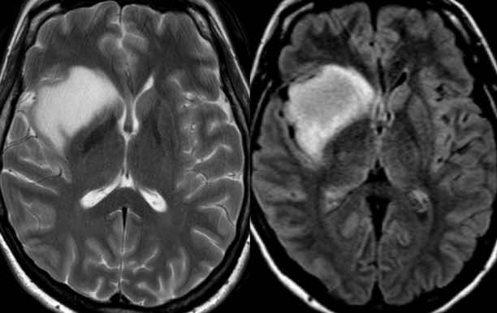
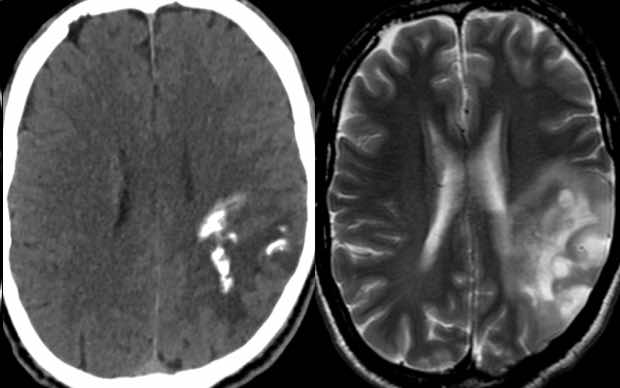
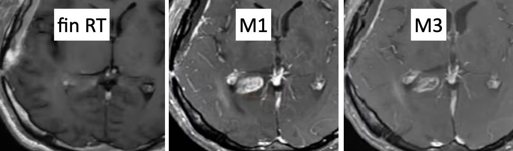
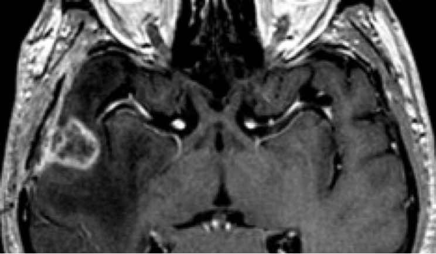
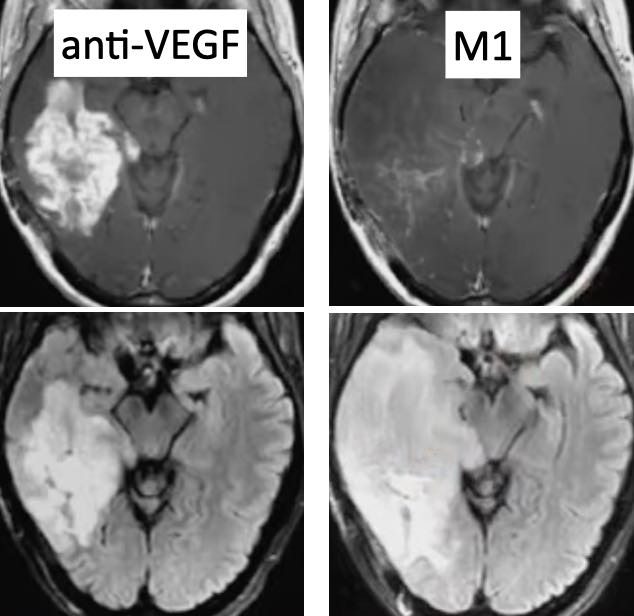

# [Glioblatome](https://radiopaedia.org/articles/glioblastoma-idh-wildtype){:target="_blank"}

!!! tip "[Gliobastome vs métastase](https://radiopaedia.org/articles/glioblastoma-vs-cerebral-metastasis){:target="_blank"}"
    - [métastase](https://radiopaedia.org/articles/brain-metastases){:target="_blank"} pulm, rein, sein, mélanome, côlon = multiple dans 75%, jonction SB-SG
    - périventriculaire ou atteinte du corps calleux ? GBM ++ (DD [lymphome](https://radiopaedia.org/articles/lymphomas-of-the-central-nervous-system){:target="_blank"})
    - composante nodulaire non rehausée ? GBM ++

<figure markdown="span">
    {width="280"}
    mismatch T2/FLAIR > 50% = [astrocytome](https://radiopaedia.org/articles/astrocytoma-idh-mutant-1){:target="_blank"} = 35a (vs 60a pour le gbm)  
     
    {width="280"}
    cortical, calcifications, contours flous = [oligodendrogliome](https://radiopaedia.org/articles/oligodendroglioma){:target="_blank"} = 50a, plus rare  
     
    glioblastome et astrocytome haut grade = chirurgie + [protocole Stupp](https://radiopaedia.org/articles/stupp-protocol){:target="_blank"} (RT S6 + TMZ)  
    IRM baseline à J2 post-op (PDC péri-cavitaire après) = plages ischémiques ? (↕ BHE après)
</figure>

|  lésion cible si > 10x10 mm |  critères [RANO](https://radiopaedia.org/articles/rano-criteria-for-glioma){:target="_blank"} = Σ produits ∅ lésions rehaussées |
| :----------: | :-------: | 
| `progression` (sauf ↘CTC) | ↗ >25% vs nadir, ↗ autres lésions, nvelle lésion | 
| `réponse partielle` (sauf ↗CTC) | ↘ >50% vs baseline pdt > M1, sinon « stable » | 
| `réponse complète` (ssi ∅CTC) | disparition des lésions rehaussées pdt > M1 | 

<figure markdown="span">
    {width="415"}
    /!\ 20% [pseudoprogression](https://radiopaedia.org/articles/tumour-pseudoprogression-brain-tumours){:target="_blank"} à M1 post-RT => critères RANO ssi > M3  
     
    {width="240"}
    [radionécrose](https://radiopaedia.org/articles/cerebral-radiation-necrosis-1){:target="_blank"} M3 - 3 ans = PDC mais rCBV < 2 et ∅ ↘ADC  
     
    {width="250"}
    anti-VEGF = 50% [pseudoréponse](https://radiopaedia.org/articles/tumour-pseudoresponse){:target="_blank"} < M1 = ↘ PDC, chercher progression FLAIR  
     
</figure>