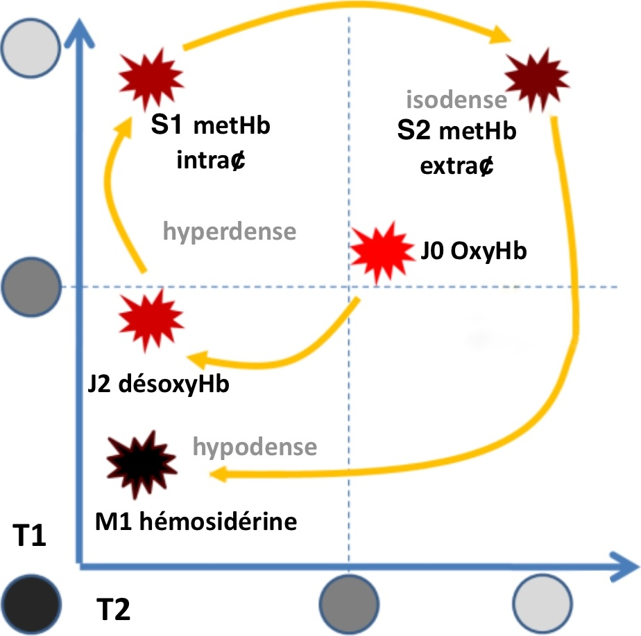

# Hématome intraparenchymateux

<figure markdown="span">
    {width="300"}
    TDM sans/art/vx sauf hématome profond >50a avec HTA

      

    {width="350"}

      
    
    {width="320"}
</figure>