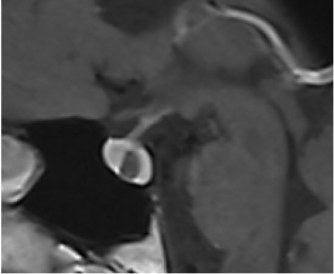
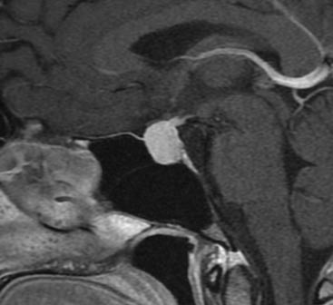
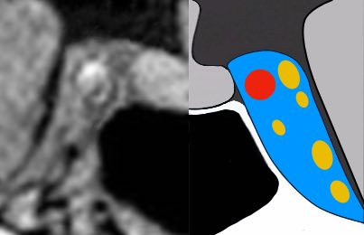
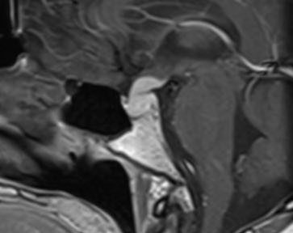

# [Hypophyse](https://radiopaedia.org/articles/pituitary-mri-an-approach-1){:target="_blank"}

```
Séquences coronales T1 et T2, sagittale T1.
Après injection de gadolinium, séquences coronales T1 dynamiques.
```
```
Antéhypophyse de taille et de morphologie normales, de signal homogène.
Pas d'anomalie focale dans l'antéhypophyse après injection de gadolinium.
Post-hypophyse en hypersignal spontané T1, d’aspect normal.
Respect du diaphragme et du plancher sellaire.
Tige pituitaire et infundibulum sans anomalie.
Pas d’anomalie dans les loges des sinus caverneux.
Intégrité des citernes supra-sellaires et opto-chiasmatiques
Bonne aération des sinus sphénoïdaux.
```

!!! tip "[Tumeurs](https://radiopaedia.org/articles/pituitary-region-masses){:target="_blank"}"
    - [microadénome](https://radiopaedia.org/articles/pituitary-microadenoma){:target="_blank"} = retard défaut de rehaussement < 10 mm
    - [macroadénome](https://radiopaedia.org/articles/pituitary-macroadenoma-1){:target="_blank"} = selle turcique élargie (croissance lente), classification de [Knosp](https://radiopaedia.org/articles/knosp-classification-of-cavernous-sinus-invasion-by-pituitary-macroadenomas){:target="_blank"}
    - [craniopharyngiome](https://radiopaedia.org/articles/adamantinomatous-craniopharyngioma){:target="_blank"} = enfant et 50a, masse avec kyste et calcifications
    - [méningiome](https://radiopaedia.org/articles/meningioma){:target="_blank"} = dural tail, hyperostose, ↘ diamètre carotide
    - [hémangiome](https://radiopaedia.org/articles/cavernous-sinus-haemangioma){:target="_blank"} du sinus caverneux = hyperT2 quasi liquidien, PDC intense homogène
    - [chordome](https://radiopaedia.org/articles/chordoma){:target="_blank"} et [chondrosarcome](https://radiopaedia.org/articles/chondrosarcoma-of-the-skull-base){:target="_blank"} = centré sur le clivus
    - [métastase](https://radiopaedia.org/articles/pituitary-metastasis-1){:target="_blank"} = selle turcique de taille normale, ostéolyse, contours irréguliers

<figure markdown="span">
    {width="200"}
    [kyste de la poche de Rathke](https://radiopaedia.org/articles/rathke-cleft-cyst-2){:target="_blank"} = nodule intrakystique dans 70%, pas de PDC  
    </br>
    {width="200"}
    [hyperplasie](https://radiopaedia.org/articles/pituitary-hyperplasia-1){:target="_blank"} hypophysaire = grossesse, puberté, [hypophysite](https://radiopaedia.org/articles/lymphocytic-hypophysitis){:target="_blank"}  
    </br>
    {width="200"}
    [sinus caverneux](https://radiopaedia.org/articles/cavernous-sinus){:target="_blank"} = carotide, III, IV, VI, V1, V2  
    </br>
    {width="200"}
    nodule [tige pituitaire](https://radiopaedia.org/articles/pituitary-stalk-abnormal-enhancement-differential){:target="_blank"} = méta, lymphome, germinome, sarcoïdose, histiocytose, BK
</figure>