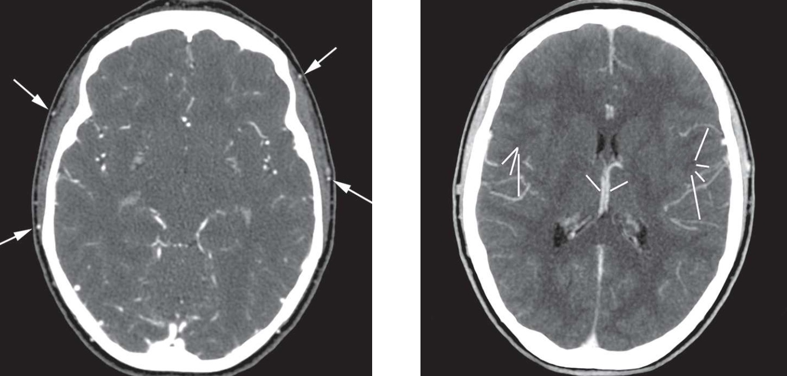

# Mort encéphalique

!!! info "Conditions"
    - **6h après diagnostic** clinique
    - hémodynamiquement stable
    - PAM > 65 mmHg et diurèse > 100 ml/h

``` title="IV-, 20s, 60s après injection de 2 ml/kg (max 120) à 3 cc/s"
Opacification satisfaisante des artères temporales superficielles.

Absence de rehaussement de la vascularisation intracrânienne :
- Artères corticales (M4) de l’artère cérébrale moyenne droite 
- Artères corticales (M4) de l’artère cérébrale moyenne gauche
- Veine cérébrale interne droite
- Veine cérébrale interne gauche
```

<figure markdown="span">
    {width="600"}
</figure>

!!! info "Arrêt circulatoire cérébral"
    - score 4/4 avec absence d'opacification des branches corticales (M4) des ACM sur une coupe passant par le toit des ventricules latéraux
    - score 3/4 avec absence de rehaussement des veines cérébrales internes : possibilité d'opacification unilatérale d'une ou deux branches corticales de l'ACM