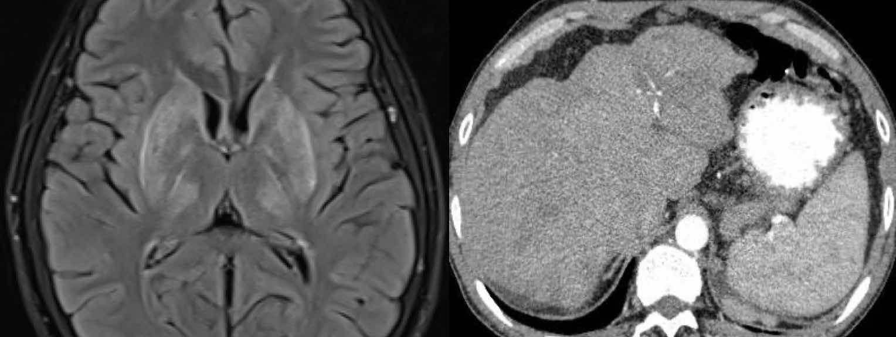

# Maladie de [Parkinson](https://radiopaedia.org/articles/parkinson-disease-1){:target="_blank"}

<figure markdown="span">
    tremblements de repos lents (5 Hz avec membres, lèvres et menton ++)  
    + rigidité qui cède par à-coups + akinésie (tb de la marche)
</figure>

```
Séquences axiale diffusion, 3D T1 EG, axiales T2 deux échos, 3D SWI et séquence dédiée aux nigrosomes.
```
```
Pas de lésion ischémique ou hémorragique récente ni de collection péricérébrale.
Pas de microsaignement chronique, de cavernome ni de stigmate hémorragique.
Pas de séquelle ischémique visualisée aux étage supra et infratentoriel.
Leucopathie périventriculaire d'origine vasculaire probable classée Fazekas
Pas de signe morphologique évocateur d'hydrocéphalie chronique de l'adulte.
Pas d'anomalie de signal des noyaux gris centraux ni d'atrophie du putamen.
Trophicité cérébrale en rapport avec l'âge, sans atrophie lobaire prédominante.
Trophicité hippocampique respectée classée Scheltens 0 de façon bilatérale.
Pas d'anomalie de morphologie ou de signal en fosse postérieure.
Pas d'anomalie de signal des nigrosomes sur la séquence dédiée.
```

<figure markdown="span">
    [**DCL**](https://radiopaedia.org/articles/dementia-with-lewy-bodies){:target="_blank"} (TNC précoce, hallucinations, vigilance fluctuante)  
    {width="500"}
    effacement de la [queue d'hirondelle](https://radiopaedia.org/articles/swallow-tail-sign-substantia-nigra){:target="_blank"}, atrophie respectant les hippocampes
    </br>  
    [**AMS**](https://radiopaedia.org/articles/multiple-system-atrophy){:target="_blank"} (-P = dysautonomie / -C = sd cérébelleux)
    {width="500"}
    AMS-P = atrophie putamen avec hypoT2 périphérique  
    AMS-C = ↘ cervelet et signe de la [croix pontique](https://radiopaedia.org/articles/hot-cross-bun-sign-pons){:target="_blank"}
    </br>  
    [**PSP**](https://radiopaedia.org/articles/progressive-supranuclear-palsy-1){:target="_blank"} (ophtalmoplégie verticale, TNC et chutes précoces)
    {width="500"}
    MR [parkinsonism index](https://radiopaedia.org/articles/magnetic-resonance-parkinsonism-index-1){:target="_blank"} (P\*PCM)/(M\*PCS) > 13, mésencéphale < 12 mm
    </br>  
    [**DCB**](https://radiopaedia.org/articles/corticobasal-degeneration){:target="_blank"} (main capricieuse, myoclonies)
    {width="500"}
    atrophie pré et post-centrale asymétrique
    </br>  
    [**MW**](https://radiopaedia.org/articles/wilson-disease-2){:target="_blank"} (< 50 ans, dystonie, psychose)
    {width="500"}
    putamen hyperT2, cirrhose
</figure>