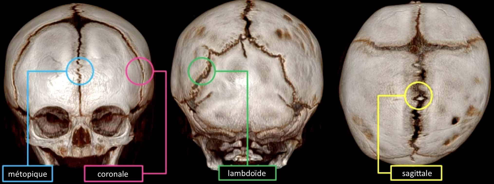
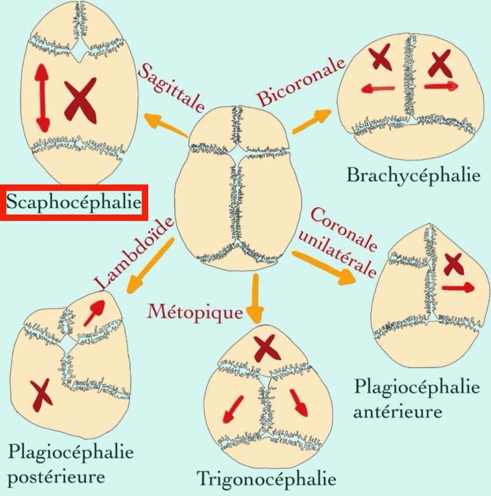
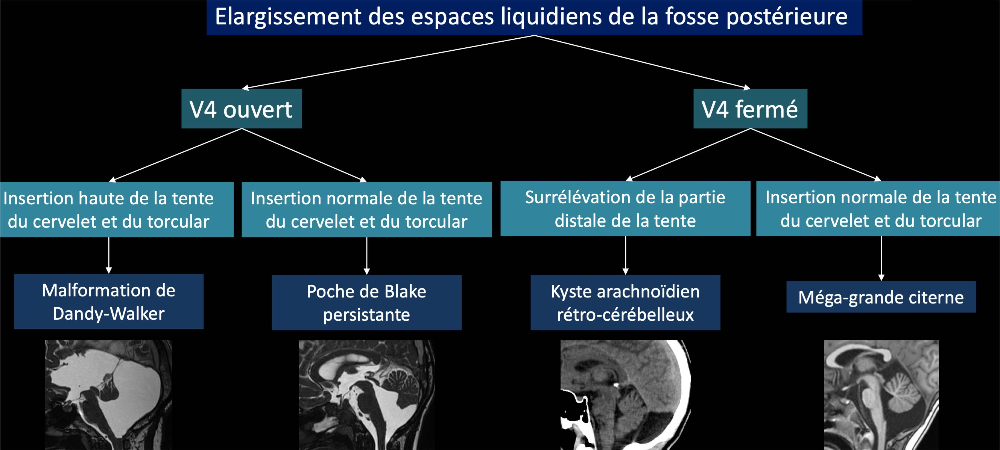
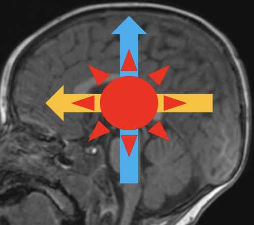
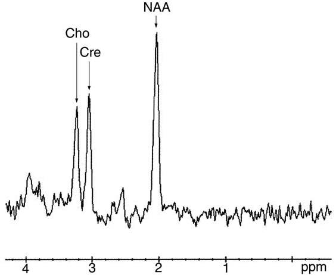

# [Neuropédiatrie](https://onclepaul.fr/wp-content/uploads/2011/07/3-Cours-Radiopediatrie-MERM-Imagerie-Neuroradiologique-Pediatrique.pdf){:target="_blank"}

=== "ANAT"

    <figure markdown="span">
        {width="800"}
        [craniosténose](https://radiopaedia.org/articles/craniosynostosis?lang=us){:target="_blank"} = fermeture prématurée d'une suture ([Vinchon](https://matthieuvinchon.fr/2017/09/12/les-craniostenoses/){:target="_blank"})  
        {width="400"}  
        </br>
        [{width="800"}](https://onclepaul.fr/wp-content/uploads/2011/07/Malformations-kystiques-et-pseudo-kystiques-de-la-fosse-postérieure-JFR-2018.pdf){:target="_blank"}  
    </figure>


=== "RETARD"

    <figure markdown="span">
        [biométrie du corps calleux](https://www.neuroradiologie.fr/index.php/outils/corps-calleux){:target="_blank"}  
        [lésions anoxo-ischémiques du NNé](https://radiopaedia.org/articles/patterns-of-neonatal-hypoxicischaemic-brain-injury?lang=gb){:target="_blank"} = prématurité +++ 
    </figure>

    !!! tip "[Myélinisation](https://radiopaedia.org/articles/normal-myelination){:target="_blank"} de la substance blanche = [atlas](https://www.myelinationmriatlas.com/6-months.html){:target="_blank"} {width="150"} "
        - NNé = fini en sous-tentoriel, puis bas → haut, arr → avt, centre → périph
        - hyperT1 commençant aux bras post. des capsules internes, terminé à M6
        - hypoT2 sus-tentoriel d'apparition très progressive **jusqu'à 2-4 ans**
        - FLAIR retardé : pas de myélinisation sus-tentoriel avant 1 an
        - [leucodystrophies](https://radiopaedia.org/articles/leukodystrophies){:target="_blank"} = anomalies de la myélinisation

    ```
    Séquences 3D T1 EG, 3D FLAIR, sagittale T2 centrée sur la ligne médiane, spectroscopie monovoxel à TE long sur les noyaux gris centraux.
    ```
    ```
    Fosse postérieure :
    Pas d'anomalie de la morphologie ni du signal du tronc cérébral.
    Cervelet et en particulier vermis de taille et morphologie normales.
    Quatrième ventricule de volume et de topographie normales.
    Intégritér des angles ponto-cérébelleux et des citernes de la base.

    Etage supra-tentoriel :
    Pas d'anomalie de la gyration ni de la migration neuronale.
    Hypersignal FLAIR symétrique de la substance blanche péri-trigonale en rapport avec des zones de myélinisation terminales.
    Intégrité des noyaux gris centraux et des structures de la ligne médiane.
    Corps calleux complet, de volume normal.
    Trophicité cérébrale respectée.
    Pas d'anomalie des métabolites sur la séquence de spectroscopie.

    Comblement bilatéral des cellules mastoïdiennes et de l'oreille moyenne associé à une hypertrophie des végétations adénoïdes.
    ```

    <figure markdown="span">
        [{width="330"}](https://www.imaios.com/fr/e-mri/spectroscopie-par-resonance-magnetique/metabolites-en-srm){:target="_blank"}
    </figure>

    !!! warning "DD macrocéphalie"
        - < M6 (ETF ± IRM) = HSD, hydrocéphalie, tumeur
        - \> M6 (IRM) = [épanchement péricérébral](https://radiopaedia.org/articles/benign-enlargement-of-the-subarachnoid-space-in-infancy){:target="_blank"} +++, sténose foramens jugulaires, [et autres](https://radiopaedia.org/articles/macrocephaly){:target="_blank"}


=== "EPILEPSIE"

    <figure markdown="span">
        **Convulsions fébriles simples** = > 1 an, crise généralisée, < 15', sans déficit post-critique  
        ≠ apyrétique, iono normal, hors suspi d'AVC => **TDM**🚨 (hématome, tumeur, TVC, abcès ?!)  
        </br> 
        [Causes](https://radiopaedia.org/articles/epilepsy){:target="_blank"} = dysplasie/hétérotopie > anoxo-ischémie > trauma > tumeurs > cavenormes, MAV  
        /!\ myélinisation M3 - 3 ans => IRM avant ou après pour chercher une [dysplasie corticale](https://radiopaedia.org/articles/focal-cortical-dysplasia){:target="_blank"}
        épilepsie temporale pharmaco-résistante => [sclérose mésiale hippocampique](https://radiopaedia.org/articles/mesial-temporal-sclerosis){:target="_blank"}
    </figure>
    
    !!! danger "[Encéphalite herpétique](https://radiopaedia.org/articles/herpes-simplex-encephalitis){:target="_blank"}"
        - tb csc **± fièvre** ± crises comitiales ± signes de localisation
        - **toute suspicion = zovirax IV** (sinon 80% †)
        - insula (90%) > thalamus (60%) > temporal (50%)

    !!! warning "Tumeurs (gado systématique au 1er bilan si anomalie !)"
        - [DNET](https://radiopaedia.org/articles/dysembryoplastic-neuroepithelial-tumour-1){:target="_blank"} = sur dysplasie corticale dans 80%, hypoT1 hyperT2 "bubbly"
        - [gangliogliome](https://radiopaedia.org/articles/ganglioglioma){:target="_blank"} = DD DNET avec **PDC**, pas bubbly, ± calcification et kyste
        - [hamartome](https://radiopaedia.org/articles/hypothalamic-hamartoma){:target="_blank"} = crises gélastiques + puberté précoce + retard intellectuel
    
    ```
    Sur une IRM 3 Tesla, séquences 3D T1 EG, 3D FLAIR, SWI, coronale T2 centrée sur les hippocampes.
    ```
    ```
    Pas d'anomalie de la gyration, de la migration neuronale ni de la myélinisation.
    Aspect sans particularité du signal et de la trophicité des hippocampes.
    Hypersignal FLAIR symétrique de la substance blanche péri-trigonale en rapport avec des zones de myélinisation terminales.
    Intégrité des noyaux gris centraux et des structures de la ligne médiane.
    Corps calleux complet, de volume normal.
    Trophicité cérébrale respectée.

    Comblement bilatéral des cellules mastoïdiennes et de l'oreille moyenne associé à une hypertrophie des végétations adénoïdes.
    ```

=== "TUMEURS"

    !!! tip "[Tumeurs en fosse postérieure](https://radiopaedia.org/articles/posterior-cranial-fossa-tumors){:target="_blank"}"
        - hydrocéphalie active = dilatation ventriculaire + résorption transépendymaire
        - plan sagittale T2 = abaissement du plancher du V3 => ventriculocisterostomie
        - [médulloblastome](https://radiopaedia.org/articles/medulloblastoma){:target="_blank"} = lésion médiane hyperdense /!\ métas spinales
        - [astrocytome pylocytique](https://radiopaedia.org/articles/pilocytic-astrocytoma){:target="_blank"} = nodulokystique avec PDC marquée = bénin
        - [gliome du tronc cérébral](https://radiopaedia.org/articles/brainstem-glioma){:target="_blank"} = élargissement hypodense de la protubérance
        - [épendymome](https://radiopaedia.org/articles/ependymoma){:target="_blank"} = hétérogène, calcifications, extension angles ponto-cérébelleux
        - adulte = métastase / [hémangioblastome](https://radiopaedia.org/articles/haemangioblastoma-central-nervous-system-2){:target="_blank"} (nodulokystique, VHL)


=== "TC"
    
    !!! danger "TC accidentel"
        - exam neuro normal = pas d'imagerie (surveillance 6h aux urgences)
        - signes neuros (**mydriase**) = HED/HSD/HIP, HSA (anévrysme ?! ++++) = neurochir 🚨
        - Coma + TDM normale = IRM ([lésions axonales diffuses](https://radiopaedia.org/articles/diffuse-axonal-injury){:target="_blank"}, corps calleux, dissection TSA)
        - Suspicion de brèche de la dure-mère = IRM avec T2 FS

    !!! danger "TC non accidentel (maltraitance) = 30% †"
        - /!\ **fractures** linéaires axiales et fractures enfoncements
        - **HSD** par rupture des veines en pont, 80% bilatéral, PAS DE DATATION
        - **HSA** (50% des cas) chercher anévrysme ++++, HIP et pétéchies (IRM)
        - **lésions anoxo-ischémiques** = œdème (dédifférenciation SB-SG, cervelet blanc)
        - IRM J2-3 avec sag STIR cervicale = lésions musculaires liées au secouement ?