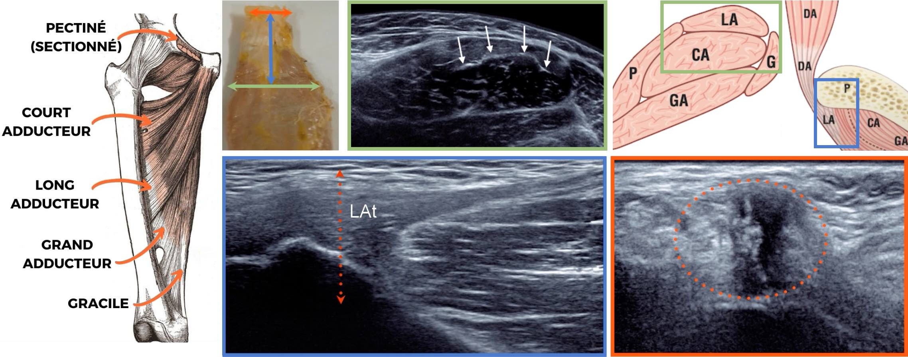
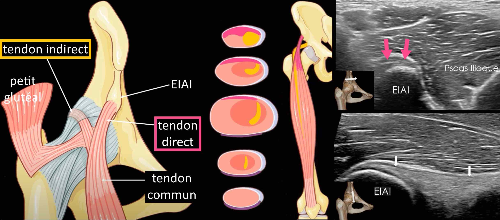
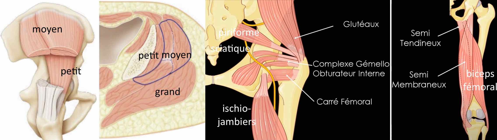
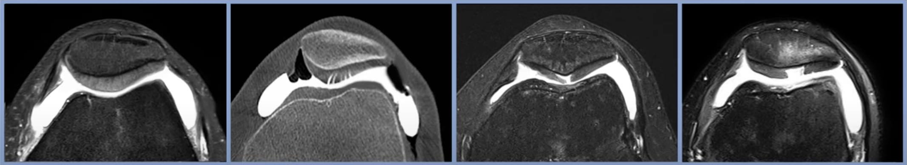

# Membre inférieur

=== "BASSIN"
    ``` title="IRM du bassin"
    Pas d'épanchement articulaire coxo-fémoral.
    Pas de chondropathie coxo-fémorale significative.
    Pas d'anomalie de signal des articulations sacro-iliaques.
    Pas d'anomalie de l'enthèse des tendons ischio-jambiers et péri-trochantériens.
    Pas de lésion osseuse suspecte.
    ```

=== "HANCHE"
    ``` title="Echo"
    Pas d'épanchement articulaire coxo-fémoral.
    Pas d'argument pour une fissure de l'enthèse du muscle long adducteur.
    Pas de lésion traumatique de la jonction myotendineuse du muscle iliopsoas.
    Intégrité du muscle droit fémoral et de ses insertions tendineuses.
    Intégrité des tendons glutéaux et de l'insertion proximale des ischio-jambiers.
    ```
    <figure markdown="span">
        [{width="900"}](https://www.youtube.com/watch?v=CvP7ZwW3trk&list=PLGV2jHWN573djULLdIjMos1uZ1iMdevnT&index=4){:target="_blank"}  
        [{width="900"}](https://www.youtube.com/watch?v=ivN3cYggy_w&list=PLGV2jHWN573djULLdIjMos1uZ1iMdevnT&index=4){:target="_blank"}  
        [{width="700"}](https://www.youtube.com/watch?v=JJLKE5kArb0&list=PLGV2jHWN573djULLdIjMos1uZ1iMdevnT&index=5){:target="_blank"}  
        [{width="900"}](https://www.youtube.com/watch?v=8AxHjBnEDPQ&list=PLGV2jHWN573djULLdIjMos1uZ1iMdevnT&index=6){:target="_blank"}  
    </figure>  

=== "GENOU"
    ``` title="IRM"
    Pas d'épanchement articulaire, de corps étranger ni de signe de synovite.
    Intégrité des structures osseusses, sans oedème ni remaniements dégénératifs.
    Surfaces cartilagineuses continues, sans signe de chondropathie.
    Absence d'anomalie de forme, position ou signal des ménisques.
    Intégrité des ligaments croisés et collatéraux.
    Respect du creux poplité.
    ```
    <figure markdown="span">
        {width="900"}
        chondropathie grade **I** : signal hétérogène, **II** : < 50%, **III** : > 50%, **IV** : atteinte ss-chondrale
    </figure>

=== "CHEVILLE"

=== "PIED"