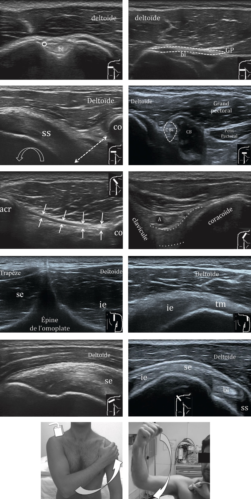

# Membre supérieur

=== "EPAULE"
    <figure markdown="span">
        {width="540"}  
    </figure>
    ``` title="Echo"
    Régions antérieure et postérieure (rotation neutre, coude à 90°, paume en haut) :
    Tendon du long biceps en place, d'aspect normal, sans épanchement significatif.
    Distance coracoïde-trochin > 6 mm, avec bon glissement du tendon subscapulaire.
    Intégrité des tendons des muscles supra-épineux, infra-épineux et teres minor.
    Pas d'épaississement ni d'épanchement de la bourse sous-acromio-deltoïdienne.
    Remaniements dégénératifs acromio-claviculaire, sans douleur à l'échopalpation.
    Pas de conflit sous-acromial lors de la manœuvre de Neer.
    Pas de lésion osseuse décelable.
    ```
    <figure markdown="span">
        {width="650"}
    </figure>  
    ``` title="arthroTDM"
    Bon alignement des structures osseuses.
    Absence de fracture, d'anomalie osseuse focale, ou de remaniements dégénératifs.
    Absence de rupture des tendons de la coiffe des rotateurs.
    Absence d'épanchement intra-articulaire.
    Trophicité musculaire conservée.
    ```

=== "COUDE"

=== "POIGNET"

=== "DOIGTS"