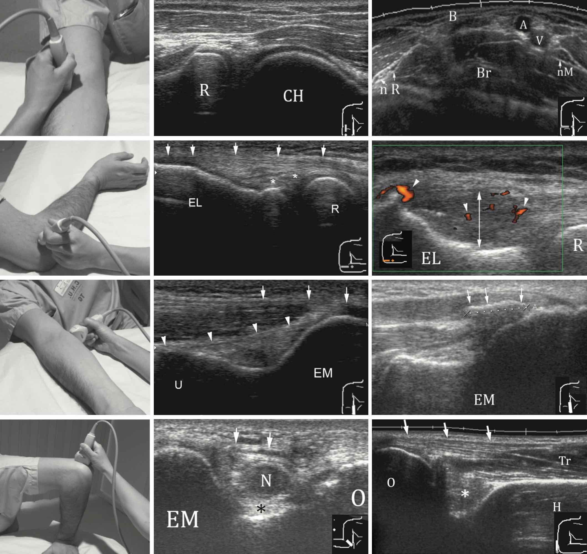

# Membre supérieur

=== "EPAULE"
    <figure markdown="span">
        {width="540"}  
    </figure>
    ``` title="Echo"
    Tendon du long biceps en place, d'aspect normal, sans épanchement significatif.
    Distance coracoïde-trochin > 6 mm, avec bon glissement du tendon subscapulaire.
    Intégrité des tendons des muscles supra-épineux et infra-épineux.
    Pas d'épaississement ni d'épanchement de la bourse sous-acromio-deltoïdienne.
    Remaniements dégénératifs acromio-claviculaire, sans douleur à l'échopalpation.
    Pas de conflit sous-acromial lors de la manœuvre de Neer.
    Pas de lésion osseuse décelable.
    ```
    <figure markdown="span">
        [{width="650"}](https://www.youtube.com/watch?v=CDN2kX3YkZQ&t=51s){:target="_blank"} 
    </figure>  
    ``` title="arthroTDM"
    Bon alignement des structures osseuses.
    Absence de fracture, d'anomalie osseuse focale, ou de remaniements dégénératifs.
    Absence de rupture des tendons de la coiffe des rotateurs.
    Absence d'épanchement intra-articulaire.
    Trophicité musculaire conservée.
    ```

=== "COUDE"
    ``` title="Echo"
    Pas d'épanchement articulaire.
    Intégrité du tendon distal du muscle biceps.
    Pas d'anomalie des tendons communs des épicondyliens latéraux et médiaux.
    Aspect normal du nerf ulnaire dans son tunnel.
    Tendon distal du triceps respecté.
    ```
    <figure markdown="span">
        [{width="800"}](https://www.youtube.com/watch?v=CDN2kX3YkZQ&t=51s){:target="_blank"} 
    </figure>  

=== "POIGNET"

=== "DOIGTS"