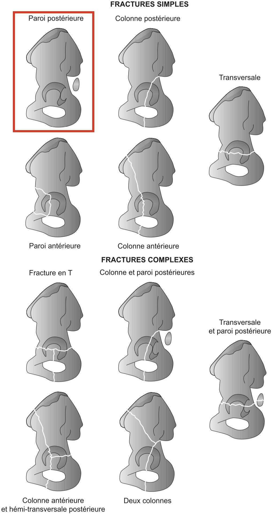
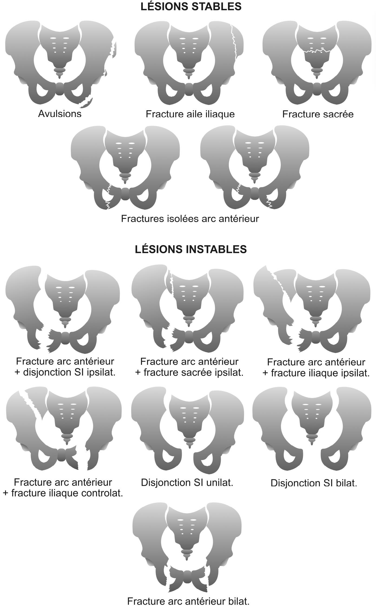
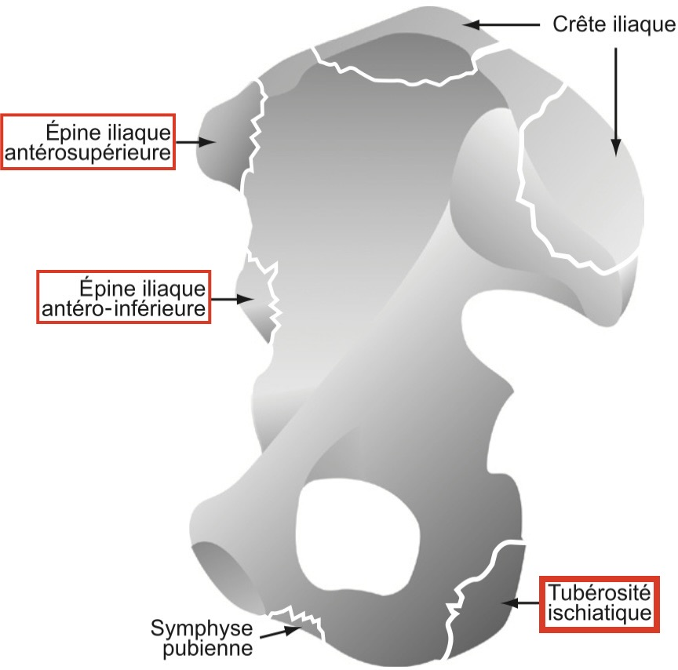
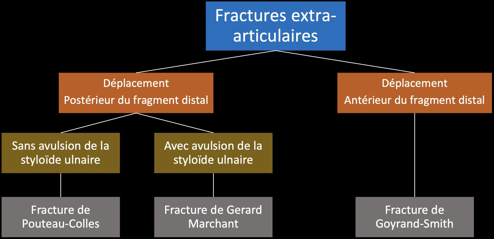
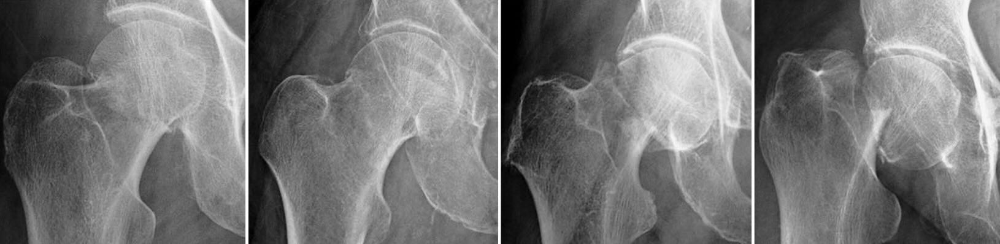
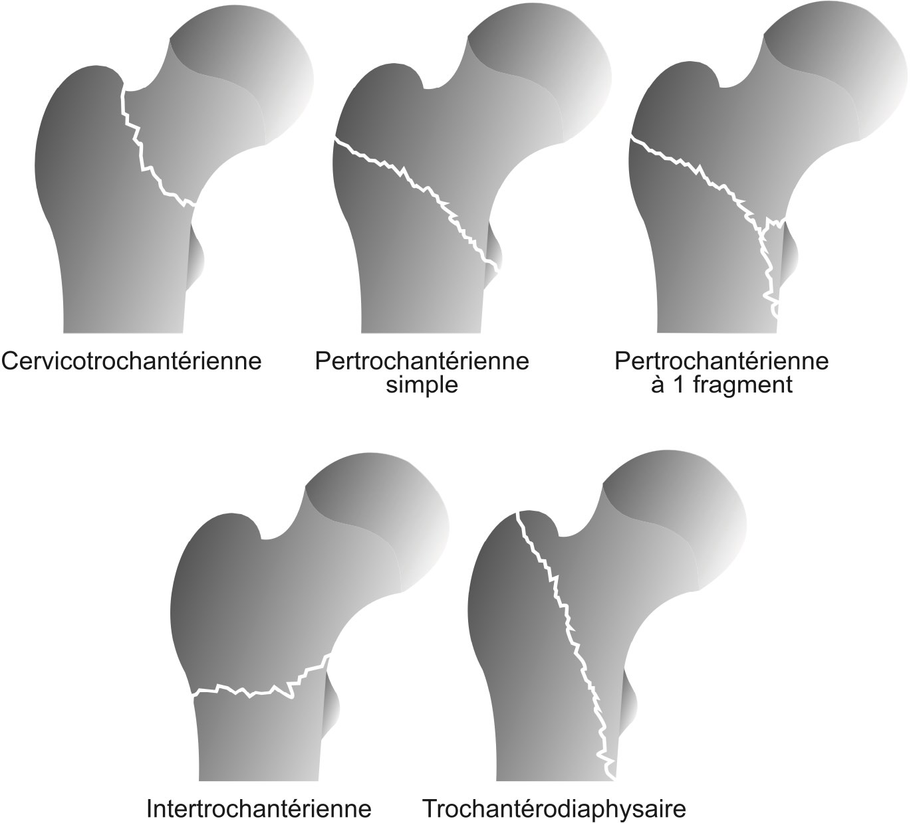
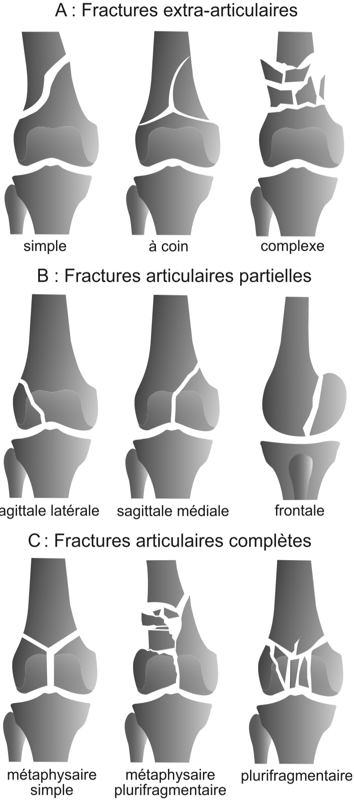
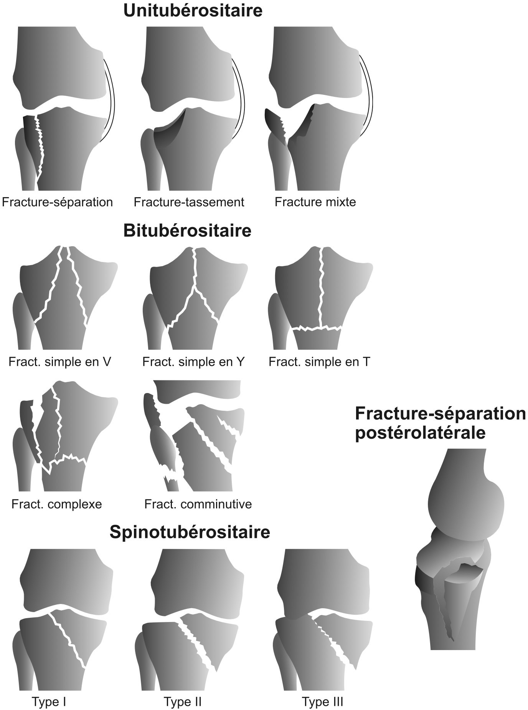
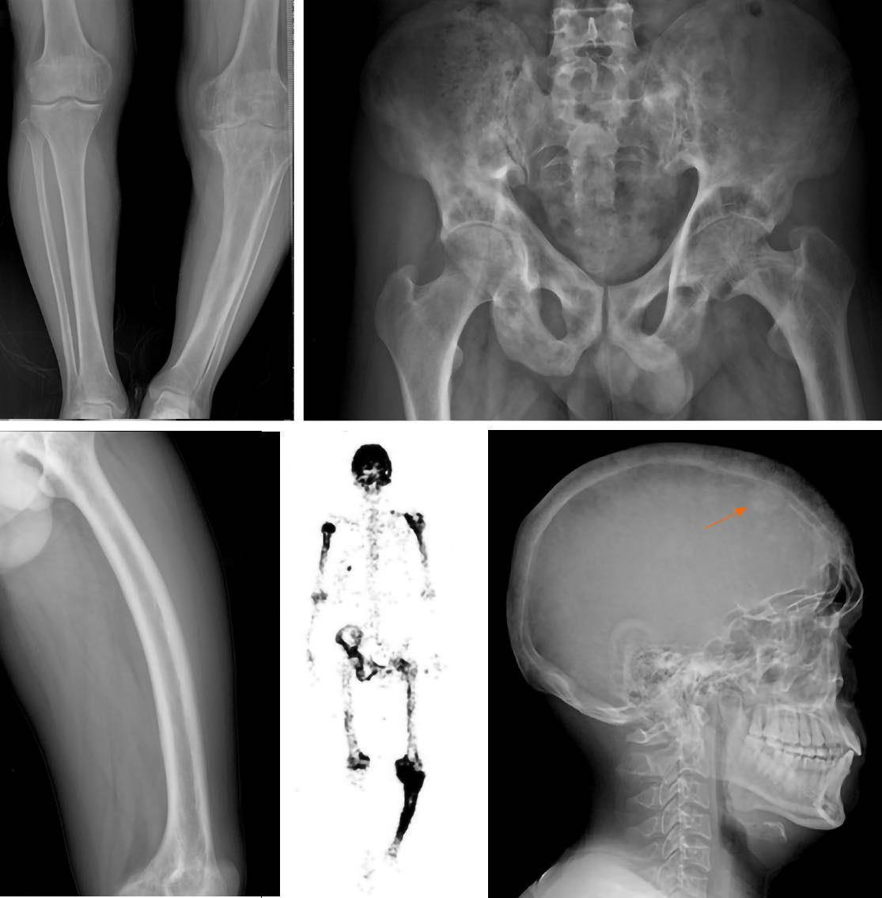

=== "vertébrale"
    !!! tip "**ostéoporose** [vs malin](https://radiopaedia.org/articles/spinal-compression-fracture?lang=gb){:target="_blank"}"
        - symétrique dans le plan frontal, rétropulsion coin postéro-sup.
        - multiples fractures vertébrales en compression
        - persistance de signal graisseux dans la moelle en T1
        - si doute => T1 post-gado montre une homogénéisation du signal 

=== "bassin"
    <figure markdown="span">
        {width="630"}  
         
        {width="600"}  
         
        {width="500"}
        **Avulsions apophysaires**  
    </figure>

=== "membres"
    <figure markdown="span">
        {width="650"}
        [Extrémité distale du **radius**](https://onclepaul.fr/wp-content/uploads/2011/07/Fractures-de-lextre%CC%81mite%CC%81-infe%CC%81rieure-du-radius-AT-2022.pdf){:target="_blank"}  
          
        {width="800"}
        [Classification de **Garden**](https://radiopaedia.org/articles/garden-classification-of-subcapital-femoral-neck-fractures){:target="_blank"}  
         
        {width="630"}  
         
        {width="380"}  
        {width="660"}   
    </figure>

=== "Paget"
    !!! tip "[Sémiologie](https://radiopaedia.org/articles/paget-disease-bone){:target="_blank"}"
        - hyperplasie, corticale épaissie, V pagétique, incurvation
        - structure fibrillaire grossière et dédifférentiation cortico-spongieuse
        - sites les plus fréquents = rachis, pelvis, crâne et en proximal des os longs

    <figure markdown="span">
        {width="650"}  
    </figure>