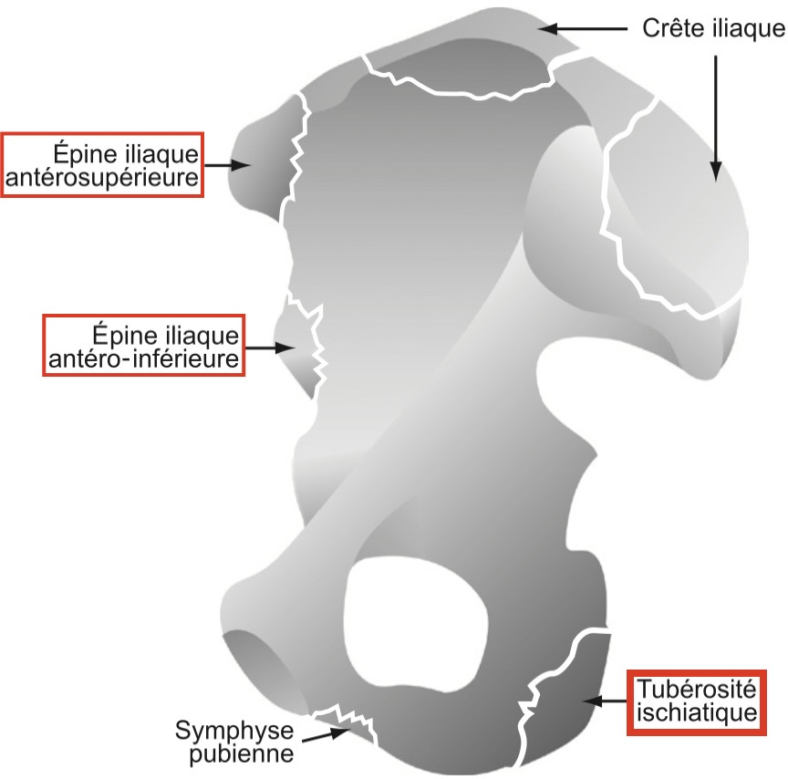

=== "MS"
    <figure markdown="span">
        [Radius](https://onclepaul.fr/wp-content/uploads/2011/07/Fractures-de-lextre%CC%81mite%CC%81-infe%CC%81rieure-du-radius-AT-2022.pdf){:target="_blank"}
    </figure>
=== "bassin"
    <figure markdown="span">
        {width="630"}  
         
        {width="600"}  
         
        {width="500"}
        **Avulsions apophysaires**  
    </figure>
=== "MI"
    <figure markdown="span">
        {width="800"}  
        {width="630"}  
         
        {width="380"}  
        {width="660"}   
    </figure>