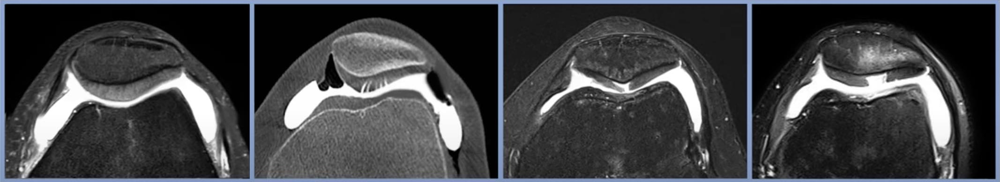

# IRM du genou

```
Séquences DP Fat Sat dans les 3 plans de l'espace, Sagittale T1.

Sur le plan ménisco-ligamentaire : 
Intégrité des ligaments croisés antérieur et postérieur. 
Intégrité des ligaments collatéraux médial et latéral. 
Intégrité du ménisque médial et latéral.

Sur le plan ostéo-cartilagineux : 
Intégrité des revêtements cartilagineux fémoropatellaire et fémorotibial médial et latéral. 
Pas d'épanchement intra-articulaire significatif. 
Pas de kyste poplité. 
Pas d'anomalie de signal suspect de remplacement ostéomédullaire. 

Sur le plan musculo-tendineux : 
Intégrité des structures musculotendineuses abarticulaires.  
```

<figure markdown="span">
    {width="900"}
    chondropathie grade **I** : signal hétérogène, **II** : < 50%, **III** : > 50%, **IV** : atteinte ss-chondrale
</figure>