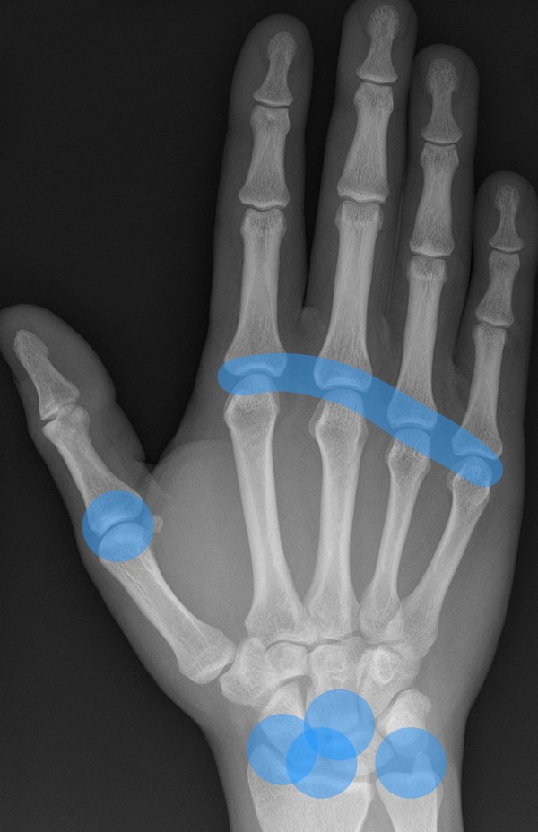

# [Maladies rhumatismales](https://radiopaedia.org/articles/inflammatory-arthritis){:target="_blank"}

| [arthrose](https://radiopaedia.org/articles/osteoarthritis){:target="_blank"} | [PR](https://radiopaedia.org/articles/rheumatoid-arthritis?lang=gb){:target="_blank"}  | [rhum pso](https://radiopaedia.org/articles/psoriatic-arthritis){:target="_blank"} | [goutte](https://radiopaedia.org/articles/gout){:target="_blank"} | [PPC](https://radiopaedia.org/articles/calcium-pyrophosphate-dihydrate-deposition-disease-1){:target="_blank"} |
| :----------: | :-------: | :-------: | :-------: | :-------: |
| {width="300"} | {width="300"} | {width="300"} | {width="300"} | {width="300"} |

=== "Maladies auto-immunes"

    ## [PR](https://radiopaedia.org/articles/rheumatoid-arthritis?lang=gb){:target="_blank"} 

    !!! tip "F50, mains/pieds, bilatéral et symétrique, par poussées"
        - **érosions marginales**, **déminéralisation**, **ténosynovites** et pincement global
        - 15% coxite rhumatoïde > épaules et coudes
        - luxation atloïdo-axoïdienne antérieure > 3 mm en flexion
        - nodules rhumatoïdes sous-cutanés et pulmonaires

    ## [SpA](https://radiopaedia.org/articles/seronegative-spondyloarthritis-1){:target="_blank"}

    !!! tip "[SpA ankylosante](https://radiopaedia.org/articles/ankylosing-spondylitis-1){:target="_blank"} = forme axiale, H35"
        - **sacro-iliite** bilatérale (DD arthrose = 1/3 moyen, bien limité, ostéophytes)
        - **charnière thoraco-lombaire** = coins antérieurs des vertèbres (mise au carré) + syndesmophytes
        - **enthésopathies périphériques** = tendon calcanéen++
        - articulations périphériques = hanches++

    !!! tip "[Rhumatisme psoriasique](https://radiopaedia.org/articles/psoriatic-arthritis){:target="_blank"} = forme périphérique, début vers 40 ans"
        - arthrite érosive **IPD** (DD arthrose = ailes de mouettes)
        - **ostéolyse / ankylose** des IPP 
        - **périostite** juxta-articulaire en bande ou en cupule
        - résorption des **houppes phalangiennes** ou ostéopériostite de la phalange distale

    !!! tip "[SAPHO](https://radiopaedia.org/articles/sapho-syndrome){:target="_blank"} = paroi thoracique antérieure"
        - Synovite Acné Pustulose Hyperostose Ostéite
        - **arthrite manubrio-sternale** et sterno-calviculaire
        - **ostéite vertébrale** lombaire et sacro-iliaque
        - synovite genoux et hanches (os longs chez l'enfant)

=== "Microcristaux"

    ## [Goutte](https://radiopaedia.org/articles/gout){:target="_blank"}

    !!! tip "1ère MTP > pied-cheville > membre sup."
        - très grandes érosions bien limitées marginales/para-articulaires
        - tophus périarticulaire ± proliférations osseuses réactionnelles
        - pincement articulaire tardif et ∅ raréfaction os adjacent (≠ PR)

    ## [Maladie à PPC](https://radiopaedia.org/articles/calcium-pyrophosphate-dihydrate-deposition-disease-1){:target="_blank"} 

    !!! tip "Genoux, Poignet, Symphyse pubienne"
        - fin liseré calcique intra-articulaire ([chondrocalcinose](https://radiopaedia.org/articles/chondrocalcinosis){:target="_blank"})
        - calcifications tendineuses linéaires/stratifiées
        - pincement sévère ± aspect crénelé des surfaces articulaires
        - peu d'ostéophytes et géodes volumineuses (≠ arthrose)

    !!! tip "Atteinte du rachis"    
        - périphérie des disques intervertébraux, zygapophyses
        - syndrome de la [dent couronnée](https://radiopaedia.org/articles/crowned-dens-syndrome){:target="_blank"} (pseudopannus rhumatoïde)
        - arthropathie sévère avec aspect microérosif (DD spondylodiscite)

        <figure markdown="span">
            {width="600"}
        </figure>

    ## [Résorption de PCB](https://radiopaedia.org/articles/hydroxyapatite-deposition-disease){:target="_blank"}

    !!! tip "Dépôts de cristaux de phosphate de calcium basique = épaule ++"
        - calcifications dans les tendons péri-articulaires denses, amorphes, bien limités
        - résorption = ↘ densité et contours irréguliers 

        <figure markdown="span">
            {width="400"}
        </figure>

        - ± érosion et migration intraosseuse

        <figure markdown="span">
            {width="400"}
        </figure>

        - centre des disques intervertébraux ± migration intraosseuse

        <figure markdown="span">
            {width="400"}
        </figure>