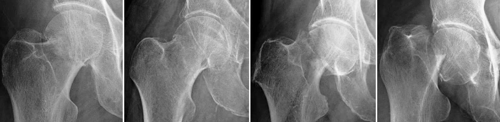

# Trauma

=== "MI"
    <figure markdown="span">
        {width="700"}  
        {width="550"}
        **Avulsions apophysaires**  
         
        {width="650"}  
        {width="800"}  
        {width="650"}  
        {width="400"}  
        {width="700"}   
    </figure>
=== "RACHIS/THO"
=== "MS"
