=== "LOMB"
    ``` title="TDM"
    Pas d'anomalie transitionnelle de la charnière lombo-sacrée.
    Lordose physiologique et bon alignement des corps vertébraux.
    Absence de fracture-tassement ou de déminéralisation osseuse.
    Pas de rétrécissement canalaire ou foraminal.
    Pas d'arthrose articulaire postérieure.
    Pas de lésion osseuse suspecte et parties molles sans particularité.
    ```
    ``` title="IRM"
    Pas d'anomalie transitionnelle de la charnière lombo-sacrée.
    Projection du cône médullaire en regard de 
    Respect de la hauteur des corps vertébraux.
    Pas d'étroitesse constitutionnelle du canal lombaire.
    Pas de lésion de remplacement ostéomédullaire.

    Discopathie
    Zygarthrose prédominant en

    En L1-L2 : Pas de rétrécissement canalaire ou foraminal.

    En L2-L3 : 

    En L3-L4 : 

    En L4-L5 : 
    
    En L5-S1 : 
    ```
    <figure markdown="span">
        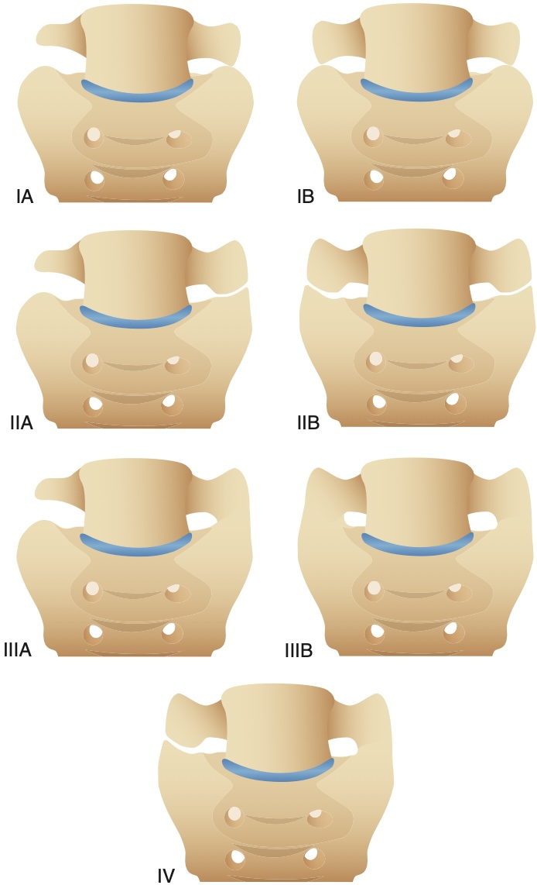{width="380"}
        **Castellvi** I = processus transverse élargi ≥ 19 mm d'axe craniocaudal, II = pseudo-articulation avec le sacrum, III = lombalisation ou sacralisation complète, IV = II + III  
        </br>
        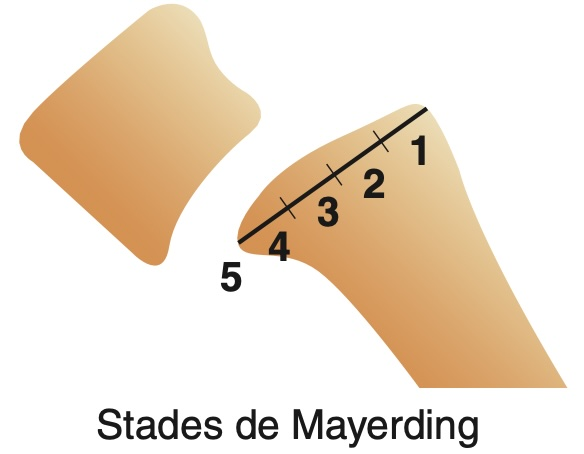{width="230"}  
        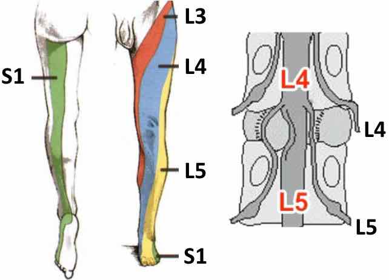{width="400"}
        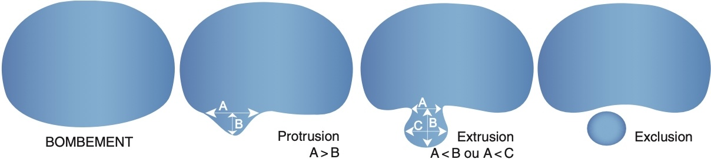{width="690"}
        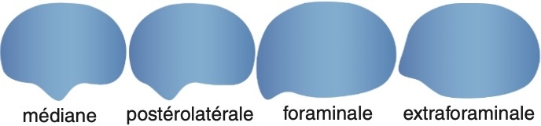{width="440"}  
        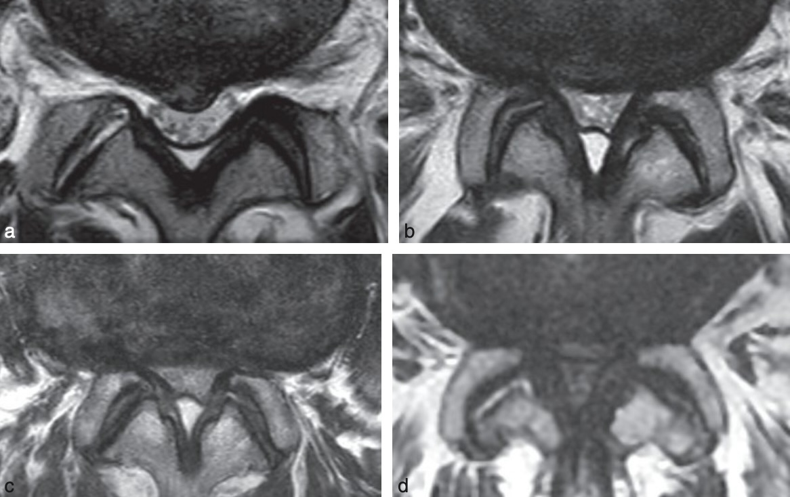{width="420"}
        **Rétrécissement** modéré si diamètre antéro-postérieur < 12 mm voire sévère < 10 mm  
        Sténose minime : LCS visible, modérée : peu visible, sévère : ∅ LCS, extrême : ∅ graisse épidurale  
        </br>
        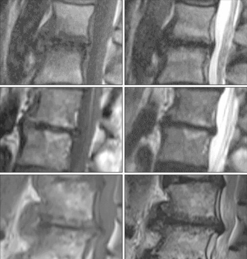{width="300"}
        **Modic** I = inflammatoire « œdémateux », II = involution graisseuse, III = fibrose
    </figure>


=== "CERVICAL"
    ``` title="TDM"
    Absence d’anomalie de la charnière cervico-occipitale.
    Lordose physiologique et bon alignement des corps vertébraux.
    Rapports articulaires, hauteurs somatiques et espaces intersomatiques respectés.
    Absence de rétrécissement significatif du canal vertébral ou des foramina.
    Absence de lésion osseuse post-traumatique ou suspecte.
    Parties molles paravertébrales sans particularité.
    ```

    ``` title="IRM"
    Lordose physiologique du rachis cervical conservée.
    Hauteurs somatiques et rapports articulaires conservés.
    Absence d’anomalie de la charnière cervico-occipitale.
    Absence de discopathie significative.
    Pas d'étroitesse constitutionnelle du canal rachidien.
    Absence d’anomalie du signal du cordon médullaire ou du LCR.
    Parties molles notamment pré-vertébrales sans particularité.
    ```
    
    <figure markdown="span">
        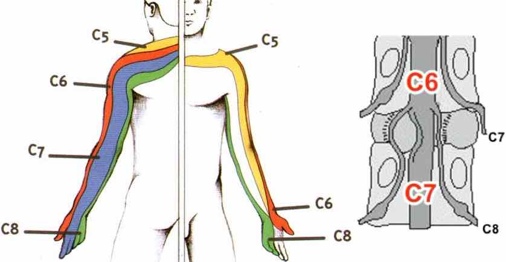{width="420"}
    </figure>


=== "SCOLIOSE"
    ```
    Scoliose  mesurant ° entre le plateau supérieur de  et le plateau inférieur de .
    Stade d'ossification Risser 
    Bascule du bassin par dénivelation vers la 
    Absence de malformation ou de lésion vertébrale décelable.
    ```
    <figure markdown="span">
        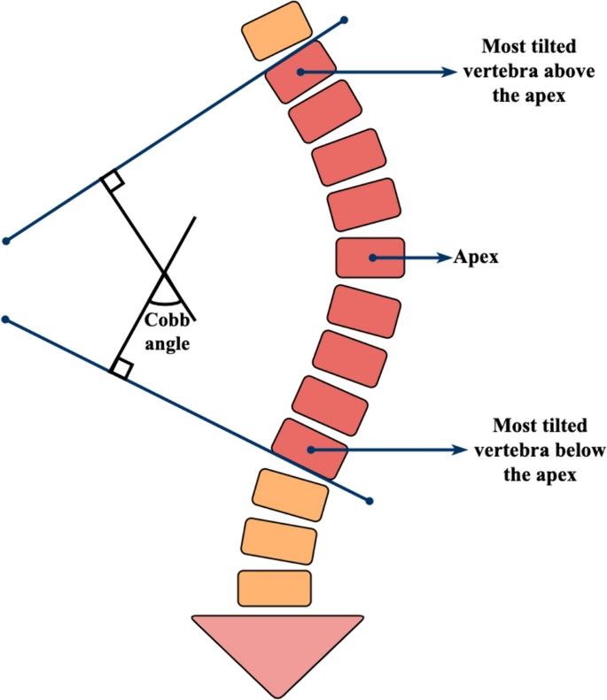{width="400"}
        mauvais Pc si > 30°  
        </br>
        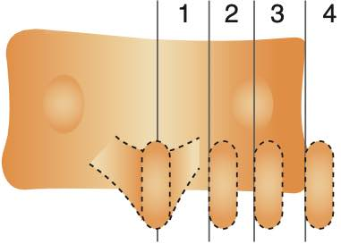{width="230"}
        degré rotation vertébrale selon Cobb en fonction de l'épineuse  
        </br>
        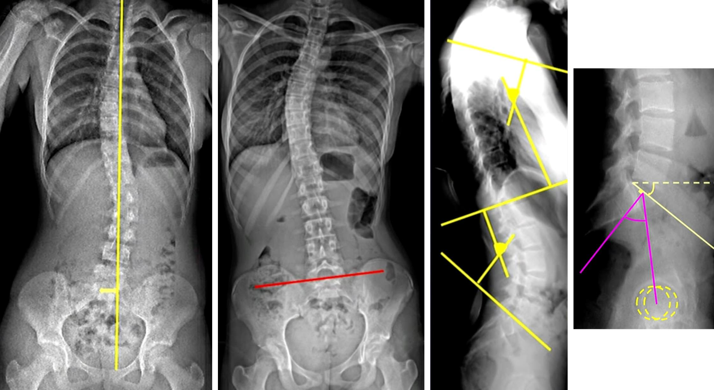{width="900"}
        déséquilibre frontal (fil à plomb électronique centré sur T1)  
        bascule du bassin  
        cyphose thoracique - lordose lombaire (T4 - vertèbre jonctionnelle - S1)  
        pente sacrée et incidence pelvienne  
        </br>
        {width="450"}
        évolution à la puberté **jusqu'à Risser 3**  
        +/- après la ménopause (scoliose dégénérative)
    </figure>


