=== "Lombaire"
    ```
    Séquences sagittale T1, sagittale et coronale T2 STIR, ainsi que 3D T2.
    
    Dernier disque mobile nommé L5-S1.
    Projection du cône médullaire en regard de L.
    Pas de lésion de remplacement ostéomédullaire suspecte.
    Respect de la hauteur et bon alignement des corps vertébraux.
    Pas d'étroitesse constitutionnelle du canal rachidien.
    
    Arthrose zygapophysaire prédominant en  sans œdème des berges articulaires.
    Discopathie dégénérative prédominant en  avec remaniements de type Modic .

    En L1-L2 : Le disque est en place. Pas de rétrécissement canalaire ou foraminal. 
    En L2-L3 : Le disque est en place. Pas de rétrécissement canalaire ou foraminal. 
    En L3-L4 : Le disque est en place. Pas de rétrécissement canalaire ou foraminal. 
    En L4-L5 : Etalement discal global avec composante foraminale, sans rétrécissement canalaire ou foraminal significatif ni argument en faveur d’un conflit discoradiculaire.
    En L5-S1 : Etalement discal global avec composante foraminale, sans rétrécissement canalaire ou foraminal significatif ni argument en faveur d’un conflit discoradiculaire.
    ```

    <figure markdown="span">
        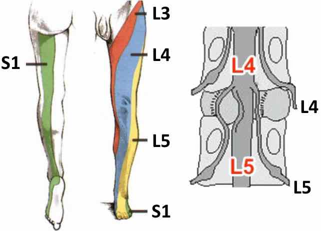{width="400"}  
        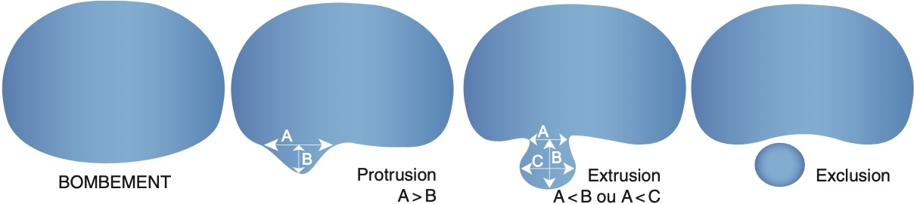{width="720"}
        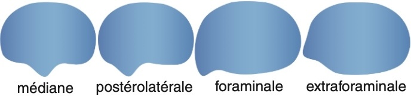{width="480"}  
        <br>
        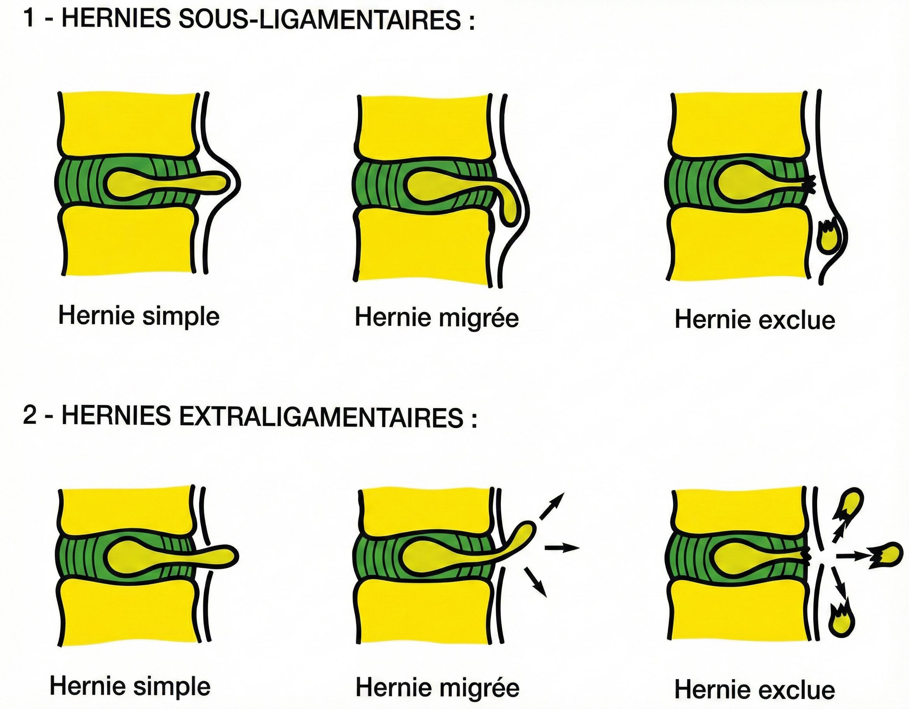{width="560"}
        vocabulaire = migration craniale/caudale; fragment exclu épidural  
        <br>
        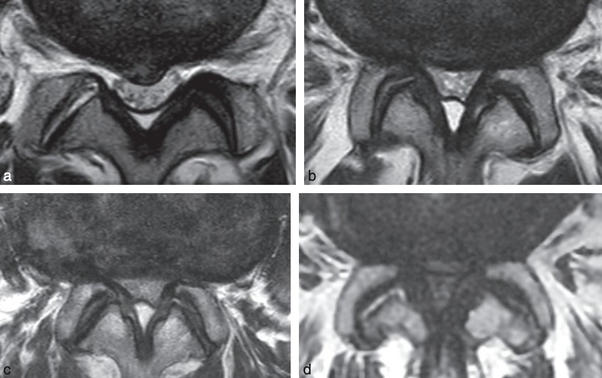{width="450"}
        Etroitesse constitutionnelle relative si diam. ant.-post. < 12 mm voire absolue < 10 mm  
        Sténose minime : LCS visible, modérée : peu visible, sévère : ∅ LCS, extrême : ∅ graisse épidurale  
        <br>
        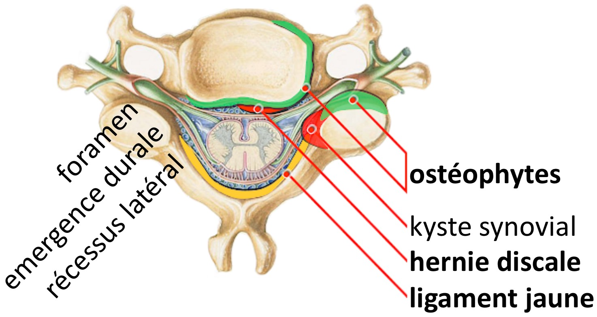{width="430"}  
        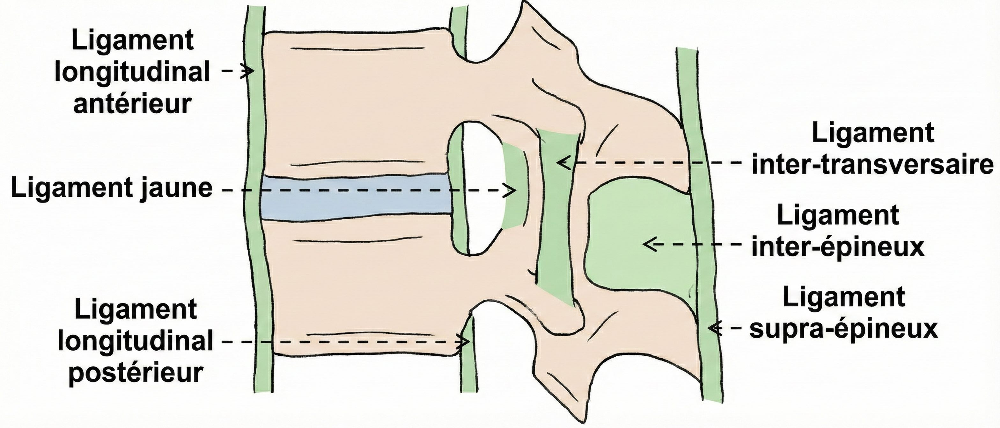{width="590"}          
        <br>
        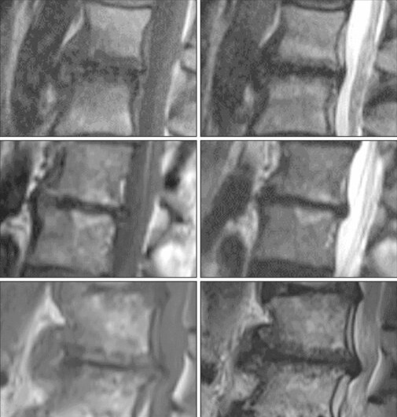{width="350"}
        **Modic** I = inflammatoire « œdémateux », II = involution graisseuse, III = fibrose
    </figure>

    ``` mermaid
    graph TD
        A[Symptôme principal ?] --> B[Lombalgie]
        A --> C[Radiculalgie]
        A --> D[Claudication]

        B -->|médiane| H[discopathie<br>Baastrup]
        B -->|latéralisée| I[AAP<br>Bartolotti]
        B -->|musculaire| J[scoliose]

        C --> K[HD</br>kyste articulaire<br>sténose foraminale]
        D --> L[canal étroit<br>et/ou rétréci]
    ```

    ``` title="TDM"
    Le dernier disque mobile est nommé L5-S1.
    Lordose physiologique et bon alignement des corps vertébraux.
    Absence de fracture-tassement ou de déminéralisation osseuse.
    Pas de rétrécissement canalaire ou foraminal.
    Pas d'arthrose articulaire postérieure.
    Pas de lésion osseuse suspecte et parties molles sans particularité.
    ```

    <figure markdown="span">
        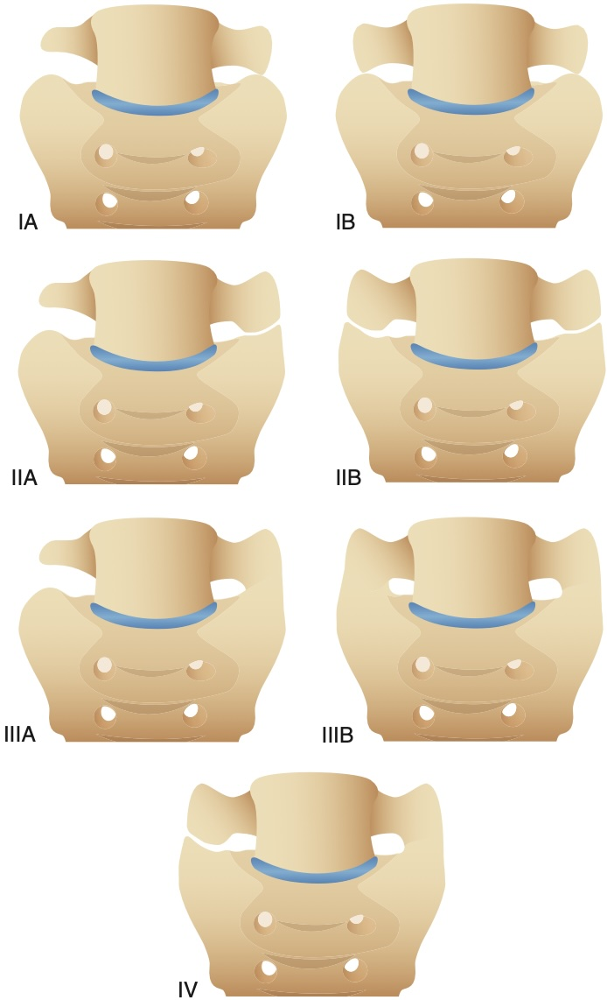{width="380"}
        **Castellvi** **I** = processus transverse élargi ≥ 19 mm d'axe craniocaudal,  
        **II** = pseudo-articulation avec le sacrum, **III** = lombalisation ou sacralisation complète, **IV** = II + III  
        </br>
        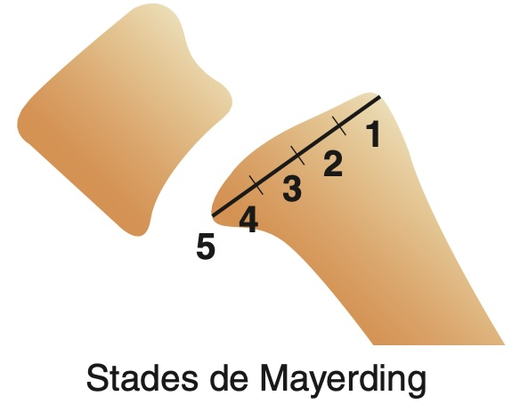{width="270"}  
    </figure>


=== "Cervical"
    ``` title="TDM"
    Absence d’anomalie de la charnière cervico-occipitale.
    Lordose physiologique et bon alignement des corps vertébraux.
    Rapports articulaires, hauteurs somatiques et espaces intersomatiques respectés.
    Absence de rétrécissement significatif du canal vertébral ou des foramina.
    Absence de lésion osseuse post-traumatique ou suspecte.
    Parties molles paravertébrales sans particularité.
    ```

    ``` title="IRM"
    Séquences sagittales T1 et T2 STIR, ainsi que 3D T2.

    Lordose physiologique du rachis cervical conservée.
    Hauteurs somatiques et rapports articulaires conservés.
    Absence d’anomalie de la charnière cervico-occipitale.
    Absence de discopathie significative.
    Pas d'étroitesse constitutionnelle du canal rachidien.
    Absence d’anomalie du signal du cordon médullaire ou du LCR.
    Parties molles notamment pré-vertébrales sans particularité.
    ```
    
    <figure markdown="span">
        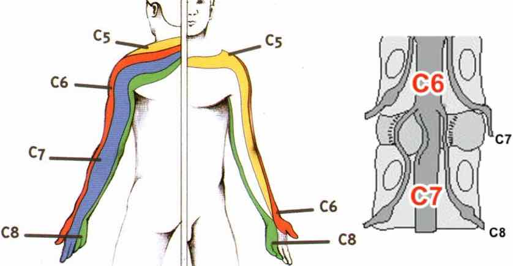{width="500"}
    </figure>


=== "Moelle"

    <figure markdown="span">
        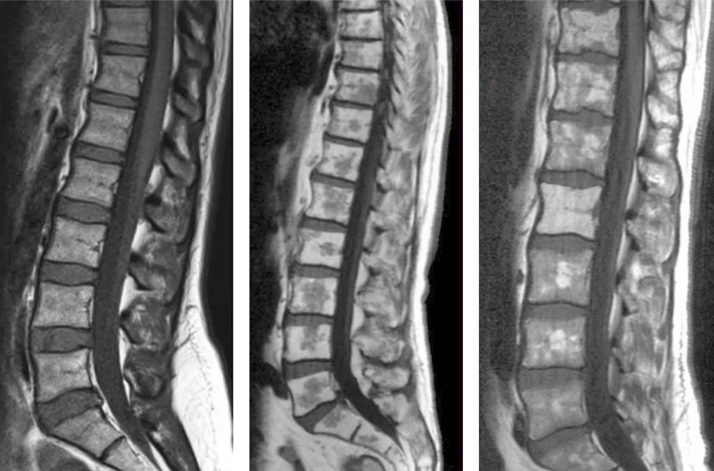{width="700"}
        aspect normal **moelle jaune** (graisse) = HT1 avec **ilôts de moelle rouge** (hématopoïétique) = hT1  
        <br>
        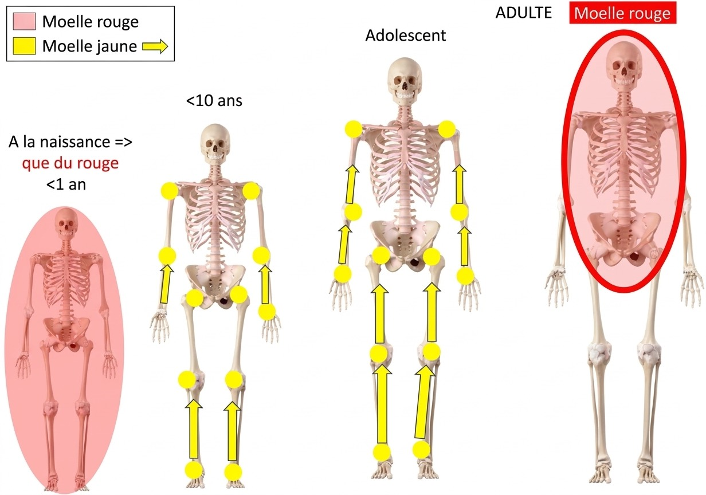{width="700"}
        apparition progressive **moelle jaune dans les membres** = épiphyses > diaphyses > métaphyses
    </figure>

    !!! tip "Modifications"
        - ↗ moelle <span style="background-color: #FFD966; color: black; padding: 2px 6px; border-radius:4px; ">jaune</span> = fracture ancienne, discopathie Modic 3, radiothérapie
        - ↗ moelle <span style="background-color: #ff0000; color: black; padding: 2px 6px; border-radius:4px; ">rouge</span> (épargne les apophyses et épiphyses) = sportif, fumeur, obèse, anémie, G-CSF

        <figure markdown="span">
            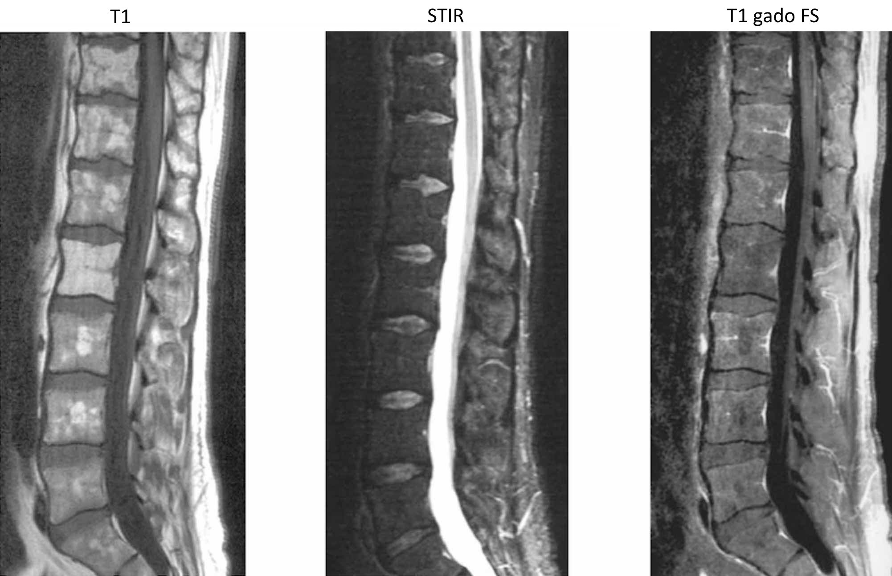{width="700"}
            **reconversion médullaire** = ilôts hT1 avec faible rehaussement
        </figure>

    <figure markdown="span">
        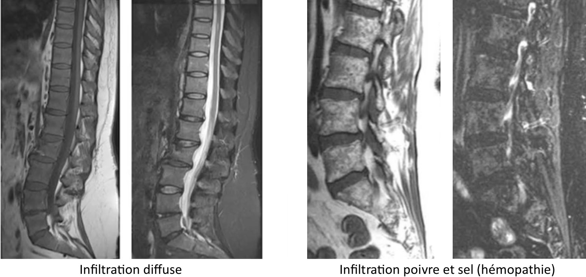{width="750"}
        moelle en **hT1 par rapport au disque** et HSTIR par rapport aux muscles  
        => à confronter au bilan biologique avec électrophorèse des protéines sériques
    </figure>

=== "Scoliose"
    ```
    Scoliose  mesurant ° entre le plateau supérieur de  et le plateau inférieur de .
    Stade d'ossification Risser 
    Bascule du bassin par dénivelation vers la 
    Absence de malformation ou de lésion vertébrale décelable.
    ```
    
    <figure markdown="span">
        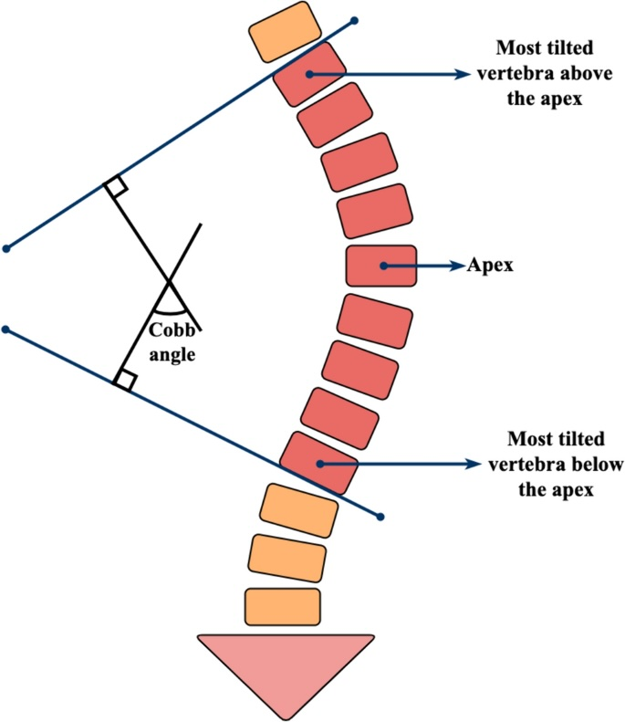{width="400"}
        mauvais Pc si > 30°  
        </br>
        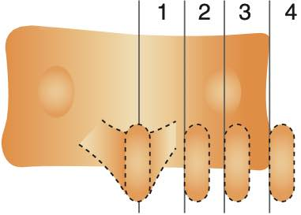{width="230"}
        degré rotation vertébrale selon Cobb en fonction de l'épineuse  
        </br>
        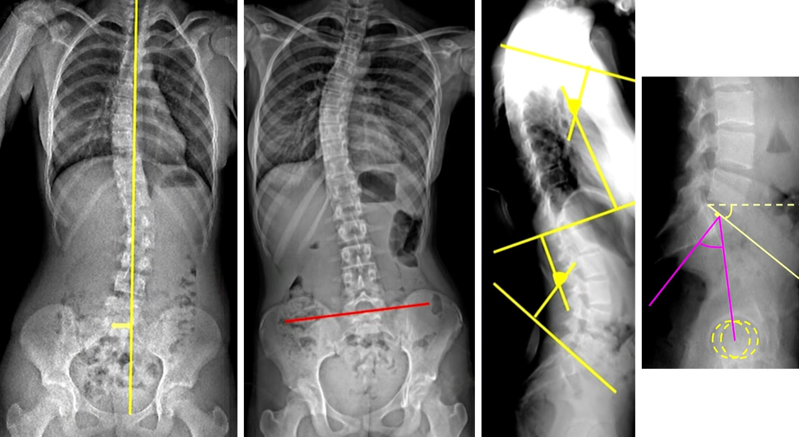{width="900"}
        déséquilibre frontal (fil à plomb électronique centré sur T1)  
        bascule du bassin (axe du pleateau supérieur de S1)  
        cyphose thoracique - lordose lombaire (T4 - vertèbre jonctionnelle - S1)  
        pente sacrée et incidence pelvienne  
        </br>
        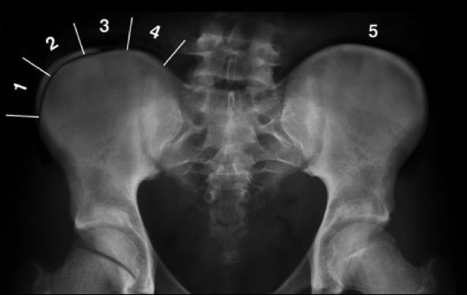{width="450"}
        évolution à la puberté **jusqu'à Risser 3**  
        (Risser 1 à 13-14 ans pour les filles et 15-16 ans pour les garçons)
    </figure>


=== "Scheuermann"

    !!! tip "[Distrophie rachidienne de croissance](https://radiopaedia.org/articles/scheuermann-disease-2){:target="_blank"} = ado avec cyphose > 45° ± douleurs"
        - **cunéïformisation** vertébrale
        - **irrégularité** des plateaux vertébraux
        - **élargissement** antéro-postérieur
        - **pincements** intersomatiques
        - atteinte **listels** marginaux antérieurs

    <figure markdown="span">
        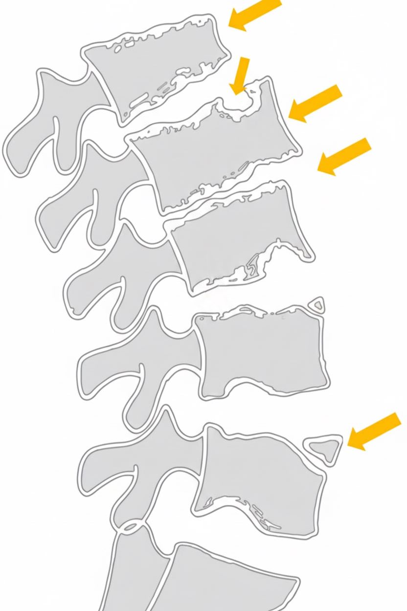{width="300"}
    </figure>


=== "Spondylodiscite"