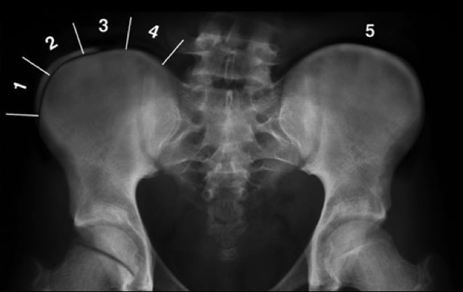

=== "LOMB"
    ``` title="Rx"
    Lordose physiologique et bon alignement des corps vertébraux.
    Absence de fracture-tassement ou de déminéralisation osseuse.
    Intégrité des rapports articulaires et des espaces intersomatiques.
    Pas de lésion osseuse suspecte et parties molles sans particularité.
    ```
    ``` title="TDM"
    Pas d'anomalie transitionnelle de la charnière lombo-sacrée.
    Lordose physiologique et bon alignement des corps vertébraux.
    Absence de fracture-tassement ou de déminéralisation osseuse.
    Pas de rétrécissement canalaire ou foraminal.
    Pas d'arthrose articulaire postérieure.
    Pas de lésion osseuse suspecte et parties molles sans particularité.
    ```
    ``` title="IRM"
    Pas d'anomalie transitionnelle de la charnière lombo-sacrée.
    Projection du cône médullaire en regard de 
    Pas de fracture-tassement vertébrale.
    Pas d'étroitesse constitutionnelle du canal lombaire.
    Pas de lésion de remplacement médullaire dans le cadre osseux.

    Bon alignement des corps vertébraux.
    Discopathie
    Arthrose articulaire postérieure en

    L1-L2 : Pas de rétrécissement canalaire ou foraminal.
    L2-L3 : Pas de rétrécissement canalaire ou foraminal.
    L3-L4 : Pas de rétrécissement canalaire ou foraminal.
    L4-L5 : Pas de rétrécissement canalaire ou foraminal.
    L5-S1 : Pas de rétrécissement canalaire ou foraminal.
    ```
    <figure markdown="span">
        {width="380"}
        **Castellvi** I = processus transverse élargi ≥ 19 mm d'axe craniocaudal, II = pseudo-articulation avec le sacrum, III = lombalisation ou sacralisation complète, IV = II + III  
        </br>
        {width="230"}  
        {width="400"}
        {width="690"}
        {width="440"}  
        {width="420"}
        **Rétrécissement** modéré si diamètre antéro-postérieur < 12 mm voire sévère < 10 mm  
        Sténose minime : LCS visible, modérée : peu visible, sévère : ∅ LCS, extrême : ∅ graisse épidurale  
        </br>
        {width="300"}
        **Modic** I = inflammatoire « œdémateux », II = involution graisseuse, III = fibrose
    </figure>

=== "SCOLIOSE"
    ```
    Scoliose  mesurant ° entre le plateau supérieur de  et le plateau inférieur de , avec un sommet au niveau de .
    Cyphose thoracique (T4-) mesurant ° et lordose lombaire (-S1) mesurant °.
    Pente sacrée mesurant ° et incidence pelvienne mesurant °.

    Ossification sans particularité pour l'âge, avec un stade Risser 
    Absence de déséquilibre frontal ou de bascule du bassin.
    Absence de malformation vertébrale congénitale.
    ```
    <figure markdown="span">
        {width="500"}
        mauvais Pc si > 30°  
        </br>
        {width="230"}
        degré rotation vertébrale selon Cobb en fonction de l'épineuse  
        </br>
        {width="900"}
        déséquilibre frontal (fil à plomb électronique centré sur T1)  
        bascule du bassin  
        cyphose thoracique - lordose lombaire (T4 - vertèbre jonctionnelle - S1)  
        pente sacrée et incidence pelvienne  
        </br>
        {width="450"}
        évolution à la puberté **jusqu'à Risser 3**  
        +/- après la ménopause (scoliose dégénérative)
    </figure>

=== "CERVICAL"
    <figure markdown="span">
        {width="420"}
    </figure>