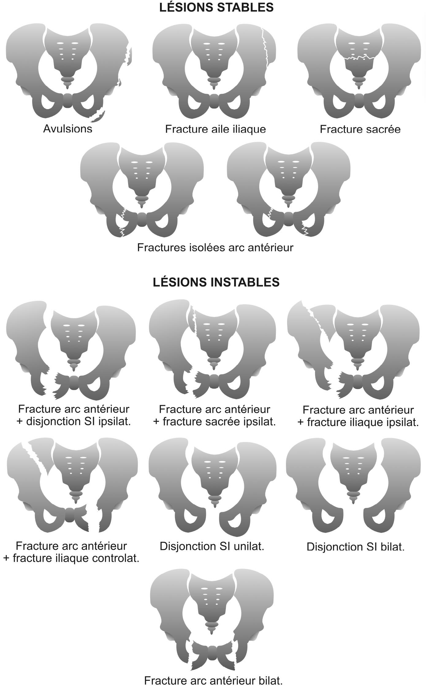
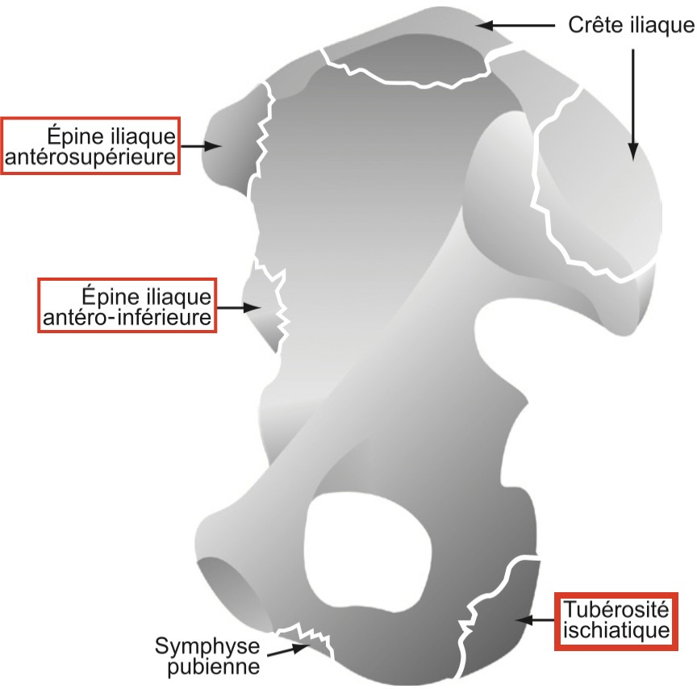
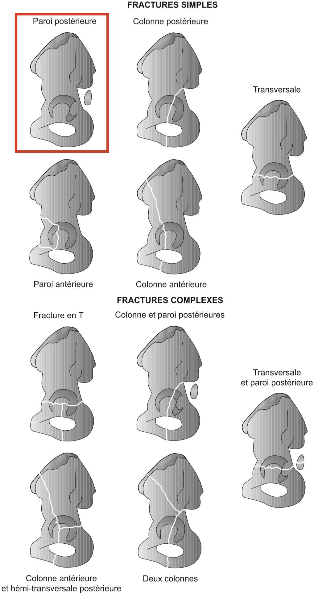
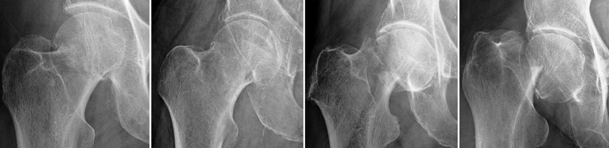
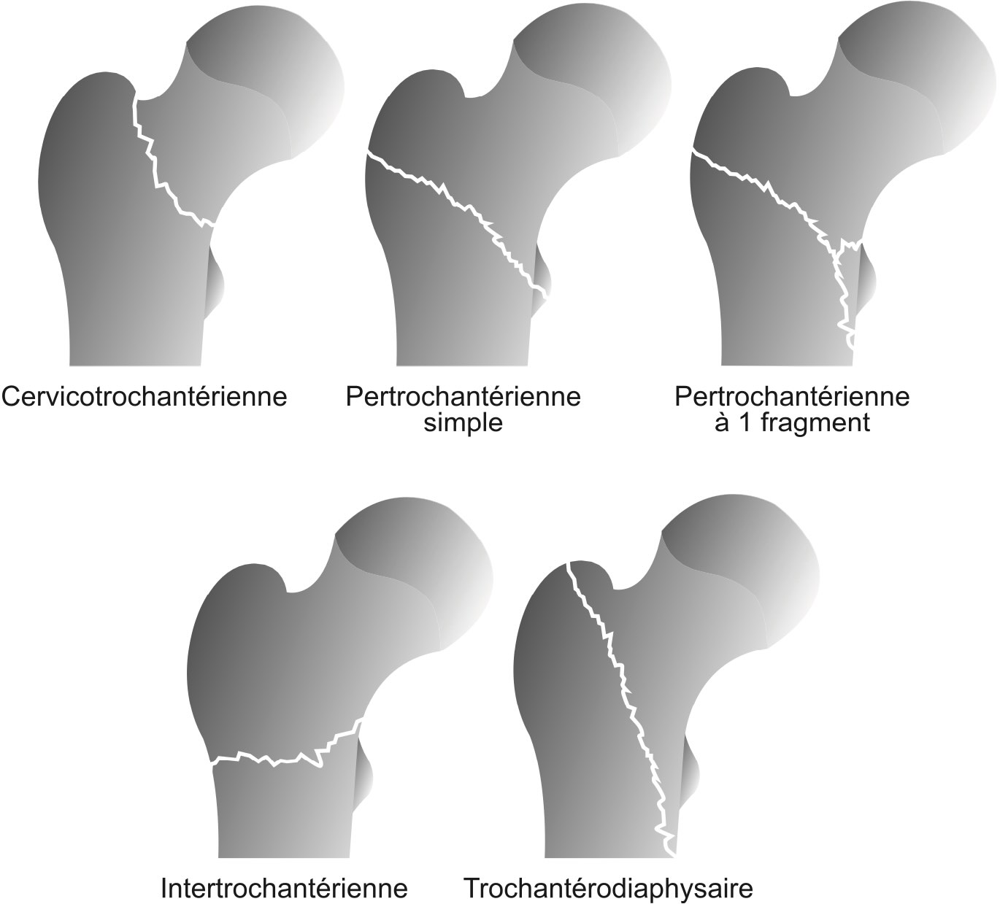
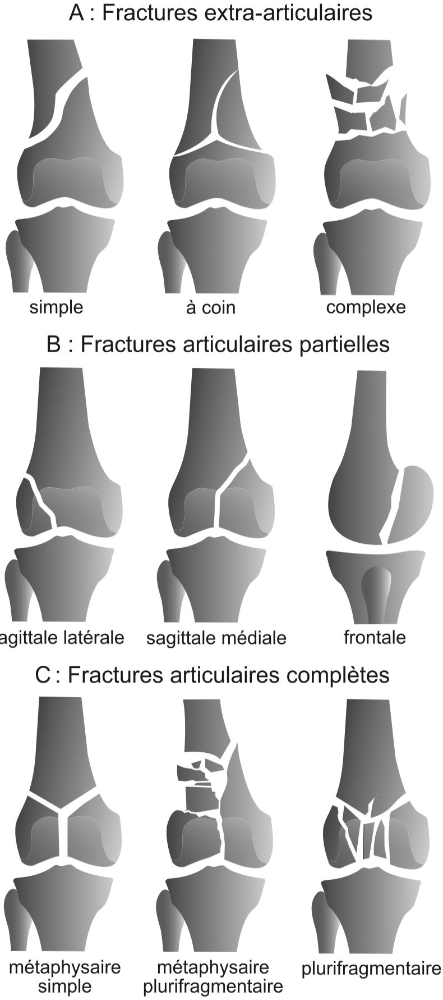
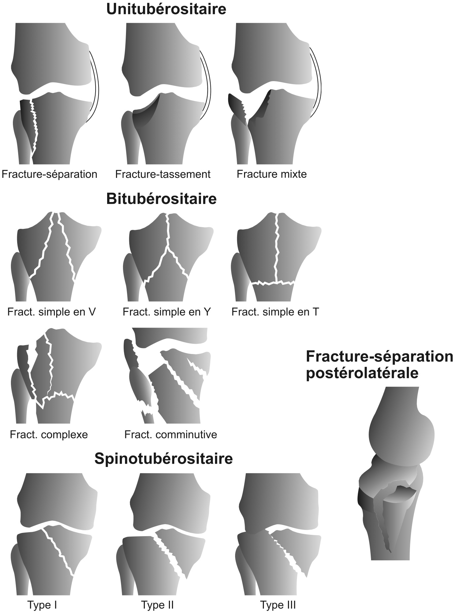

# Trauma

=== "MI"
    <figure markdown="span">
        {width="600"}  
        {width="500"}
        **Avulsions apophysaires**  
         
        {width="630"}  
        {width="800"}  
        {width="630"}  
        {width="380"}  
        {width="660"}   
    </figure>
=== "RACHIS/THO"
=== "MS"
