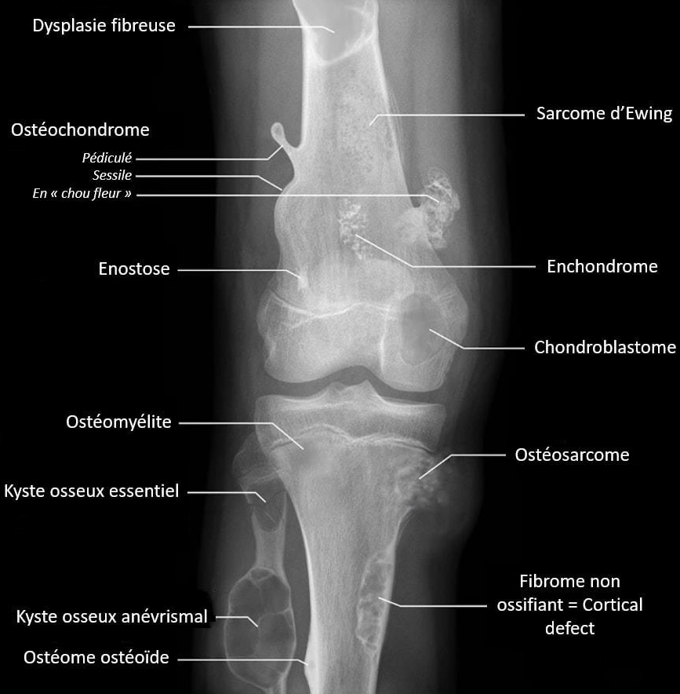
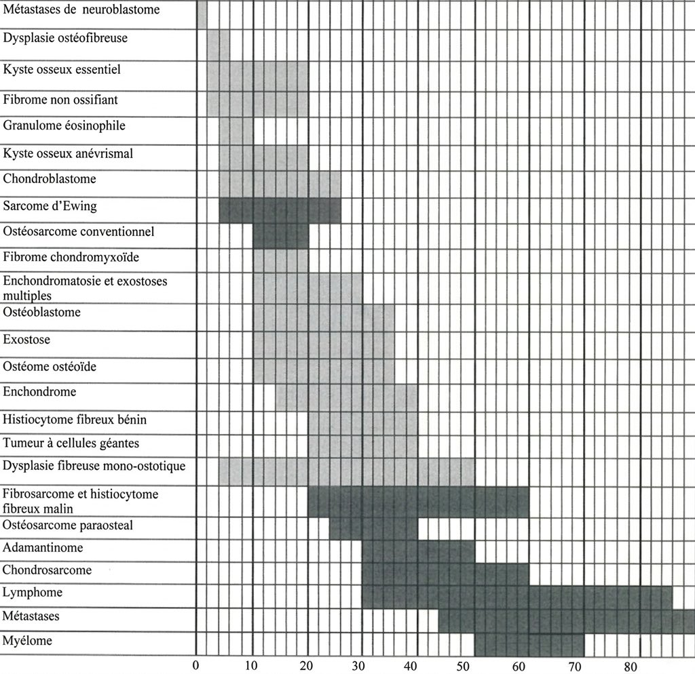

# [Tumeurs osseuses](https://radiopaedia.org/articles/bone-tumors-overview){:target="_blank"}

<figure markdown="span">
    {width="700"}  
    [{width="800"}](http://onclepaul.net/wp-content/uploads/2011/07/Critères-dagressivité-15%EF%80%A202%EF%80%A213-light.pdf){:target="_blank"}
    tumeurs bénignes 100 x plus fréquentes que les malignes
</figure>