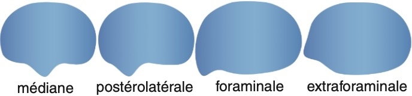
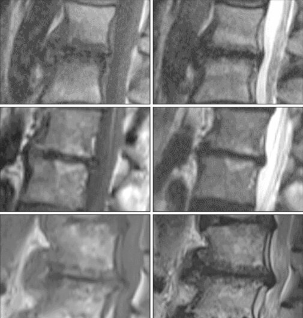

# Urgences ostéo-articulaires

=== "Hernie discale"
    ```
    Séquences sagittales T1 et T2 Dixon, 3D T2 et coronale T2 STIR.

    Pas d'anomalie transitionnelle de la charnière lombo-sacrée.
    Pas de lésion de remplacement ostéomédullaire suspecte.
    Projection du cône médullaire en regard de 
    Pas d'anomalie de signal du cordon médullaire.
    Respect de la hauteur des corps vertébraux.
    Pas d'étroitesse constitutionnelle du canal lombaire.
    Zygarthrose prédominant en

    En L1-L2 : 
    Intégrité du disque intevertébrale.
    Pas de rétrécissement canalaire ou foraminal.

    En L2-L3 : 

    En L3-L4 : 

    En L4-L5 : 
    
    En L5-S1 : 
    ```

    <figure markdown="span">
        {width="400"}
        {width="720"}
        {width="480"}  
        {width="450"}
        Etroitesse constitutionnelle relative si diam. ant.-post. < 12 mm voire absolue < 10 mm  
        Sténose minime : LCS visible, modérée : peu visible, sévère : ∅ LCS, extrême : ∅ graisse épidurale  
        </br>
        {width="450"}  
        </br>
        {width="350"}
        **Modic** I = inflammatoire « œdémateux », II = involution graisseuse, III = fibrose
    </figure>

=== "Tendon d'Achille"
    ```
    Solution de continuité des fibres du tendon calcanéen occupée par une plage hétérogène mesurant  mm.
    Distance entre le rebord supérieur du calcanéum et la rupture :  mm.
    Pas de réductibilité lors de la flexion plantaire du pied.
    Pas d'argument pour une tendinopathie sous-jacente.
    Pas d'arrachement osseux.
    ```
    <figure markdown="span">
        {width="400"}  
    </figure>

=== "Boiterie fébrile"
    ```
    Hanche :
    Pas d'épanchement en regard du col fémoral.
    
    Genou :
    Pas d'épanchement au sein du récessus sous-quadricipital.
    
    Cheville :
    Pas d'épanchement talo-crural.
    ```