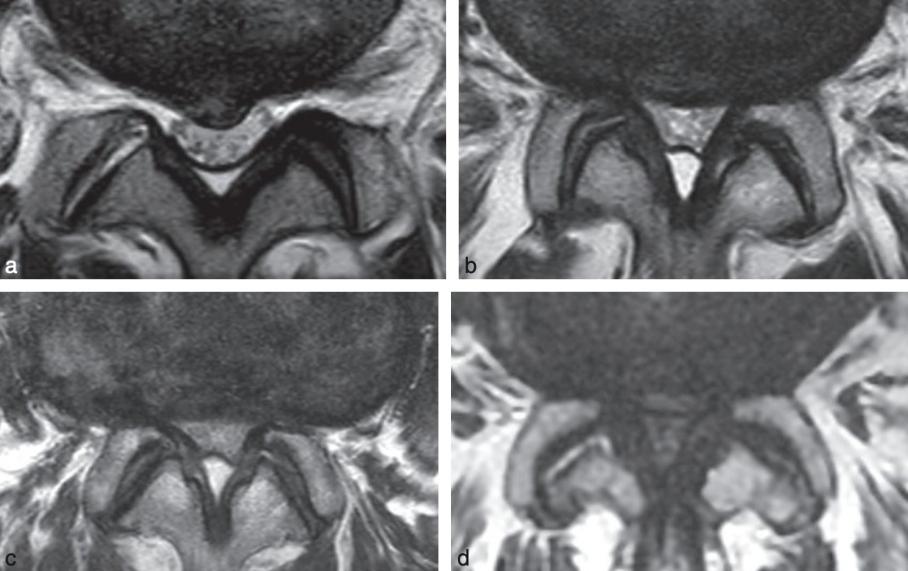

# Urgences ostéo-articulaires

=== "Hernie discale"
    ```
    Séquences sagittale T1, sagittale et coronale T2 STIR, ainsi que 3D T2.
    
    Dernier disque mobile nommé L5-S1.
    Projection du cône médullaire en regard de L.
    Pas de lésion de remplacement ostéomédullaire suspecte.
    Respect de la hauteur et bon alignement des corps vertébraux.
    Pas d'étroitesse constitutionnelle du canal.

    En T12-L1, L1-L2, L2-L3, L3-L4, L4-L5, L5-S1 : Pas de rétrécissement canalaire ni foraminal.

    En

    En
    ```

    <figure markdown="span">
        {width="400"}  c 
        {width="720"}
        {width="480"}  
        <br>
        {width="56 0"}
        vocabulaire = migration craniale/caudale; fragment exclu épidural  
        <br>
        {width="450"}
        Etroitesse constitutionnelle relative si diam. ant.-post. < 12 mm voire absolue < 10 mm  
        Sténose minime : LCS visible, modérée : peu visible, sévère : ∅ LCS, extrême : ∅ graisse épidurale  
        <br>
        {width="450"}
        <br>
        {width="350"}
        **Modic** I = inflammatoire « œdémateux », II = involution graisseuse, III = fibrose
    </figure>

    ``` mermaid
    graph TD
        A[Symptôme principal ?] --> B[Lombalgie]
        A --> C[Radiculalgie]
        A --> D[Claudication]

        B -->|médiane| H[discopathie<br>Baastrup]
        B -->|latéralisée| I[AAP<br>Bartolotti]
        B -->|musculaire| J[scoliose]

        C --> K[HD</br>kyste articulaire<br>sténose foraminale]
        D --> L[canal étroit<br>et/ou rétréci]
    ```

=== "Tendon d'Achille"
    ```
    Solution de continuité des fibres du tendon calcanéen occupée par une plage hétérogène mesurant  mm.
    Distance entre le rebord supérieur du calcanéum et la rupture :  mm.
    Pas de réductibilité lors de la flexion plantaire du pied.
    Pas d'argument pour une tendinopathie sous-jacente.
    Pas d'arrachement osseux.
    ```
    <figure markdown="span">
        {width="400"}  
    </figure>

=== "Boiterie fébrile"
    ```
    Hanche :
    Pas d'épanchement en regard du col fémoral.
    
    Genou :
    Pas d'épanchement au sein du récessus sous-quadricipital.
    
    Cheville :
    Pas d'épanchement talo-crural.
    ```