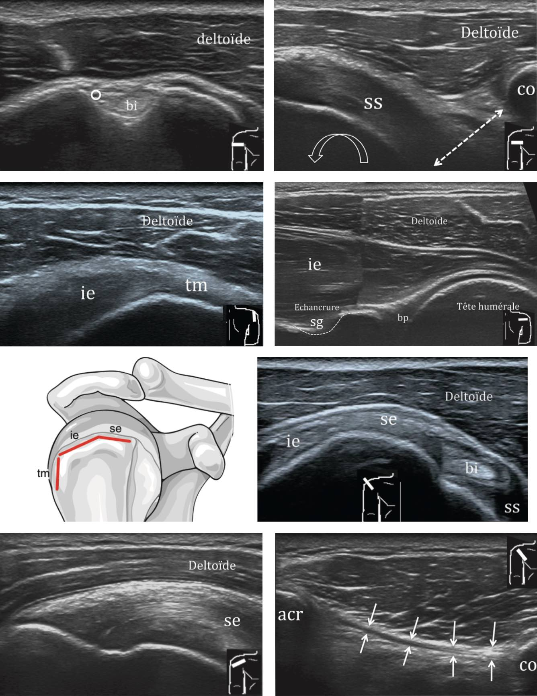

<figure markdown="span">
    {width="540"}  
    {width="420"}
</figure>

=== "ECHO"
    ```
    Régions antérieure et postérieure (rotation neutre, coude à 90°, paume en haut) :
    Tendon du long biceps en place, d'aspect normal, sans épanchement significatif.
    Intégrité du tendon subscapulaire, avec bon glissement sous la coracoïde.
    Distance coracoïde-trochin mesurant
    Intégrité des tendons du court biceps, du coraco-brachial et du petit pectoral.
    Intégrité des ligaments acromio-coracoïdien et coraco-claviculaires.
    Intégrité des tendons des muscles infra-épineux et teres minor.

    Région antéro-supérieure (main à plat sur la fesse, coude en rétropulsion) :
    Pas d'anomalie du tendon du muscle supra-épineux.
    Pas d'épaississement ni d'épanchement de la bourse sous-acromio-deltoïdienne.
    Intégrité des tendons et ligaments dans l'intervalle des rotateurs.
    Intégrité acromio-claviculaire, sans mobilité anormale lors du cross arm.
    Pas de conflit sous-acromial de la manœuvre de Neer.

    Pas de lésion osseuse décelable.
    ```
    <figure markdown="span">
        {width="650"}
    </figure>

=== "arthroTDM"
    ```
    Bon alignement des structures osseuses.
    Absence de fracture, d'anomalie osseuse focale, ou de remaniements dégénératifs.
    Absence de rupture des tendons de la coiffe des rotateurs.
    Absence d'épanchement intra-articulaire.
    Trophicité musculaire conservée.
    ```