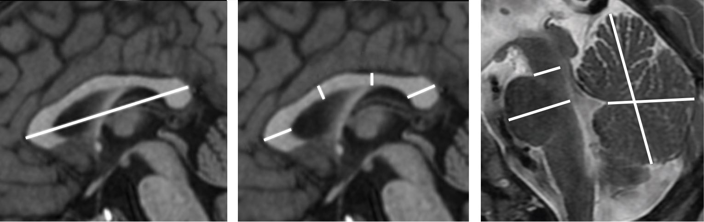
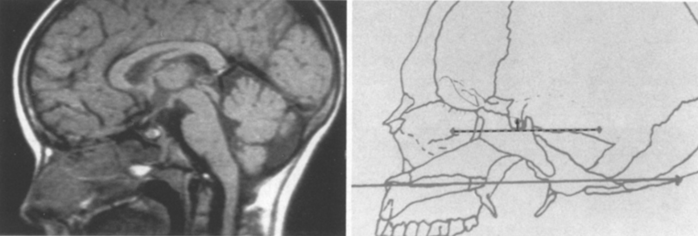

# [Biométrie neuropédiatrique](https://neuroradiologie.fr/outils){:target="_blank"}

<figure markdown="span">
    {width="700"}
</figure>

  <form onsubmit="return false;">
    <!-- Sélecteurs : Années | Mois | Sexe -->
    

      <input id="years" type="text" inputmode="numeric" pattern="\d*" placeholder="Années" />
      <input id="months" type="text" inputmode="numeric" pattern="\d*" placeholder="Mois" />
      <select id="sex">
        <option value="G" selected>Garçon</option>
        <option value="F">Fille</option>
      </select>
    

    <!-- Résultats -->
    

      

        <!-- Corps calleux -->
        

          <h4><a href="https://www.ajnr.org/content/ajnr/32/8/1436.full.pdf" target="_blank" rel="noopener">Corps calleux</a> (mm)</h4>
          <table class="tbl" id="cc-table">
            <thead><tr><th></th><th>3è p.</th><th>97è p.</th></tr></thead>
            <tbody>
              <tr data-key="APD"><td>Grand axe</td><td class="p3"></td><td class="p97"></td></tr>
              <tr data-key="GT"><td>Genou</td><td class="p3"></td><td class="p97"></td></tr>
              <tr data-key="BT"><td>Corps</td><td class="p3"></td><td class="p97"></td></tr>
              <tr data-key="IT"><td>Isthme</td><td class="p3"></td><td class="p97"></td></tr>
              <tr data-key="ST"><td>Splénium</td><td class="p3"></td><td class="p97"></td></tr>
            </tbody>
          </table>
        

        <!-- Fosse postérieure -->
        

          <h4><a href="https://www.ajnr.org/content/ajnr/early/2019/10/17/ajnr.A6257.full.pdf" target="_blank" rel="noopener">Fosse postérieure</a> (mm)</h4>
          <table class="tbl" id="cb-table">
            <thead><tr><th></th><th>3è p.</th><th>97è p.</th></tr></thead>
            <tbody>
              <tr data-key="APD-MP"><td>Mésencéphale</td><td class="p3"></td><td class="p97"></td></tr>
              <tr data-key="APD-P"><td>Pont</td><td class="p3"></td><td class="p97"></td></tr>
              <tr data-key="H-V"><td>Vermis H</td><td class="p3"></td><td class="p97"></td></tr>
              <tr data-key="APD-V"><td>Vermis AP</td><td class="p3"></td><td class="p97"></td></tr>
            </tbody>
          </table>
        

      

      <!-- Mesures hypophysaires -->
      

        <h4><a href="https://www.em-consulte.com/article/231459/imagerie-de-la-region-sellaire-normale-et-patholog" target="_blank" rel="noopener">Mesures hypophysaires</a></h4>
        

          <table class="tbl" id="pit-table">
            <thead>
              <tr><th></th><th>5è p.</th><th>10è p.</th><th>25è p.</th><th>50è p.</th><th>75è p.</th><th>90è p.</th><th>95è p.</th></tr>
            </thead>
            <tbody>
              <tr><th scope="row"><a href="https://link.springer.com/article/10.1007/BF02018614" target="_blank" rel="noopener">Hauteur</a> (mm)</th><td class="height-minus" colspan="3"></td><td class="height-mean"></td><td class="height-plus" colspan="3"></td></tr>
              <tr><th scope="row"><a href="https://link.springer.com/article/10.1007/s00247-022-05505-5" target="_blank" rel="noopener">Volume</a> (mm³)</th><td class="p5"></td><td class="p10"></td><td class="p25"></td><td class="p50"></td><td class="p75"></td><td class="p90"></td><td class="p95"></td></tr>
            </tbody>
          </table>
        

      

    

  </form>

<figure markdown="span">
    {width="600"}
    Mesurer la hauteur hypophysaire perpendiculairement au plan parallèle au palais
</figure>
