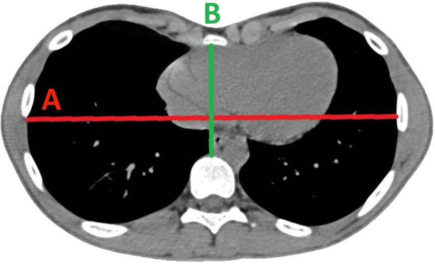

# Indice de [Haller](https://radiopaedia.org/articles/haller-index?lang=gb){:target="_blank"}

<figure markdown="span">
    {width="350"}
</figure>

  <form onsubmit="return false;" oninput="hallerCompute()">
    

      

        <input id="a" type="text" inputmode="decimal" placeholder="A (mm)" />
        <input id="b" type="text" inputmode="decimal" placeholder="B (mm)" />
      

    

    

      

        
—

        

          <button type="button" class="copy" id="haller-copy" disabled>Copier</button>
          
        

      

    

    

      <button type="button" class="clear" onclick="hallerClear()">Effacer</button>
    

  </form>

