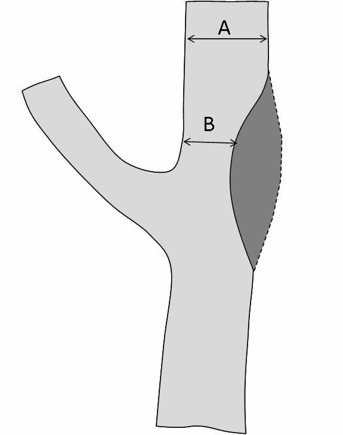

# Calcul d'une sténose selon [NASCET](https://www.ahajournals.org/doi/epdf/10.1161/01.STR.22.6.711){:target="_blank"}

<figure markdown="span">
    {width="300"}
</figure>

  <form onsubmit="return false;">
    

        <input id="a" type="text" inputmode="decimal" placeholder="A" />
        <input id="b" type="text" inputmode="decimal" placeholder="B" />
    

    

      

        
— %

      

    

    

      <button id="clear" type="button">Effacer</button>
    

  </form>

<figure markdown="span">
    (1 − B / A) × 100  
    50% < sténose modérée < 70% < sévère < 90% < pré-occlusive  
    (vide de flux ARM = > 80% si calibre Ⓝ en aval / > 90% si réduit)  
    = athérome linéaire/sessile/pédiculé ± Ca2+/ulcéré
</figure>