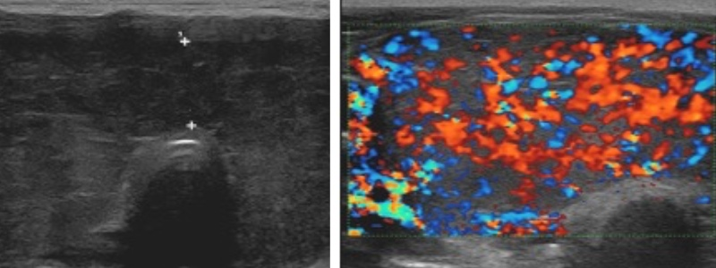

# [Echographie thyroïdienne](https://cireol.net/wp-content/uploads/2017/05/2017-CIREOL-EUTIRADS.pdf){:target="_blank"}

<link rel="stylesheet" href="https://cdnjs.cloudflare.com/ajax/libs/font-awesome/6.0.0/css/all.min.css">

  
  

    
    

        <select id="echostructure" onchange="updateReport()">
            <option value="hyper" selected>Hyperéchogène</option>
            <option value="hypo">Hypoéchogène</option>
        </select>
        <select id="aspect" onchange="updateReport()">
            <option value="homo" selected>Homogène</option>
            <option value="heter">Hétérogène</option>
        </select>
    

    

        <select id="contours" onchange="updateReport()">
            <option value="reguliers" selected>Contours réguliers</option>
            <option value="lobules">Contours lobulés</option>
        </select>
        <select id="vascularisation" onchange="updateReport()">
            <option value="none" selected>Pas d'hypervascularisation</option>
            <option value="moderate">Hypervascularisation < 1 m/s</option>
            <option value="intense">Hypervascularisation > 1 m/s</option>
        </select>
    

    

        <input id="ld" type="number" inputmode="decimal" placeholder="Lobe droit (cc)" oninput="updateReport()" />
        <input id="lg" type="number" inputmode="decimal" placeholder="Lobe gauche (cc)" oninput="updateReport()" />
    

  

  

      

          <canvas id="thyroidCanvas"></canvas>
          

              <button type="button" class="action-btn" onclick="addNoduleVisual()">
                <i class="fas fa-plus"></i> Nodule
              </button>
              <button type="button" class="action-btn" id="btn-copy-schema" onclick="copySchema()" title="Copier le schéma">
                <i class="fas fa-copy"></i>
              </button>
              <button type="button" class="action-btn" id="btn-download-schema" onclick="downloadSchema()" title="Télécharger le schéma">
                <i class="fas fa-download"></i>
              </button>
              <button type="button" class="action-btn" onclick="copyReportOnly()" title="Copier le compte-rendu sans schéma" id="btn-copy-cr">
                CR
              </button>
          

      

  

  

  

      <button type="button" class="btn-main-copy" id="btn-copy-full" onclick="copyFullReport()">
         CR ± Schéma
      </button>
      
      <button type="button" class="btn-reset" onclick="fullReset()">
         Effacer
      </button>
  

<textarea id="report-text"></textarea>

<figure markdown="span">
    <b>4-10 cc/lobe</b> (< 9 cc ♀ et < 8 cc ado), Doppler < 40 cm/s, 20% [lobe pyramidal](https://radiopaedia.org/articles/pyramidal-lobe-of-thyroid){:target="_blank"}  
    nodule EU-TIRADS 3 < 20 mm ou 4 < 15 mm => **surveillance à 1a**, puis 2-3a, puis 5a  
     
</figure>

| [EU-TIRADS](https://cireol.net/wp-content/uploads/2017/05/2017-CIREOL-EUTIRADS.pdf){:target="_blank"} | Critères | Cytoponction | Malignité |
| :---: | :---: | :---: | :---: |
| 2 6% | anéchogène/spongiforme | compressif | 0% |
| 3 60% | iso/hyperéchogène | > 20 mm | 3% |
| 4 30% | modérément hypo | > 15 mm | 15% |
| 5 4% | très hypo, microCa, irrégulier, h>l | > 10 mm | 50% |

<figure markdown="span">
    **contours irréguliers** = au moins 3 lobulations/spicules, **microCa** = au moins 5    
    **↗ taille significative** +2 mm dans 2 diam. / 50% en volume => [cytoponction](https://lamediatheque.radiologie.fr/mediatheque/media.aspx?mediaId=2896&channel=3277){:target="_blank"}
</figure>

=== "Basedow"
    - goitre hypoéchogène **homogène**, Ac anti-récepteur de la TSH (TRAK)
    - hypervascularisation intense **> 1 m/s** ("thyroid inferno" > 50% parenchyme)
    - récidive : plus hétérogène et moins vascularisé
    <figure markdown="span">
        {width="500"}
    </figure>
=== "Hashimoto"
    - goitre hypoéchogène **micronodulaire**, Ac anti-TPO +/- anti-Tg
    - hypervascularisation modérée **< 1 m/s**
    - suivi/an, travées fibreuses hyperécho, /!\ lymphome/cancer
    <figure markdown="span">
        {width="500"}
    </figure>
=== "De Quervain"
    - contexte viral, douloureux
    - plages hypoéchogènes mal limitées peu vascularisées
    - contrôle à M3 si pseudonodulaire
    <figure markdown="span">
        {width="500"}
    </figure>
=== "Hyperpara"
    - 80% [adénome](https://radiopaedia.org/articles/parathyroid-adenoma){:target="_blank"} parathyroïdien > 15% hyperplasie > 5% carcinome
    - nodule hypoéchogène homogène > 1 cm + hyperhémie
    - à confronter à scintigraphie MIBI / TEP choline
    <figure markdown="span">
        {width="500"}
    </figure>