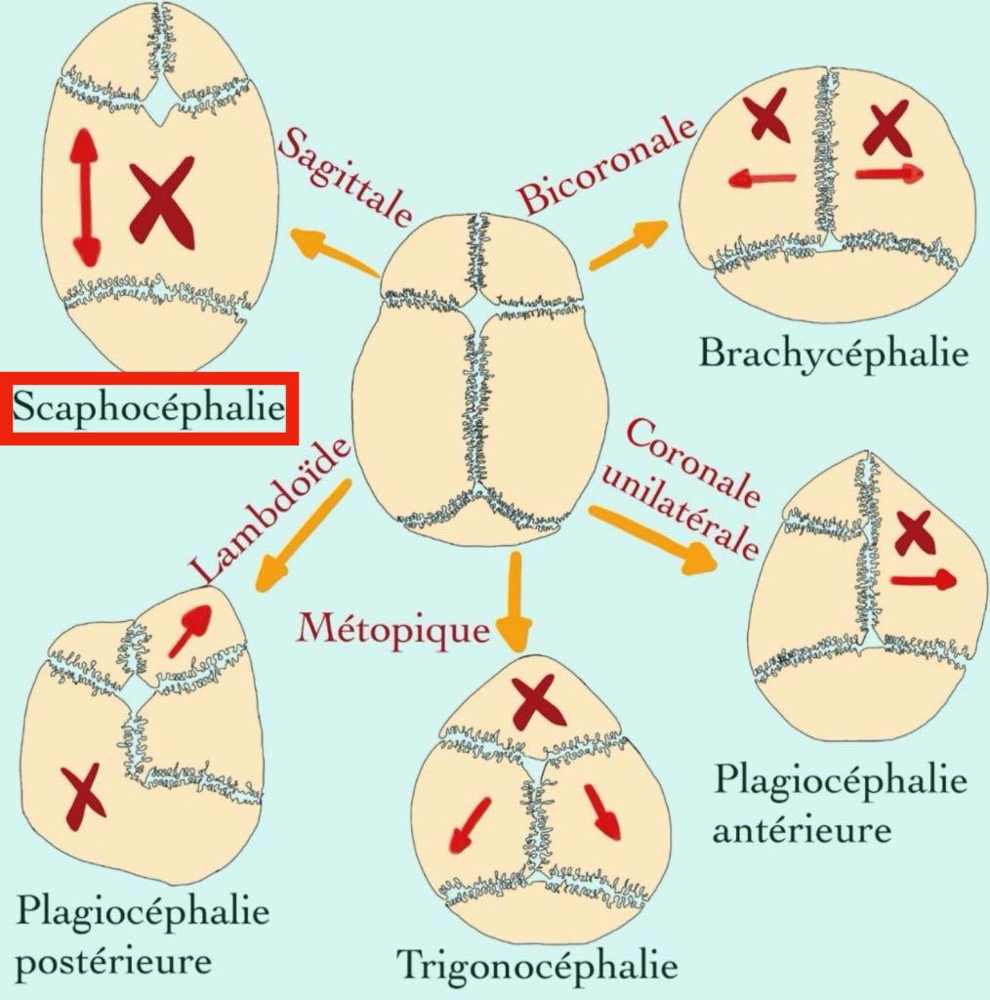
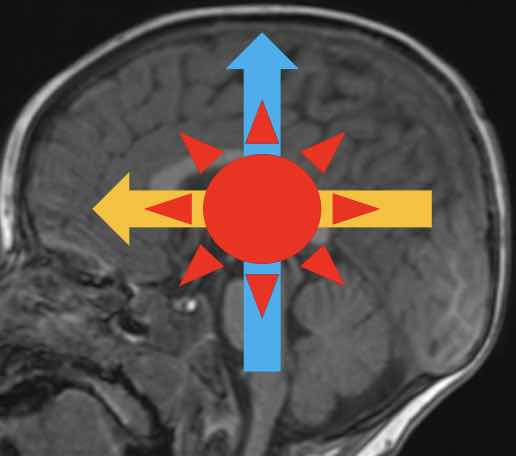

# [SNC](https://onclepaul.fr/wp-content/uploads/2011/07/3-Cours-Radiopediatrie-MERM-Imagerie-Neuroradiologique-Pediatrique.pdf){:target="_blank"}

=== "ANAT"

    <figure markdown="span">
        {width="800"}
        [craniosténose](https://radiopaedia.org/articles/craniosynostosis?lang=us){:target="_blank"} = fermeture prématurée d'une suture  
        {width="400"}  
    </figure>

    !!! tip "[Myélinisation](https://radiopaedia.org/articles/normal-myelination){:target="_blank"} de la substance blanche = [atlas](https://www.myelinationmriatlas.com/6-months.html){:target="_blank"} {width="150"} "
        - NNé = fini en sous-tentoriel, puis bas → haut, arr → avt, centre → périph
        - hyperT1 commençant aux bras post. des capsules internes, terminé à M6
        - hypoT2 sus-tentoriel d'apparition très progressive **jusqu'à 2-4 ans**
        - FLAIR retardé : pas de myélinisation sus-tenoriel avant 1 an
        - [leucodystrophies](https://radiopaedia.org/articles/leukodystrophies){:target="_blank"} = anomalies de la myélinisation

    </br>
    !!! warning "DD macrocéphalie"
        - < M6 (ETF ± IRM) = HSD, hydrocéphalie, tumeur
        - \> M6 (IRM) = [épanchement péricérébral](https://radiopaedia.org/articles/benign-enlargement-of-the-subarachnoid-space-in-infancy){:target="_blank"} +++, sténose foramens jugulaires, [et autres](https://radiopaedia.org/articles/macrocephaly){:target="_blank"}


=== "TC"
    
    !!! danger "TC accidentel"
        - exam neuro normal = pas d'imagerie (surveillance 6h aux urgences)
        - signes neuros (**mydriase**) = HED/HSD/HIP, HSA (anévrysme ?! ++++) = neurochir 🚨
        - Coma + TDM normale = IRM ([lésions axonales diffuses](https://radiopaedia.org/articles/diffuse-axonal-injury){:target="_blank"}, corps calleux, dissection TSA)
        - Suspicion de brèche de la dure-mère = IRM avec T2 FS

    !!! danger "TC non accidentel (maltraitance) = 30% †"
        - /!\ **fractures** linéaires axiales et fractures enfoncements
        - **HSD** par rupture des veines en pont, 80% bilatéral, PAS DE DATATION
        - **HSA** (50% des cas) chercher anévrysme ++++, HIP et pétéchies (IRM)
        - **lésions anoxo-ischémiques** = œdème (dédifférenciation SB-SG, cervelet blanc)
        - IRM J2-3 avec sag STIR cervicale = lésions musculaires liées au secouement ?


=== "ORL"

    <figure markdown="span">
        [adénite cervicale](https://radiopaedia.org/articles/cervical-adenitis){:target="_blank"} = virale ++ (sauf unilatéral = bactérien) = abcédation ?
    </figure>

    !!! example "sinusite"
        - pneumatisation ethmoïde NNé < maxillaire 3a < frontale et sphénoïdale 5-10a
        - ethmoïdite = [Chandler](https://radiopaedia.org/articles/chandler-classification-of-orbital-infections){:target="_blank"} (III abcès sous-périosté et V thrombose sinus caverneux) 
        <figure markdown="span">
            {width="450"}
        </figure>
        - DD = [dacryocystite](https://radiopaedia.org/articles/dacryocystitis){:target="_blank"}

    !!! example "[mastoïdite aiguë](https://radiopaedia.org/articles/acute-mastoiditis){:target="_blank"}"
        - M6 - 3a = complication d'une otite moyenne aiguë
        - abcès sous-périosté péri-auriculaire ± abcès épidural et TVC

    !!! example "[abcès péri-amygdalien](https://radiopaedia.org/articles/peritonsillar-abscess){:target="_blank"}"
        - adénomégalie de densité liquidienne avec PDC périph = NON spécifique d'un abcès
        - sd de [Lemierre](https://radiopaedia.org/articles/lemierre-syndrome){:target="_blank"} = thrombose veine jugulaire interne + 90% EP septiques
        - /!\ torticolis fébrile = abcès [rétropharyngée](https://radiopaedia.org/articles/retropharyngeal-abscess){:target="_blank"} ± extension médiastinale

    !!! example "maladie des [griffes du chat](https://radiopaedia.org/articles/cat-scratch-disease){:target="_blank"}"
        - adénomégalie axillaire/cervicale S2-4 après contage ↬ abcédation/fistulisation
        - 10% granulomes hépatiques et spléniques (évolution vers la calcification)
        - sérologie peu fiable = PCR sur ponction ++

    !!! danger "**adénomégalie** suspecte"
        - ferme, sans dl, persistante à S6, non inflammatoire, sus-clav
        - DD = lymphome, leucémie, métastase, histiocytose, lupus, ...
    
    <figure markdown="span">
    </figure>

    !!! warning "principales [masses cervicales](https://pap-pediatrie.fr/orl/comment-raisonner-devant-une-masse-cervicale-chez-lenfant){:target="_blank"}"
        - NNé [fibromatosis colli](https://radiopaedia.org/articles/fibromatosis-colli){:target="_blank"} = hypertrophie muscle SCM
        - <M3 [hémangiome infantile](https://radiopaedia.org/articles/infantile-haemangioma){:target="_blank"} = lésion parotidienne molle avec hypervascularisation
        - <2a [lymphangiome kystique](https://radiopaedia.org/articles/cystic-hygroma-1){:target="_blank"} = masse kystique ± remaniements hémorragiques
        - <10a [kyste tractus thyréoglosse](https://radiopaedia.org/articles/thyroglossal-duct-cyst){:target="_blank"} = (para)médian = thyroïde en place ?!
        - 10-40a [kyste 2è arc branchial](https://radiopaedia.org/articles/second-branchial-cleft-cyst){:target="_blank"} = antéro-médial au SCM = surinfection récidivante
        - <20a [rhabdomyosarcome](https://radiopaedia.org/articles/rhabdomyosarcomas-head-and-neck){:target="_blank"} = masse de croissance rapide
 

=== "EPILEPSIE"

    <figure markdown="span">
        **Convulsions fébriles simples** = > 1 an, 1 crise généralisée, < 15', sans déficit post-critique  
        ≠ apyrétique, sans suspi d'AVC, iono normal => **TDM**🚨 (hématome, tumeur, TVC, abcès ?!)  
        </br> 
        IRM 3T = **3D T1 EG**, FLAIR, coro T2 ⊥ hippocampes, coro IR (+ gado si anomalie), T2*  
        [Causes](https://radiopaedia.org/articles/epilepsy){:target="_blank"} = dysplasie/hétérotopie > anoxo-ischémie > trauma > tumeurs > cavenormes, MAV  
        /!\ myélinisation M3 - 3 ans => IRM avant ou après pour chercher une [dysplasie corticale](https://radiopaedia.org/articles/focal-cortical-dysplasia){:target="_blank"}
        épilepsie temporale pharmaco-résistante => [sclérose mésiale hippocampique](https://radiopaedia.org/articles/mesial-temporal-sclerosis){:target="_blank"}
    </figure>
    
    !!! danger "[Encéphalite herpétique](https://radiopaedia.org/articles/herpes-simplex-encephalitis){:target="_blank"}"
        - tb csc **± fièvre** ± crises comitiales ± signes de localisation
        - **toute suspicion = zovirax IV** (sinon 80% †)
        - insula (90%) > thalamus (60%) > temporal (50%)

    !!! warning "Tumeurs (gado systématique au 1er bilan si anomalie !)"
        - [DNET](https://radiopaedia.org/articles/dysembryoplastic-neuroepithelial-tumour-1){:target="_blank"} = sur dysplasie corticale dans 80%, hypoT1 hyperT2 "bubbly"
        - [gangliogliome](https://radiopaedia.org/articles/ganglioglioma){:target="_blank"} = DD DNET avec **PDC**, pas bubbly, ± calcification et kyste
        - [hamartome](https://radiopaedia.org/articles/hypothalamic-hamartoma){:target="_blank"} = crises gélastiques + puberté précoce + retard intellectuel
    
    ```
    Pas d'anomalie de la gyration, de la migration neuronale ni de la myélinisation.
    Aspect sans particularité du signal et de la trophicité des hippocampes.
    ```


=== "TUMEURS"
    
    !!! tip "Fosse postérieure (40% des tumeurs pédiatriques)"
        - hydrocéphalie active = dilatation ventriculaire + résoprtion transépendymaire
        - plan sagittale T2 = abaissement du plancher du V3 => ventriculocisterostomie
        - [astrocytome pylocytique](https://radiopaedia.org/articles/pilocytic-astrocytoma){:target="_blank"} = nodulokystique avec PDC marquée = bénin
        - [médulloblastome](https://radiopaedia.org/articles/medulloblastoma){:target="_blank"} = lésion médiane hyperdense /!\ métas spinales
        - [épendymome](https://radiopaedia.org/articles/ependymoma){:target="_blank"} = hétérogène, calcifications, extension angles ponto-cérébelleux
        - [gliome du tronc cérébral](https://radiopaedia.org/articles/brainstem-glioma){:target="_blank"} = élargissement hypodense de la protubérance


