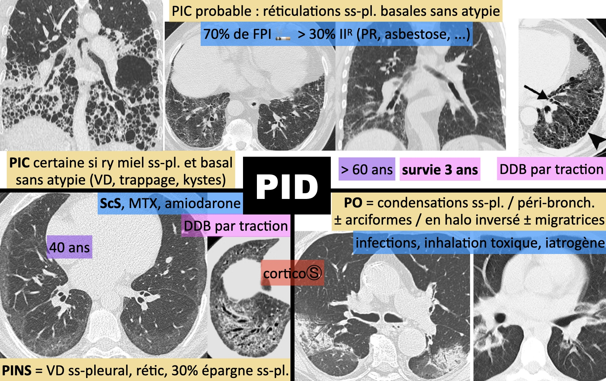
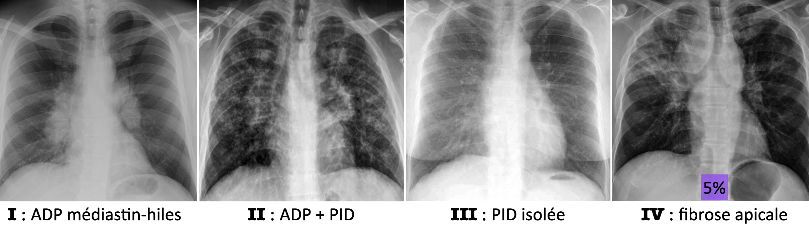
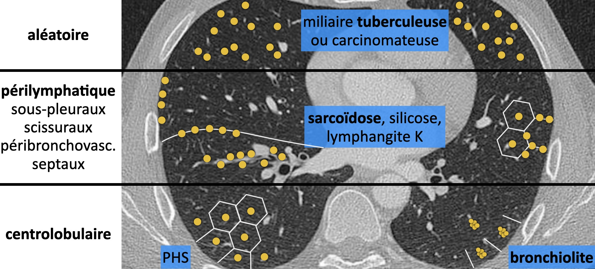

# PID

<figure markdown="span">
    {width="730"}
    <figcaption>fibrose = DDB, ry de miel, scissures irrégulières, perte de volume</figcaption>
</figure>

!!! tip "Maladies auto-immunes"
    - **Lupus** : pleurésie/péricardite, HIA, SDRA, PIC/PINS/PO, HTAP
    - **PR** : PIC, nodules périphériques ± troués
    - **ScS** : PINS, dilatation œsophage, HTP
    - **SGS** : LIP (verre dépoli et qq kystes), lymphome, bronchiolite, PINS
    - **DM** : PINS, PO
    - **GPA** : nodules ± troués, HIA, PO, ép. trachée-bronches (DD amylose), sinusite

 

!!! tip "[Amiante](https://onclepaul.fr/wp-content/uploads/2011/07/amiante-asbestose-ID-DR1.pdf){:target="_blank"}"
    - 90% plaques pleurales ± calcifiées = sous crosse Ao : antéro-sup, postéro-inf, coupoles
    - asbestose = PID postéro-basale (VD, rétic, bronchiolectasies, bande curviligne ↬ PIC)
    - ép. plèvre viscérale = bandes, pied de corneille, atélectasie par enroulement

 

<figure markdown="span">
    [{width="800"}](https://onclepaul.fr/wp-content/uploads/2011/07/sarcoidose-AO-FILEminimizer.pdf){:target="_blank"}
</figure>

<figure markdown="span">
    [{width="600"}](https://onclepaul.fr/wp-content/uploads/2011/07/Syndrome-micronodulaire-.pdf){:target="_blank"}
</figure>