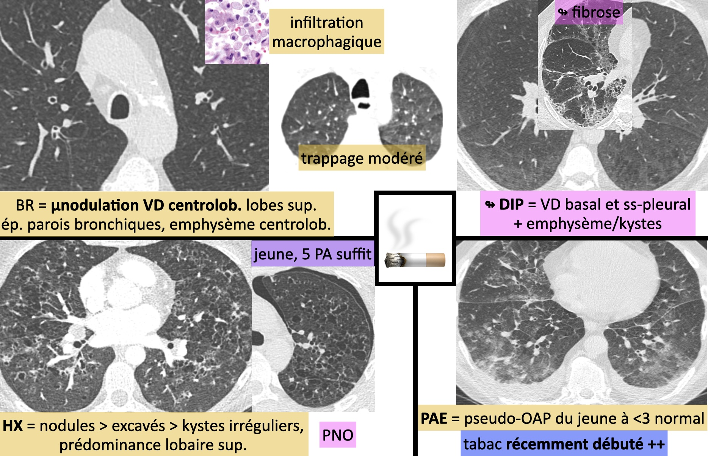
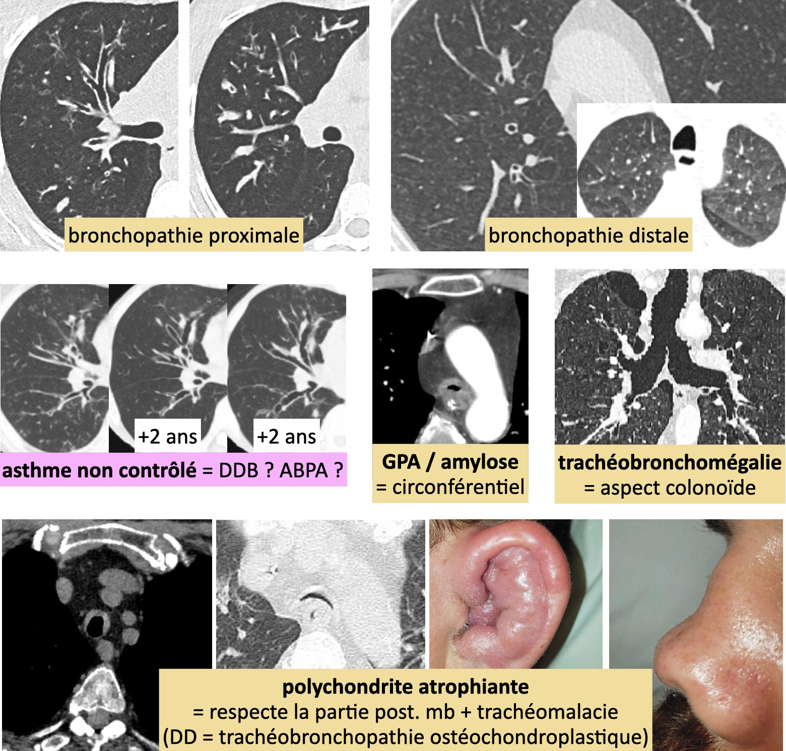
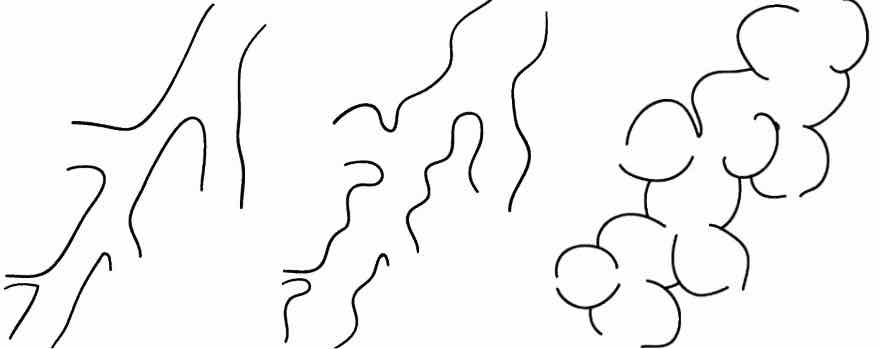

# Trachée et bronches

<figure markdown="span">
    [{width="700"}](https://radiopaedia.org/articles/smoking-related-lung-disease-3){:target="_blank"} 
    [syndrome emphysème-fibrose](https://onclepaul.fr/wp-content/uploads/2011/07/sd-emphyseme-fibrose1.pdf){:target="_blank"}  
     
    {width="580"}  
    [Bronchectasies](https://radiopaedia.org/articles/bronchiectasis){:target="_blank"} = diamètre > artère bronchique, visible < 1 cm plèvre
    {width="400"}
     
    {width="350"}
    [perfusion en mosaïque](https://radiopaedia.org/articles/mosaic-attenuation-pattern-in-lung){:target="_blank"} = bronchiolaire (piégeage expiratoire) / vasculaire
</figure>

