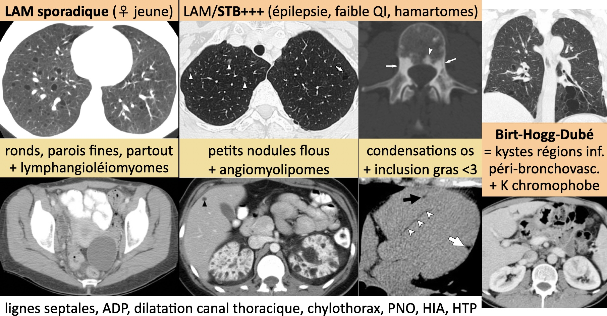
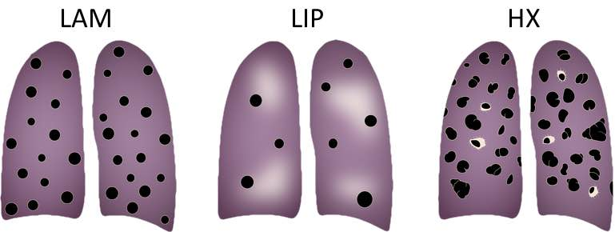

# Emphysème et maladies kystiques

!!! tip "[Emphysème](https://onclepaul.net/wp-content/uploads/2011/07/BPCO-et-emphys%C3%A8meFILEminimizer.pdf){:target="_blank"} (fenêtrage C-800 L400)"
    - centro-lobulaire = tabac, prédominance postéro-sup, coalescence en bulles
    - para-septal = sous-pleural et apical &nbsp;&nbsp;&nbsp;&nbsp; ≠ &nbsp;&nbsp;&nbsp;&nbsp; para-cicatriciel (BK++)
    - pan-lobulaire = BPCO et déficit en α1-AT, bases pulmonaires

 

<figure markdown="span">
    {width="750"}  
    [{width="450"}](https://radiopaedia.org/articles/cystic-lung-disease-2){:target="_blank"}
    <figcaption>DD rares = amylose, maladie de dépôts de chaînes légères</figcaption>
</figure>

!!! tip "[AEF](https://www.clubthorax.com/web/fiches/file/PID_AEF.pdf){:target="_blank"} = DD du ry de miel"
    - kystes multiples
    - sans contact pleural
    - épargne des bases