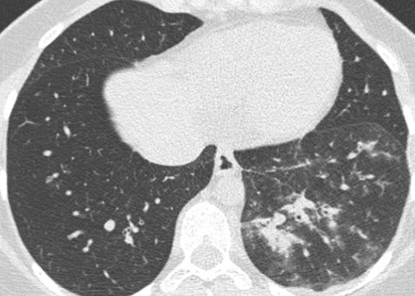

# Infections pulmonaires

=== "généralités"

    |  tableaux | sémio (germes) | aspect | 
    | :----------: | :-------: | :-------: |
    | [**pneumonie lobaire**](https://radiopaedia.org/articles/lobar-pneumonia){:target="_blank"} | condensation alvéolaire ([pneumocoque](https://radiopaedia.org/articles/pneumococcal-pneumonia){:target="_blank"}, [klebsiella](https://radiopaedia.org/articles/klebsiella-pneumonia){:target="_blank"}, [legionella](https://radiopaedia.org/articles/legionella-pneumonia){:target="_blank"}) | {width="600"} |
    | [**broncho-pneumonie**](https://radiopaedia.org/articles/bronchopneumonia){:target="_blank"} | condensations péribronchovasc + micro-macronodulation confluente (staph, haemophilus, pseudomonas, E. coli, [grippe](https://radiopaedia.org/articles/h1n1-influenza){:target="_blank"}) | {width="600"} |
    | **pneumonie interstitielle** | plages de verre dépoli, réticulations (viral, mycoplasma, chlamydia, [pneumocystose](https://radiopaedia.org/articles/pulmonary-pneumocystis-jirovecii-infection-2){:target="_blank"}) | {width="600"} | 
    | [**embolies septiques**](https://radiopaedia.org/articles/septic-pulmonary-emboli){:target="_blank"} | condensations nodulaires ±excavées (staph, pyo, candida, BK, [Lemierre](https://radiopaedia.org/articles/lemierre-syndrome){:target="_blank"}) | {width="600"} |

    !!! tip "DD"
        - condensations = sarcoïdose, pneumonies organisées
        - [verre dépoli](https://radiopaedia.org/articles/diffuse-ground-glass-opacification?lang=gb){:target="_blank"} = OAP, HIA, PHS, toxicité médicamenteuse
        - [lésions excavées](https://radiopaedia.org/articles/pulmonary-cavity-1){:target="_blank"} = K epidermoïde/métas, GPA/PR

    !!! warning "complications"
        - [empyème](https://radiopaedia.org/articles/pleural-empyema-1){:target="_blank"} = pneumocoque chez l'enfant, staph, BGN, anaérobies
        - [abcès](https://radiopaedia.org/articles/lung-abscess){:target="_blank"} = bactéries anaérobies dans l'inhalation, staph, pyo, klebsiella
        - [pneumatocèle](https://radiopaedia.org/articles/pneumatocele-1){:target="_blank"} = staph et pneumocystose > E. coli, pneumocoque
        - [pneumonie nécrosante](https://radiopaedia.org/articles/necrotising-pneumonia){:target="_blank"} /!\ faux-anévrysmes = staph, BK, fongique 

=== "immunodéprimé"

    !!! tip "**AMG nécrotiques** = [BK](https://radiopaedia.org/articles/tuberculosis-pulmonary-manifestations-1){:target="_blank"} ([nocardiose](https://radiopaedia.org/articles/pulmonary-nocardiosis){:target="_blank"}, [candidose](https://radiopaedia.org/articles/pulmonary-candidiasis){:target="_blank"}, [tularémie](https://radiopaedia.org/articles/tularaemia){:target="_blank"})"

    !!! tip "[Orientation chez l'immunodéprimé](https://onclepaul.fr/wp-content/uploads/2011/07/infections-pulmonaires-immunod%C3%A9prim%C3%A9-def.pdf){:target="_blank"}"
        - 69 : VIH
        - 75 : allogreffé
        - 78 : aplasie
        - 79 : transplanté

    !!! tip "[Tuberculose, mycobactéries atypiques et infections fongiques](https://onclepaul.net/wp-content/uploads/2011/07/infection-2FILEminimizer.pdf){:target="_blank"}"
        - 4 : tuberculose
        - 37 : mycobactéries atypiques ([Lady Windermere](https://radiopaedia.org/articles/lady-windermere-syndrome){:target="_blank"})
        - 47 : aspergillome
        - 57 : ABPA
        - 68 : aspergillose
        - 78 : candidose
        - 80 : cryptococcose