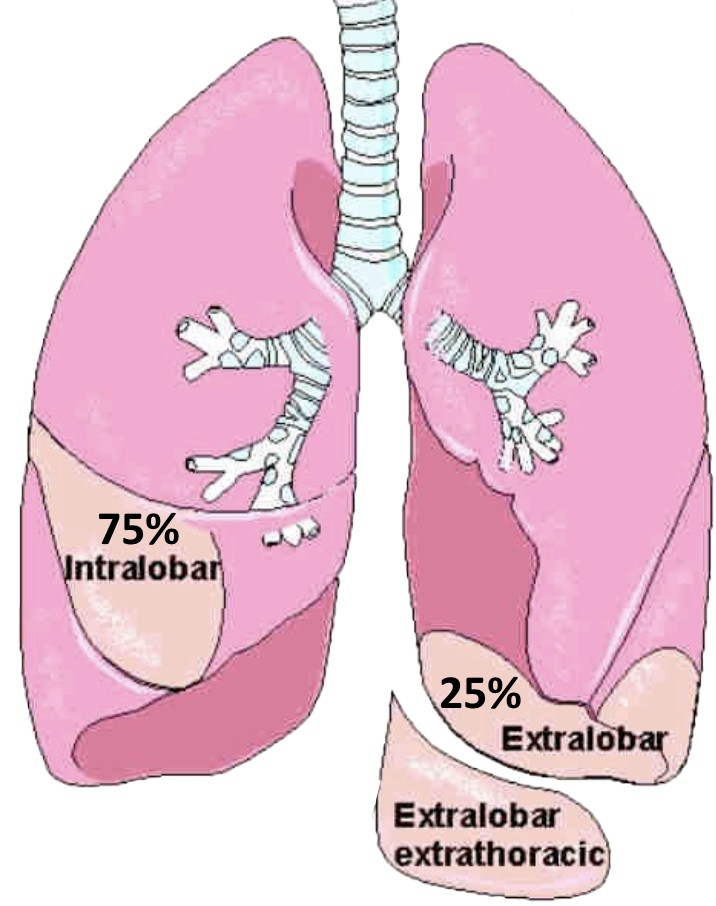

# Malformations pulmonaires

<a href="https://radiopaedia.org/articles/congenital-pulmonary-airway-malformation"target="_blank">CPAM</a> = MAKP

<figure markdown="span">
    ≠ [séquestration](https://radiopaedia.org/articles/pulmonary-sequestration){:target="_blank"} pulmonaire  
    (mais [lésion hybride](https://radiopaedia.org/articles/hybrid-lesion-paediatric-chest-3?lang=us){:target="_blank"} possible)  
    {width="300"} 
</figure>

| [Oncle Paul](https://onclepaul.fr/wp-content/uploads/2011/07/séquestrations-pulmonaires-de-ladulte.pdf){:target="_blank"} | intralobaire ++  |  extralobaire | 
| :----------: | :-------: | :----------: | 
| `enveloppe pleurale` | non | oui |
| `topographie` | 60% G| 90% G |
| `apport artériel` | Ao | Ao ou AP |
| `retour veineux` | pulmonaire | (hémi)azygos / VCI |
| `malfoutose` | ± | ++ |

<figure markdown="span">
      
    [atrésie bronchique](https://radiopaedia.org/articles/bronchial-atresia){:target="_blank"} (sd bronchocèle - hyperaération)
</figure>