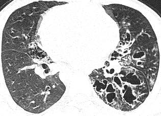
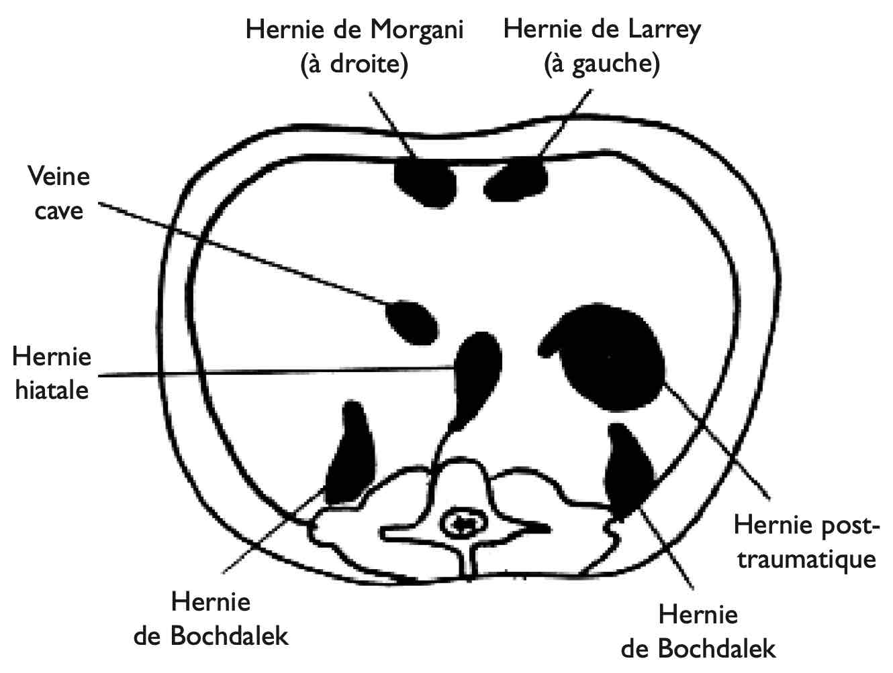

# Malformations

=== "Poumons"

    <figure markdown="span">
        [CPAM](https://radiopaedia.org/articles/congenital-pulmonary-airway-malformation){:target="_blank"} = MAKP
        {width="350"}
        ≠ [séquestration](https://radiopaedia.org/articles/pulmonary-sequestration){:target="_blank"} pulmonaire (mais [lésion hybride](https://radiopaedia.org/articles/hybrid-lesion-paediatric-chest-3?lang=us){:target="_blank"} possible)  
        {width="300"}
        PAS de communication avec l'arbre bronchique  
        + presque tjrs vascularisation artérielle d'origine systémique
    </figure>

    | [Oncle Paul](https://onclepaul.fr/wp-content/uploads/2011/07/séquestrations-pulmonaires-de-ladulte.pdf){:target="_blank"} | intralobaire ++  |  extralobaire | 
    | :----------: | :-------: | :----------: | 
    | `enveloppe pleurale` | non | oui |
    | `topographie` | 60% G| 90% G |
    | `apport artériel` | Ao | Ao ou AP |
    | `retour veineux` | pulmonaire | (hémi)azygos / VCI |
    | `malfoutose` | ± | ++ |

=== "Bronches"

    <figure markdown="span">
        [atrésie bronchique](https://radiopaedia.org/articles/bronchial-atresia){:target="_blank"} (sd bronchocèle - hyperaération)
        {width="350"}  
          
        dyskinésie ciliaire primitive + situs inversus = sd de [Kartagener](https://radiopaedia.org/articles/kartagener-syndrome-1){:target="_blank"}
        {width="300"}  
    </figure>

=== "Sternum"

    <figure markdown="span">
        [pectus excavatum](https://radiopaedia.org/articles/pectus-excavatum){:target="_blank"} : indice de [Haller](https://radiopaedia.org/articles/haller-index){:target="_blank"}
        {width="350"}
        diamètre transverse max / distance AP min  
        léger < 3,2 < modéré < 3,5 < sévère  
          
        5% [foramen sternal](https://radiopaedia.org/articles/sternal-foramen?lang=gb){:target="_blank"}
    </figure>

=== "Hernies"

    <figure markdown="span">
        hernies diphragmatiques dont 95% de [hernie de Bochdalek](https://radiopaedia.org/articles/bochdalek-hernia){:target="_blank"}
        {width="500"}  
          
        ≠ [éventration diaphragmatique](https://radiopaedia.org/articles/diaphragmatic-eventration){:target="_blank"}
    </figure>