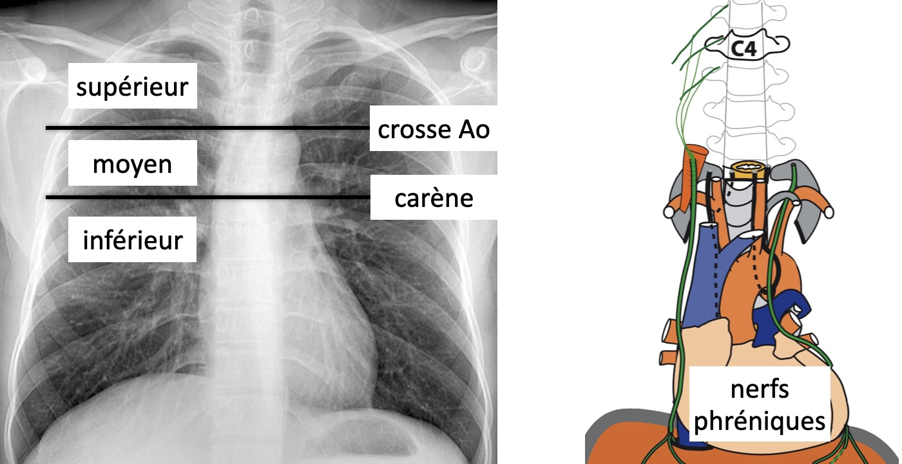

# Médiastin

<figure markdown="span">
    [{width="600"}](https://radiopaedia.org/articles/mediastinum-1){:target="_blank"}
 
    [{width="800"}](https://radiopaedia.org/articles/mediastinal-mass){:target="_blank"}
 
    [{width="550"}](https://radiopaedia.org/articles/phrenic-nerve-paralysis-1){:target="_blank"}
</figure>