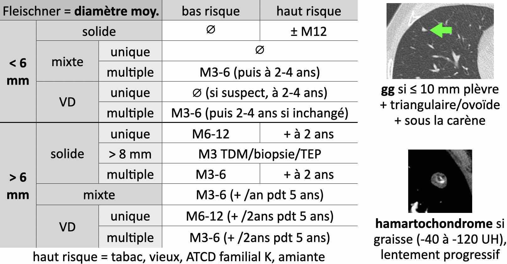

# Nodules pulmonaires

<figure markdown="span">
    {width="750"}
</figure>

  

<figure markdown="span">
    {width="670"}
    <figcaption>[CAT nodule pulmonaire](https://cerf.radiologie.fr/sites/cerf.radiologie.fr/files/Enseignement/DES/Archives-Documents/02%20ML%20CAT%20d%C3%A9couverte%20fortuite%20nodule%20pulmonaire.pdf){:target="_blank"}</figcaption>
</figure>

!!! tip "Causes de **nodules troués**"
    - cancer : primitif ou méta
    - infectieux : endocardite, abcès, BK
    - maladies auto-immunes : GPA et PR

 

<figure markdown="span">
    {width="670"}
</figure>