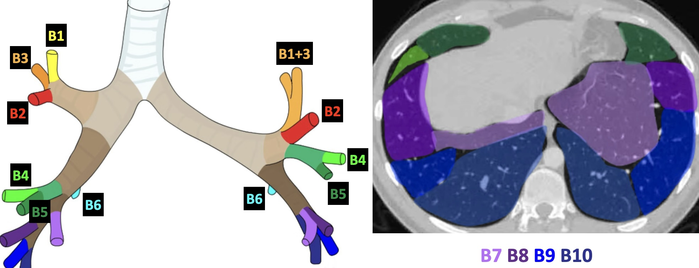
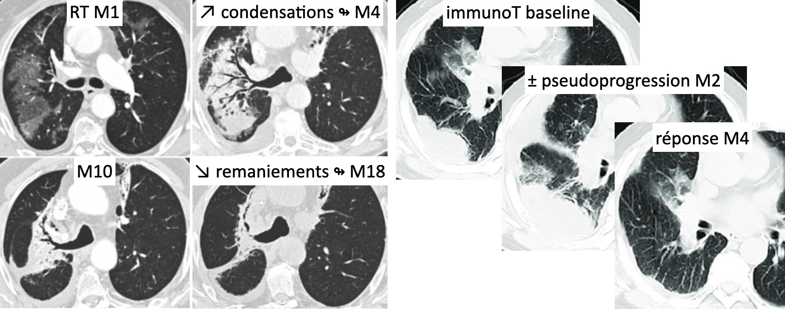

# Nodules pulmonaires (3 - 30 mm)

<figure markdown="span">
    {width="750"}
</figure>

!!! warning "**Critères de malignité** = spicules, rétractile, bronchogramme, périkystique"

!!! info "**FDR de malignité** = tabac, atcd familial, emphysème/fibrose, âge avancé"

|  Nodule solide | contrôle | CAT | 
| :----------: | :-------: | :----------: |
| `< 6 mm`   (100 mm³) | 1 an   ssi FDR | si majoration (TDV < 500j) RCP   sinon contrôle 2 ans |
| `6-8 mm`   (100-250 mm³) | M6 | si majoration (TDV < 400j) RCP   sinon contrôle 1 an |
| `8-10 mm`   (250-500 mm³) | M3 | si majoration (TDV < 250j) RCP   sinon contrôle 6 mois |
| `≥10 mm`   (250-500 mm³) | ATB + M1 | si persistance TEP-TDM et RCP |

<figure markdown="span">
    Nodule **mixte** avec large zone solide = contrôle M1 puis RCP si persistance  
    Nodule en **verre dépoli** = contrôle à M6 puis annuel  
     
    {width="380"} 
</figure>

!!! tip "Causes de **nodules troués**"
    - cancer : primitif ou méta
    - infectieux : endocardite, abcès, BK
    - maladies auto-immunes : GPA et PR

<figure markdown="span">
    {width="670"}
</figure>