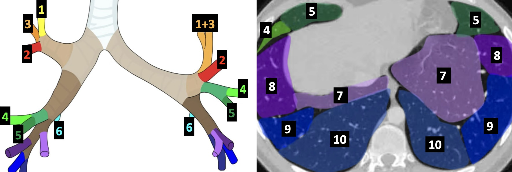
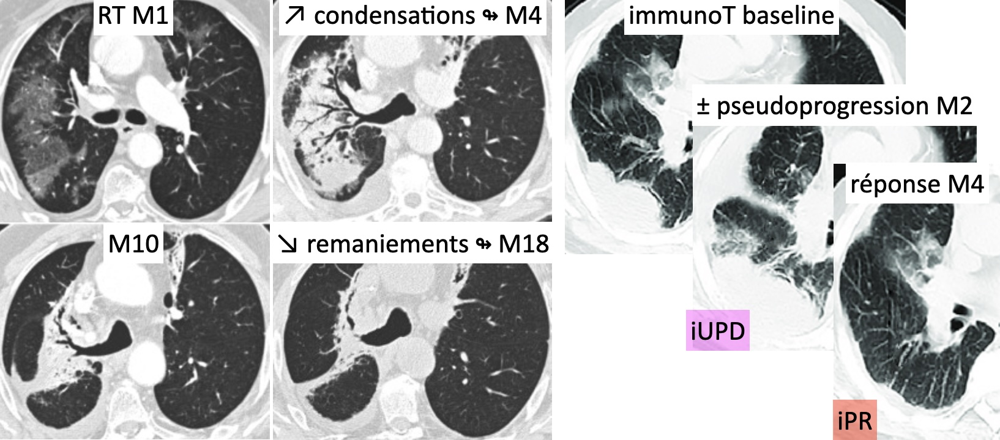

# Nodules pulmonaires (3 - 30 mm)

<figure markdown="span">
    {width="750"}
</figure>

!!! warning "**Critères de malignité** = spicules, rétractile, bronchogramme, périkystique"

!!! info "**FDR de malignité** = tabac, atcd familial, emphysème/fibrose, âge avancé"

|  Nodule solide | contrôle | CAT | 
| :----------: | :-------: | :----------: |
| `< 6 mm`   (100 mm³) | 1 an   ssi FDR | si majoration (TDV < 500j) RCP   sinon contrôle 2 ans |
| `6-8 mm`   (100-250 mm³) | M6 | si majoration (TDV < 400j) RCP   sinon contrôle 1 an |
| `8-10 mm`   (250-500 mm³) | M3 | si majoration (TDV < 250j) RCP   sinon contrôle 6 mois |
| `≥10 mm`   (250-500 mm³) | ATB + M1 | si persistance TEP-TDM et RCP |

<figure markdown="span">
    Nodule **mixte** avec large zone solide = contrôle M1 puis RCP si persistance  
    Nodule en **verre dépoli** = contrôle à M6 puis annuel  
     
    {width="380"}
</figure>

!!! tip "Causes de **nodules troués**"
    - cancer : primitif ou méta
    - infectieux : endocardite, abcès, BK
    - maladies auto-immunes : GPA et PR

| [TNM](https://oncologik.fr/referentiels/dsrc/cancer-bronchique-non-a-petites-cellules#11.1.1.Classification%20TNM%208%C3%A8me%20%C3%A9dition){:target="_blank"} | critères |
| :--- | :--- |
| **T**1 | ≤ 3 cm (a ≤1cm, b 1-2cm, c 2-3cm) |
| T2 | 3 à 5 cm OU bronche souche / plèvre viscérale / atélectasie |
| T3 | 5 à 7 cm OU envahissement paroi thoracique / nodule même lobe |
| T4 | > 7 cm OU trachée, carène, envahissement vertébral (confirmé par IRM), myocarde, artère ou veine pulmonaire, aorte / nodule autre lobe |
| **N**1 | péribronchique ou hilaire homolatéral |
| N2 | médiastinal homolatéral ou sous-carinaire |
| N3 | médiastinal controlatéral ou sus-claviculaire |
| **M**1a | intra-thoracique (nodule(s), plèvre, péricarde) |
| M1b/c | extra-thoracique unique/multiple |

<figure markdown="span">
    {width="670"}
    **RT = 30% pneumonie** radique (qq semaines après) et PO (qq mois après)  
    **PID => LBA** (notamment pneumocystose ?) sinon PID médic (cortico)  
    ↗ gg = **surcharge** vasculaire / réaction **sarcoïd-like** (immunothérapie)  
    [RECIST 1.1](../outils/recist.md)
</figure>