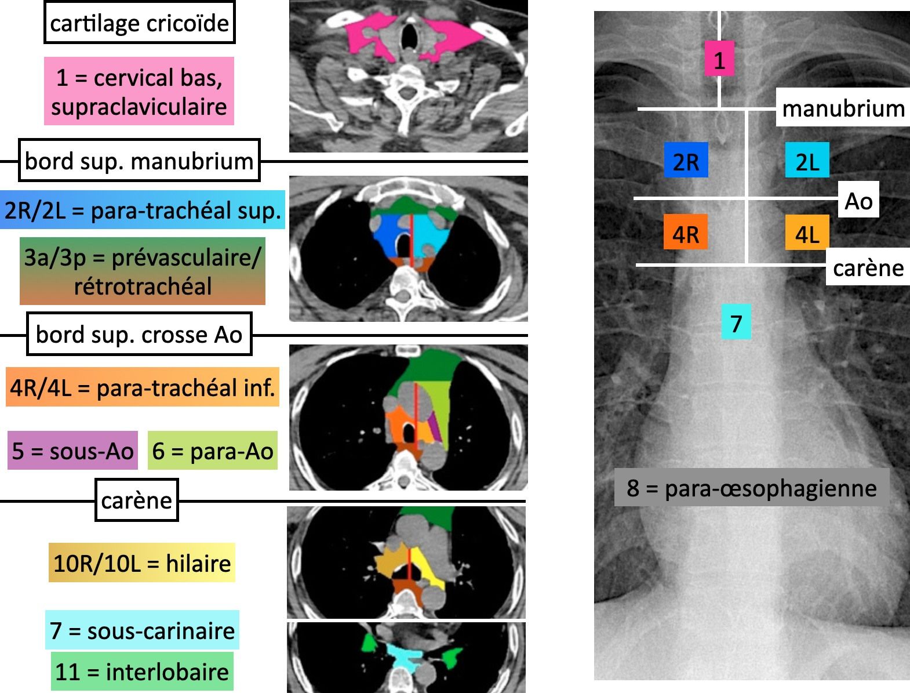

# Nodules pulmonaires

<figure markdown="span">
    {width="700"}
</figure>

<figure markdown="span">
    {width="450"}
    <figcaption>haut risque = tabac, vieux, ATCD familial CBP, exposition amiante</figcaption>
</figure>

<figure markdown="span">
    {width="600"}
</figure>

<figure markdown="span">
    {width="700"}
</figure>

<figure markdown="span">
    {width="750"}
</figure>