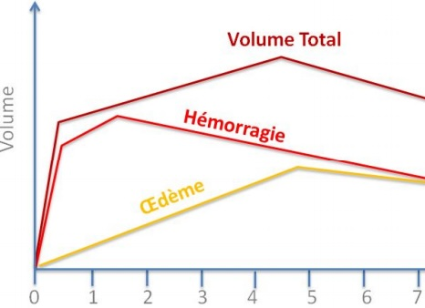

# [AVC](https://onclepaul.fr/wp-content/uploads/2011/07/AVC-ischemiques-.-RD-2021.pdf){:target="_blank"}

!!! info "[Lobes cérébraux](https://radiopaedia.org/cases/61691/studies/69700?lang=gb){:target="_blank"} et [territoires artériels](https://radiopaedia.org/cases/10814/studies/11258?lang=gb){:target="_blank"}"

<figure markdown="span">
     

    {width="250"}

      
    
    {width="410"}

      
    
    {width="330"}

      
    
    {width="300"}

      
    
    {width="260"}
</figure>

  

# Hématome intraparenchymateux

<figure markdown="span">
    {width="300"}
    TDM sans/art/vx sauf hématome profond >50a avec HTA

      

    {width="350"}

      
    
    {width="320"}
</figure>