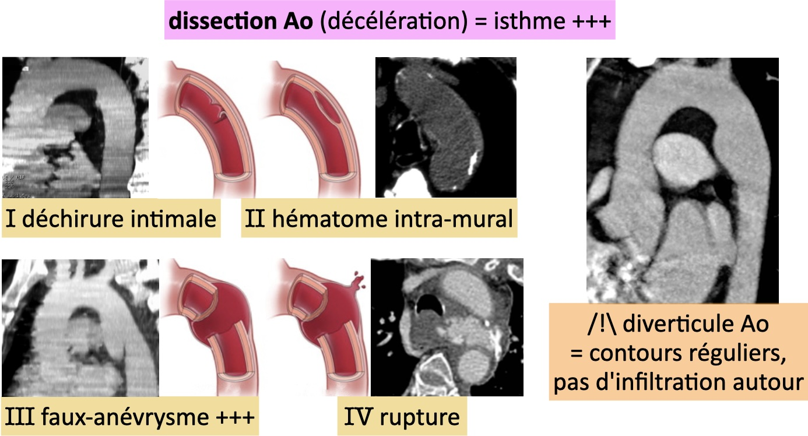
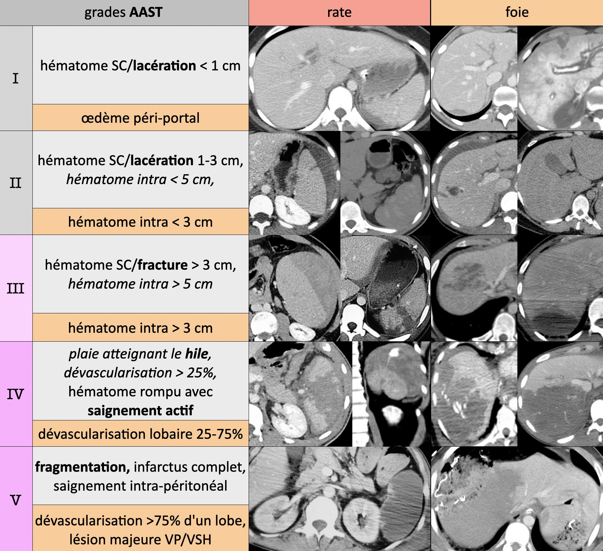
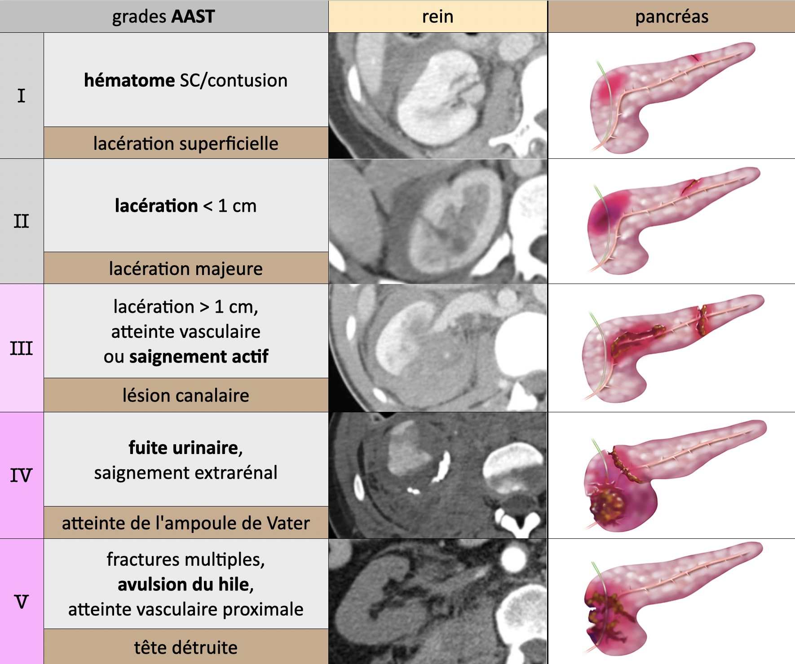
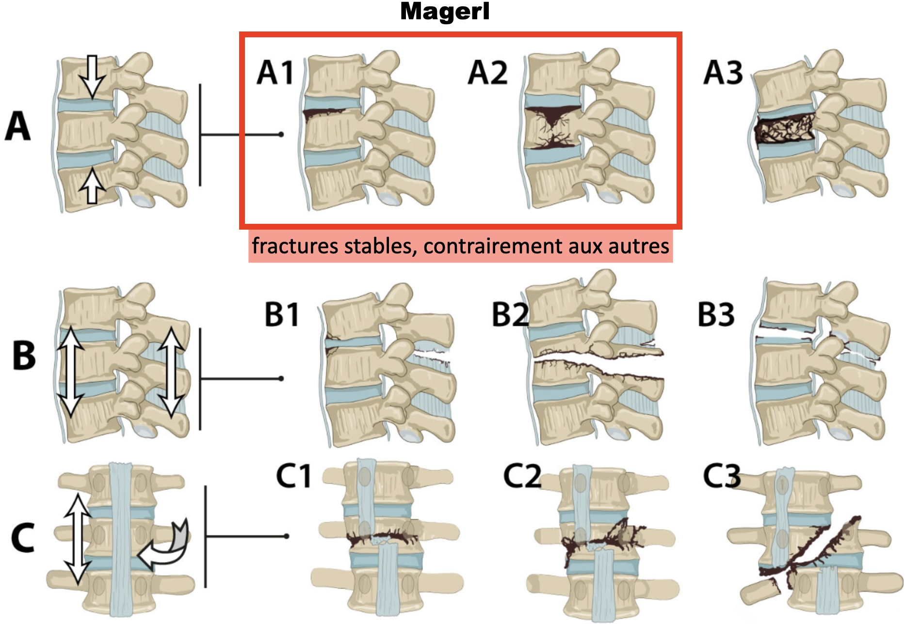

# AVP

!!! info "Protocole"
    - crâne, cou et AP IV- > TAP art > AP vx > **excrétoire si lésion rein/bassin**
    - enfant > 50 kg = TAP biphasique (80 cc > 60 cc à 60s > acquisition à 90s)
    - enfant < 50 kg = crâne et cou IV- > TAP temps mixte (50s)

```
Thorax :
Pas d'anomalie des gros vaisseaux (sous réserve de quelques artéfacts cinétiques).
Pas de pneumomédiastin, d'épanchement pleural ni péricardique.
Pas de contusion parenchymateuse.

Abdomen et pelvis :
Pas de lésion traumatique du foie, de la rate, du pancréas, ni des reins.
Pas d'épanchement péritonéal ni de pneumopéritoine.
Pas d'infiltration de la racine du mésentère.

Crâne et cadre osseux : cf. CR dédié.
```

<figure markdown="span">
    </br>
    {width=580"}
    </br>
    {width=700"}
    /!\ rate faux-a à J3-J7 et **grade IV/V = embolisation** sinon 50% rupture II<sup>R</sup>
    </br></br>
    {width=700"}
    </br>
    {width=700"}
</figure>