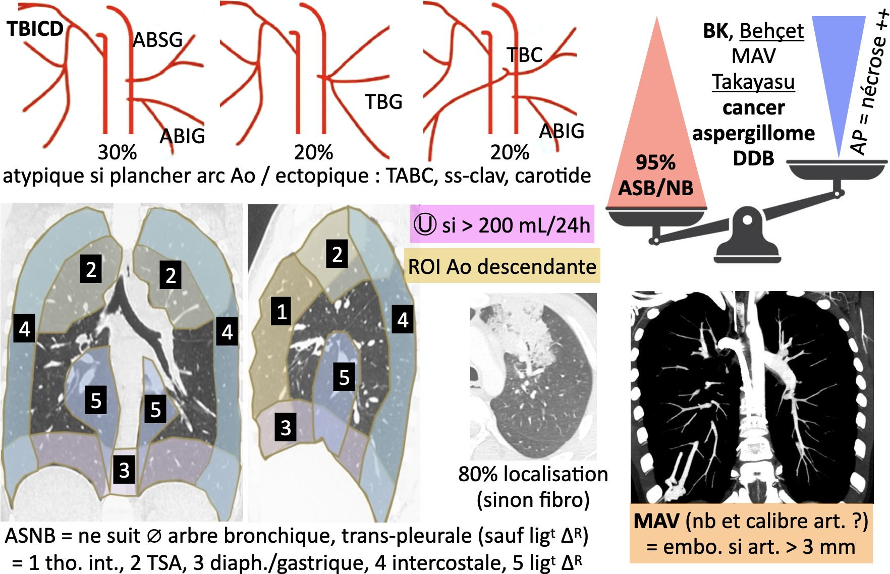

# EP et hémoptysie

```
Absence d'embolie pulmonaire jusqu'au niveau sous-segmentaire.
Pas de dilatation des cavités cardiaques droites.

Pas de syndrome aortique aigu.
Pas d'épanchement péricardique.

Intégrité de la trachée et des bronches proximales.
Pas d'infiltration ni de nodule pulmonaire.
Pas d'épanchement pleural.
Pas de lésion osseuse.
```

!!! tip "[Femme enceinte](https://onclepaul.net/wp-content/uploads/2011/07/EP-chez-la-femme-enceinte-CS-2013+++1.pdf){:target="_blank"} ([risque](https://onclepaul.fr/wp-content/uploads/2011/07/La-femme-enceinte-en-imagerie-pire-angoisse-du-radiologue-New-JFR-2020.pdf){:target="_blank"} de l'irradiation)"
    - Apnée simple
    - 120 cc ≥ 4,5 cc/s de Ioméron 400
    - Couper apex et culs-de-sac pleuraux
    - 100 kV

```
Absence d'hypervascularisation systémique bronchique et non bronchique.
Pas d'infiltration ni de nodule dans le parenchyme pulmonaire.
Intégrité de la trachée et des bronches proximales.
Pas d'épanchement pleural ni péricardique.
Pas de lésion osseuse.
```

<figure markdown="span">
    {width="750"}
</figure>
