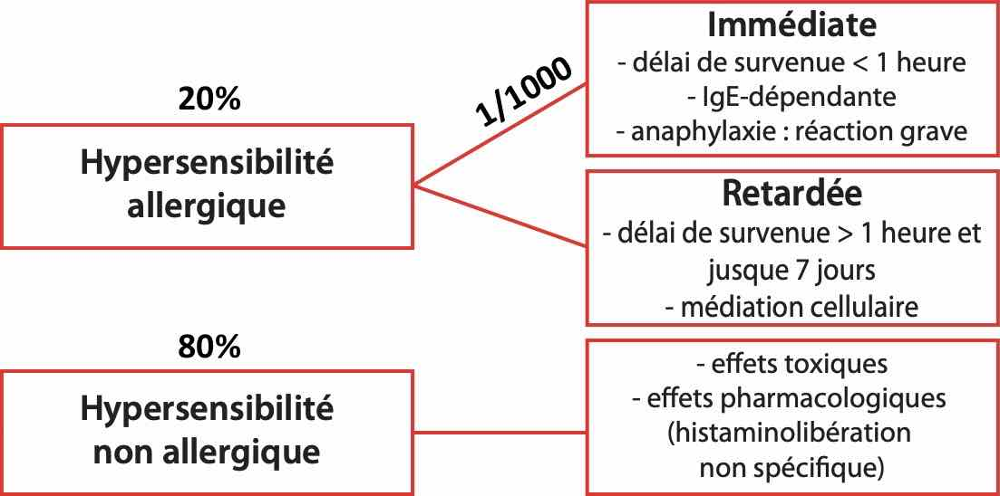

# Produits de contraste

!!! danger "[Réactions d'hypersensibilité](https://www.radiologie.fr/sites/www.radiologie.fr/files/medias/documents/CIRTACI%20Fiche%20Allergie%2029%2009%202009_0.pdf){:target="_blank"} = 10✝/an en France"
    - immédiate = urticaire/angiœdème/anaphylaxie = ↗ histamine et tryptase
    - non allergique = érythème/urticaire localisé = prémédication anti-H1 1h avt
    {width=480"}  
    
    | grade | symptômes  |  PEC | 
    | :----------: | :-------: | :----------: | 
    | I | érythème, urticaire, angiœdème | polaramine + surveillance 30' | 
    | II | hypoTA, tachy<3, dyspnée, nausées | remplissage NaCl |
    | III | choc anaphylactique | adré IM 0.5 mg, O<sup>2</sup>, ventoline | 

!!! warning "[IRA post-contraste](https://www.radiologie.fr/sites/www.radiologie.fr/files/medias/documents/CIRTACI%20Fiche%20Rein_2020_2_4_0.pdf){:target="_blank"} (< J3 ↗ créat ≥ 0,3 mg/dL)"
    - risque ssi **DFG < 30 => 10 mL/kg NaCl** réparti avant et après
    - **> 4h entre deux** injections / > 48h si DFG < 30 ou dialyse
    - **myélome** => corriger l'hyperCa2+ (∅ risque si ∅ d'IRénale)
    - **metformine** => PAS d'↕ (sauf IRA : ↕ pdt 48h après l'inj)

!!! warning "[Hyperthyroïdie non équilibrée](https://www.radiologie.fr/sites/www.radiologie.fr/files/medias/documents/CIRTACI%20Fiche%20Thyro%C3%AFde%2029%2009%202009_0.pdf){:target="_blank"}"
    - CI absolue
    - scintigraphie thyroïdienne et IRA-thérapie > M2 après injection

!!! warning "[Extravasation](https://www.radiologie.fr/sites/www.radiologie.fr/files/medias/documents/CIRTACI%20fiche%20extravasation_0.pdf){:target="_blank"} 1/500"
    - **aspiration** via le cathéter puis expression cutanée
    - **surélévation** du membre pdt 3h si gravité
    - **glace** pdt 20' puis /h pdt 6h
    ```
    L'injection de produit de contraste s'est compliquée d'une extravasation d'environ  ml étendue sur  cm. Consignes données de surélévation du membre pendant 3 heures et d'application de glace toutes les heures pendant 6 heures. L'évolution attendue est à la résolution en 24 à 48 heures; à défaut, il conviendra de prendre un avis médical.
    ```
    - /!\ sd des loges = paresthésies et parésie => avis chir. plastique

!!! tip "[Allaitement](https://www.lecrat.fr/9781/){:target="_blank"}"
    - 1/2 vie d'élimination de 2 heures
    - ↕ 4h sauf pour Omnipaque et Visipaque
    - si > 14 SA, risque théorique de [dysthyroïdie](https://www.sfip-radiopediatrie.org/wp-content/uploads/2018/07/Elefant_trousseau_2016.pdf){:target="_blank"} foetale transitoire

!!! tip "[Grossesse](https://www.lecrat.fr/9775/){:target="_blank"}"
    - [dose à l'utérus](https://www.lecrat.fr/9777/){:target="_blank"} << 100 mGy (seuil à risque)
    - nombreuses études rassurantes, même au 1<sup>er</sup> trimestre
    