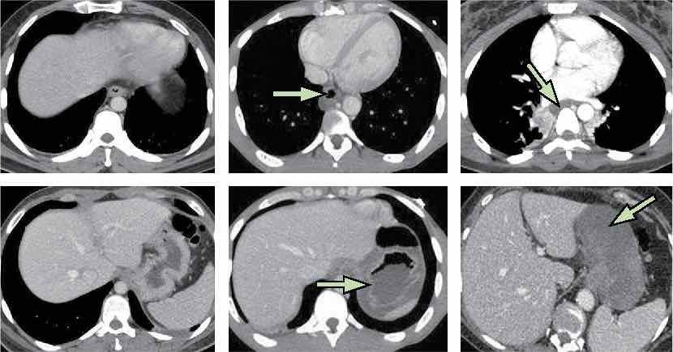

# [Ingestion de caustique](https://www.fmcgastro.org/texte-postu/postu-2023/prise-en-charge-de-lingestion-de-caustique/){:target="_blank"}

!!! tip "PEC"
    - **10% chirurgie** en Ⓤ guidée par la **TDM** (fibro ssi enfant ou CI PDC)
    - nécrose transmurale de la paroi œsophagienne/gastrique ?! = absence de PDC
    - TDM 3 à 6 heures après l'ingestion = CTAP sans puis 90s après injection

<figure markdown="span">
    {width="800"}
</figure>

|  Grade |  œsophage |  estomac |
| :----------: | :-------: |  :-------: | 
| 1 | aspect normal (pas de risque de sténose) | aspect normal | 
| 2 | PDC fine +/- infiltration de la graisse | œdème | 
| 3 | ∅ PDC +/- épanchement autour | nécrose | 