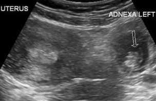
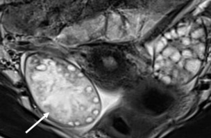
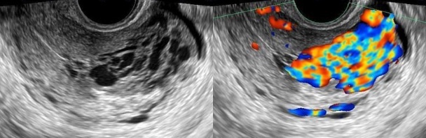

# Urgences gynécologiques

=== "GEU"
    - dl peviennes et métrorragies + utérus vide et **hCG > 1500** UI/L
    - 80% **ampullaire** > 10% isthmique > 5% cornuale ou ovarienne
    - sac gestationnel intrautérin sans vésicule vitelline = GLI (< 5 SA ou pseudosac)
    - sac gesta > 10 mm = vésicule / > 16 mm = embryon / embryon > 4 mm = act. <3
    <figure markdown="span">
        {width="300"}
    </figure>
=== "TORSION"
    - dl pelvienne brutale intense + nausées
    - médialisation ovaire + œdème stromal + tour de spire
    - complique notamment **kyste dermoïde** et **fibrome** ovarien (tumeurs denses)
    - IRM = 3 plans T2 ± T1 DIXON pré et post-gado
    <figure markdown="span">
        {width="300"}
    </figure>
=== "MAV"
    - **curetage**, après ttt d'une tumeur trophoblastique gestationnelle (15%)
    - dilatations vasculaires dans le myomètre avec flux **> 1 m/s** et IR < 0,5
    - IRM = flow voids hypoT2, PDC précoce, **retour veineux précoce**
    <figure markdown="span">
        {width="600"}
    </figure>
=== "TVO"
    - dl et fièvre **post-partum**
    - IV- et veineux à **100s** = veine ovarienne **droite** ++, VCI ?!
    - ± utérus rétentionnel, urétérohydronéphrose, masse annexielle
    <figure markdown="span">
        {width="300"}
    </figure>