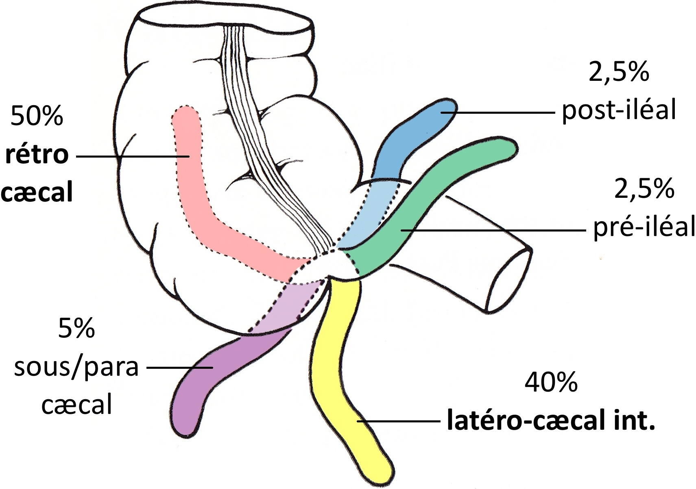
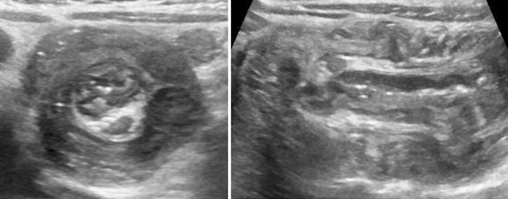
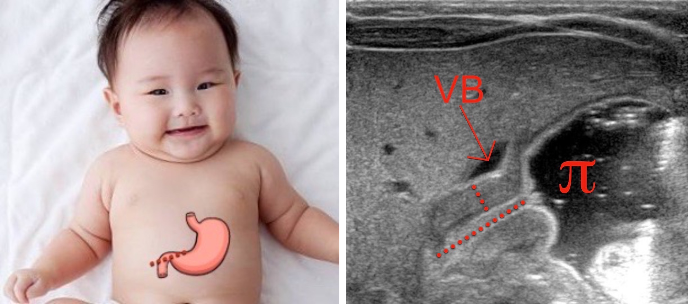
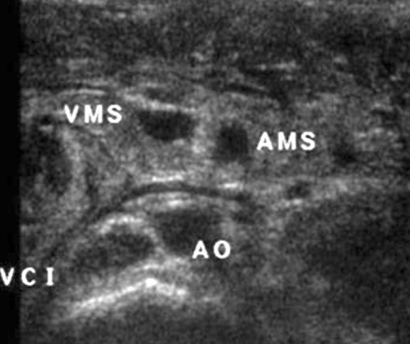
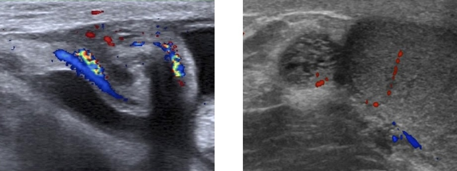

# Urgences pédiatriques

=== "APP"
    - non compressible, **> 6 mm** (TDM > 7 mm), hyperhémie, hyperécho autour, 25% stercolithe
    - contenu liquidien + ligne hyper (sous-muqueuse) + anneau hypo (musculeuse)
    - [complications](https://www.lexipatho.fr/36-appendicite-aigue){:target="_blank"} : plastron, abcès, péritonite
    - DD = [mucocèle](https://radiopaedia.org/articles/appendiceal-mucocele-2){:target="_blank"} (mucoviscidose ++), hyperplasie lymphoïde (âge scolaire ++)
    - DD d'exclusion = [adénolymphite mésentérique](https://radiopaedia.org/articles/mesenteric-adenitis){:target="_blank"} (> 3 gg > 5 mm)
    <figure markdown="span">
        {width="500"}
         
        {width="400"}
         
        {width="370"}
    </figure>
=== "IIA"
    - 95% **iléo-colique**, **M3 - 1 an** +++, 99% Se en écho = diamètre et longueur du boudin ?
    - &gt; 2a = [iléo-iléale](https://radiopaedia.org/articles/intussusception){:target="_blank"} = diverticule de [Meckel](https://radiopaedia.org/articles/meckel-diverticulum-3){:target="_blank"}, **lymphome**, tumeur, purpura rhumatoïde
    - lavement air/eau/PDC sous scopie/écho = 90% réussite (2% perfo => chir. viscéral prévenu)
    <figure markdown="span">
        {width="500"}
         
        {width="300"}
    </figure>
=== "PYLORE"
    - garçon **M1-M3**, vomis alimentaires en jet, musculeuse > 3 mm et L > 14 mm
    - négatif => répéter écho à 24-48h = tourner vers la droite
    <figure markdown="span">
        {width="550"}
        Sténose hypertrophique du pylore
    </figure>
=== "VOLVULUS"
    - **vomis bilieux NNé** < S2 à ventre plat, 80% < 1 an mais peut survenir à tout âge
    - complique une [malrotation intestinale](https://www.radeos.org/maladie/fiche-malrotation-intestinale-mesentere-commun_1266.html){:target="_blank"} (mésentère commun incomplet)
    <figure markdown="span">
        {width="250"}
         
        {width="500"}
        signe du **tourbillon** => PEC chirurgicale immédiate
          
        {width="250"}
        écho non contributive / négative => opacification digestive haute
    </figure>
=== "TORSION TESTI"
    - <b>ado / NNé</b>, 3% des dl scrotales aiguës de l'enfant
    - DD orchiépididymite /!\ hypervascularisation testiculaire = orchite/torsion-détorsion
    - DD <b>torsion d'hydatide</b> (6-12 ans) = masse ovalaire infracm vacuolisée Doppler⊖
    <figure markdown="span">
        {width="500"}
    </figure>